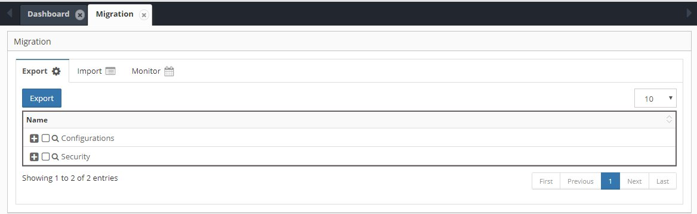
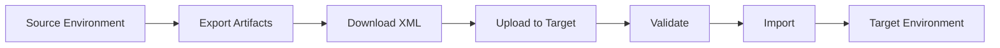
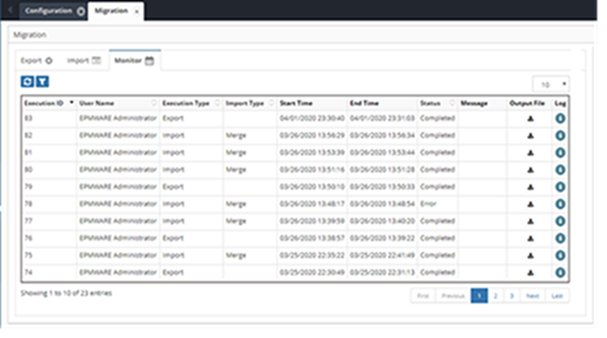

## Application Migration

The Migration module enables moving applications and configuration artifacts between EPMware environments, supporting development lifecycle and disaster recovery.

<br/>
*Migration module with Export, Import, and Monitor tabs*

### Migration Process



### Export

Export artifacts from the source environment:

<br/>
*Export artifact selection tree*

#### Artifact Categories

Select artifacts to export:

**Application Artifacts:**
- Application configuration
- Dimensions and hierarchies
- Member properties
- Property mappings
- Dimension mappings

**Configuration Artifacts:**
- Workflows
- Email templates
- Lookups
- Logic Builder scripts
- Global settings
- Export profiles
- ERP import configurations

**Security Artifacts:**
- Users (optional)
- Groups
- Security classes
- Security provisioning

#### Export Process

1. Navigate to **Administration → Migration → Export**
2. Select artifacts to export:

<br/>
*Artifact selection for export*

3. Click **Export** button
4. Monitor progress in Monitor tab
5. Download XML file when complete

#### Migration Example

Typical UAT to Production migration:

```
Selected for Export:
✓ HFM Application
  ✓ Properties
  ✓ Dimensions
  ✓ Metadata
✓ Workflows (all)
✓ Dimension Mappings
✓ Logic Scripts
✓ Email Templates
✓ Lookups
✓ Export Profiles
✓ ERP Import Configurations

Excluded:
✗ Infrastructure (different servers)
✗ Environments (not multi-env)
✗ Security (different in PROD)
✗ User accounts
```

### Import

Import artifacts into the target environment:

<br/>
*Import configuration screen*

#### Import Process

1. Navigate to **Administration → Migration → Import**
2. Choose import mode:
   - **Merge** - Add new, update existing
   - **Replace** - Delete existing, add new

3. Upload XML file:

<br/>
*Upload migration file dialog*

4. Click **Upload** to stage import
5. Click **Validate** to check for issues
6. Review validation results:

<br/>
*Import validation results*

7. Click **Import** to execute
8. Monitor progress in Monitor tab

#### Import Options

| Option | Description | Use Case |
|--------|-------------|----------|
| **Merge** | Preserves existing, adds new | Incremental updates |
| **Replace** | Complete replacement | Clean slate import |
| **Skip Errors** | Continue on error | Partial imports |
| **Backup First** | Auto-backup before import | Safety measure |

### Monitor

Track migration job status and download files:

<br/>
*Migration monitor showing job history*

#### Monitor Grid

| Column | Description |
|--------|-------------|
| **Execution ID** | Unique job identifier |
| **Type** | Export or Import |
| **Status** | Running/Completed/Failed |
| **Start Time** | Job start timestamp |
| **End Time** | Completion timestamp |
| **Records** | Artifact count |
| **Output File** | Download link |
| **Log** | View log file |

#### Monitoring Actions

- **Download Files** - Click file icon to download
- **View Logs** - Click log icon for details
- **Filter Results** - Use search/filter options
- **Refresh Status** - Auto-refresh or manual

---
