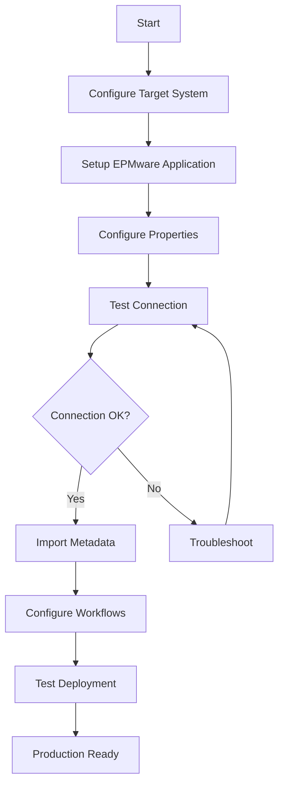

# Appendices

The EPMware Administrator's Guide appendices provide detailed configuration requirements and integration guides for connecting EPMware to various Enterprise Performance Management (EPM) and Enterprise Resource Planning (ERP) systems.

## Overview

These technical appendices contain step-by-step instructions, configuration requirements, and best practices for integrating EPMware with your target applications. Each appendix focuses on a specific platform or integration scenario.

## Quick Navigation

  

    <h3>☁️ Oracle EPM Cloud</h3>
    
Configure PBCS, FCCS, TRCS, ARCS, and PCMCS cloud applications

    <a href="oracle-epm-cloud.md" class="md-button md-button--primary">View Guide →</a>
  

  
  

    <h3>🔄 Oracle Fusion GL</h3>
    
Integrate with Oracle Fusion Cloud General Ledger

    <a href="oracle-fusion-gl.md" class="md-button md-button--primary">View Guide →</a>
  

  
  

    <h3>✅ Out of Box Validations</h3>
    
Standard validation rules for supported applications

    <a href="validations.md" class="md-button md-button--primary">View Guide →</a>
  

  
  

    <h3>🎯 OneStream</h3>
    
Configure OneStream XF integration

    <a href="onestream.md" class="md-button md-button--primary">View Guide →</a>
  

  
  

    <h3>📊 Oracle EBS GL</h3>
    
Deploy metadata to Oracle E-Business Suite GL

    <a href="oracle-ebs-gl.md" class="md-button md-button--primary">View Guide →</a>
  

---

## Integration Overview

### Supported Platforms

| Platform | Type | Integration Method | Appendix |
|----------|------|-------------------|----------|
| **Oracle Cloud EPM** | Cloud | REST API | [Appendix A](oracle-epm-cloud.md) |
| **Oracle Fusion GL** | Cloud | REST API / File | [Appendix B](oracle-fusion-gl.md) |
| **OneStream XF** | On-Premise/Cloud | REST API | [Appendix D](onestream.md) |
| **Oracle EBS GL** | On-Premise | Concurrent Program | [Appendix E](oracle-ebs-gl.md) |

### Integration Capabilities

  <table>
    <thead>
      <tr>
        <th>Capability</th>
        <th>Oracle EPM</th>
        <th>Fusion GL</th>
        <th>OneStream</th>
        <th>EBS GL</th>
      </tr>
    </thead>
    <tbody>
      <tr>
        <td><strong>Auto Import</strong></td>
        <td>✅</td>
        <td>✅</td>
        <td>Manual</td>
        <td>Manual</td>
      </tr>
      <tr>
        <td><strong>Direct Deploy</strong></td>
        <td>✅</td>
        <td>✅</td>
        <td>✅</td>
        <td>Via SFTP</td>
      </tr>
      <tr>
        <td><strong>Real-time Sync</strong></td>
        <td>✅</td>
        <td>Scheduled</td>
        <td>✅</td>
        <td>Scheduled</td>
      </tr>
      <tr>
        <td><strong>Validation Rules</strong></td>
        <td>✅</td>
        <td>✅</td>
        <td>✅</td>
        <td>Custom</td>
      </tr>
    </tbody>
  </table>

---

## Common Prerequisites

Before configuring any integration, ensure you have:

### Access Requirements
- ✅ Administrator access to EPMware
- ✅ Administrative privileges in target system
- ✅ Network connectivity between systems
- ✅ Valid service accounts for integration

### EPMware Configuration
1. **Server Configuration** - Define connection details
2. **Application Setup** - Create application entry
3. **Properties Configuration** - Set application-specific properties
4. **Security Setup** - Configure appropriate access

### Target System Preparation
- Enable required APIs or services
- Create integration users
- Configure security and permissions
- Prepare import/export jobs (where applicable)

---

## Integration Workflow

---

## Configuration Checklist

Use this checklist to track your integration setup progress:

### Initial Setup
- [ ] Review target system requirements
- [ ] Obtain necessary credentials
- [ ] Configure network/firewall access
- [ ] Install required agents (if applicable)

### EPMware Configuration
- [ ] Create server configuration
- [ ] Setup application
- [ ] Configure application properties
- [ ] Import metadata
- [ ] Setup dimension mapping
- [ ] Configure workflows
- [ ] Setup deployment schedules

### Testing & Validation
- [ ] Test connectivity
- [ ] Validate metadata import
- [ ] Test sample deployment
- [ ] Verify audit trails
- [ ] Document configuration

---

## Best Practices

### 1. Planning
- **Document Requirements** - List all dimensions and properties
- **Design Hierarchies** - Plan structure before implementation
- **Define Workflows** - Map approval processes
- **Schedule Deployments** - Plan deployment windows

### 2. Security
- **Use Service Accounts** - Don't use personal credentials
- **Apply Least Privilege** - Grant minimum required access
- **Secure Credentials** - Use encrypted storage
- **Audit Access** - Enable comprehensive logging

### 3. Testing
- **Start Small** - Test with subset of data
- **Use Non-Production** - Validate in test environment
- **Document Issues** - Track and resolve problems
- **Create Rollback Plans** - Prepare for contingencies

### 4. Maintenance
- **Regular Reviews** - Check integration health
- **Update Documentation** - Keep configs current
- **Monitor Performance** - Track execution times
- **Plan Upgrades** - Stay current with versions

---

## Troubleshooting Guide

### Common Issues Across Integrations

| Issue | Symptoms | Resolution |
|-------|----------|------------|
| **Connection Failure** | HTTP 401/403 errors | Verify credentials and permissions |
| **Import Timeout** | Process exceeds time limit | Increase timeout settings or reduce batch size |
| **Property Mismatch** | Import validation errors | Review property mappings and data types |
| **Deployment Failure** | Metadata not updating | Check deployment logs and target system status |
| **Network Issues** | Intermittent failures | Verify firewall rules and network stability |

### Getting Support

1. **Check Documentation** - Review specific appendix for your integration
2. **Review Logs** - Check EPMware and target system logs
3. **Test Connectivity** - Use test connection features
4. **Contact Support** - Provide configuration details and error messages

---

## Quick Reference

### Important URLs and Ports

| System | Default Port | Protocol | Notes |
|--------|-------------|----------|-------|
| Oracle Cloud EPM | 443 | HTTPS | REST API endpoint varies by region |
| OneStream | 50001 | HTTPS | Configurable in XF Server |
| Oracle EBS | 1521 | SQL*Net | Database connection |
| SFTP Server | 22 | SSH/SFTP | For file-based integration |

### File Formats

| Integration | Import Format | Export Format |
|-------------|--------------|---------------|
| Oracle EPM Cloud | ZIP (LCM) | CSV |
| Oracle Fusion GL | XLS/ZIP | CSV |
| OneStream | XML/ZIP | XML |
| Oracle EBS GL | CSV | CSV |

---

## Version Compatibility

!!! important "Version Requirements"
    Always verify version compatibility before configuring integrations. EPMware supports specific versions of target applications.

### Supported Versions

- **Oracle EPM Cloud**: Current cloud versions (auto-updated)
- **Oracle Fusion**: R13 and later
- **OneStream**: 5.0 and later
- **Oracle EBS**: R12.1.3 and later

---

## Additional Resources

### Related Documentation
- [Application Configuration](../configuration/applications.md)
- [Deployment Management](../deployment/index.md)
- [Security Configuration](../security/index.md)
- [Workflow Builder](../workflow/index.md)

### External Resources
- Oracle Cloud Documentation
- OneStream Community
- Oracle Support Portal
- EPMware Support (support@epmware.com)

---

## Contact Information

For integration assistance:

📧 **Email**: support@epmware.com  
📞 **Phone**: 408-614-0442  
🌐 **Website**: [www.epmware.com](https://www.epmware.com)

!!! tip "Pro Tip"
    Before starting any integration, create a backup of your EPMware configuration using the Migration module. This allows you to quickly restore settings if needed.