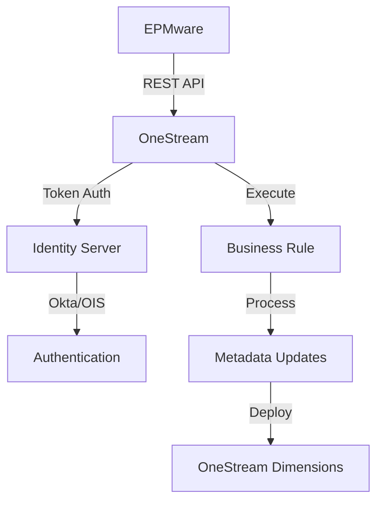

# OneStream Configuration

This appendix provides detailed requirements for integrating EPMware with OneStream XF applications, enabling metadata import and direct deployment through REST APIs.

## Overview

The OneStream integration enables EPMware to manage OneStream dimensions and hierarchies with full bi-directional synchronization. This integration supports both on-premise and cloud OneStream deployments through secure REST API connections.

## Integration Architecture



---

## Prerequisites

<div class="grid cards">
  <div class="card">
    <h3>🔑 Authentication</h3>
    <p>Okta M2M or OIS Personal Access Token</p>
  </div>
  
  <div class="card">
    <h3>📦 EPMware DLL</h3>
    <p>Custom assembly for OneStream server</p>
  </div>
  
  <div class="card">
    <h3>👤 Service Account</h3>
    <p>REST API user with admin privileges</p>
  </div>
  
  <div class="card">
    <h3>🌐 Network Access</h3>
    <p>Whitelisted IP addresses</p>
  </div>
</div>

---

## Configuration Steps

### Step 1: Extract OneStream Artifacts

Required artifacts for EPMware import:

#### Application Artifacts

1. **Navigate to Application Tab**
   ```
   Application → Tools → Load/Extract
   ```

2. **Extract Required Files**

   | Artifact | Menu Selection | Save As |
   |----------|---------------|---------|
   | **Properties** | Application Properties | `ApplicationProperties.xml` |
   | **Metadata** | Metadata → Dimensions & Business Rules | `<AppName>_Metadata.xml` |
   | **Workflows** | Workflow Channels | `WorkflowChannels.xml` |

#### Security Artifacts

1. **Navigate to Security Tab**
   ```
   Security → Tools → Load/Extract
   ```

2. **Extract Security Groups**
   - Select: Security → Security Groups
   - Save as: `Security_Groups.xml`

#### Package for Import

Create ZIP file with all artifacts:
```
onestream_import.zip
├── ApplicationProperties.xml
├── GolfStream_Metadata.xml
├── WorkflowChannels.xml
└── Security_Groups.xml
```

---

### Step 2: Configure OneStream for Deployment

#### Create Business Rule

1. **Access Business Rules**
   ```
   Application → Tools → Business Rules
   ```

2. **Create Extender Rule**
   - Click New Business Rule
   - Type: **Extender**
   - Name: `EPMWARE_DataMgmt`
   - Save

3. **Configure Properties**
   
   | Property | Value |
   |----------|-------|
   | **Referenced Assemblies** | `XF\EPMWARE.dll` |
   | **Language** | Visual Basic |

4. **Add Formula Code**

<details>
<summary>Click to view Business Rule code</summary>

```vb
Imports System
Imports System.Data
Imports System.Data.Common
Imports System.IO
Imports System.Collections.Generic
Imports Microsoft.VisualBasic
Imports OneStream.Finance.Engine
Imports OneStream.Finance.Database
Imports OneStream.BusinessRule.Extender.EPMWARE_DLL

Namespace OneStream.BusinessRule.Extender.EPMWARE_DataMgmt
    Public Class MainClass
        
        Public Function Main(ByVal si As SessionInfo, _
                           ByVal globals As BRGlobals, _
                           ByVal api As Object, _
                           ByVal args As ExtenderArgs) As Object
            Try
                Dim MainClass As New EWMainClass()
                Return MainClass.Main(si, globals, api, args)
            Catch ex As Exception
                Throw ErrorHandler.LogWrite(si, New XFException(si, ex))
            End Try
        End Function
        
    End Class
End Namespace
```

</details>

#### Create Data Management Group

1. **Access Data Management**
   ```
   Application → Tools → Data Management
   ```

2. **Create Group**
   - Click New Data Management Group
   - Name: `EPMWARE Metadata Adapter`
   - Save

#### Create Sequence

1. **Select EPMWARE Metadata Adapter**
2. **Create Sequence**
   - Click Create Sequence icon
   - Name: `Deploy Metadata`
   - Save

#### Create and Assign Step

1. **Create Step**
   - Click Step icon
   - Type: Execute Business Rule
   - Language: Visual Basic
   - Name: `Deploy Metadata`

2. **Assign Business Rule**
   - Select `EPMWARE_DataMgmt`
   - Save

3. **Add to Sequence**
   - Select Deploy Metadata sequence
   - Go to Sequence Steps tab
   - Add Deploy Metadata step
   - Save

---

### Step 3: Configure Authentication

#### Option A: Okta Integration

**Okta Administrator provides:**

| Parameter | Description | Example |
|-----------|-------------|---------|
| `OS_REST_API_CLIENT_ID` | M2M Client ID | `0oa1b2c3d4e5f6g7h8i9` |
| `OS_REST_API_CLIENT_SECRET_KEY` | M2M Secret Key | `secretkey123...` |
| `OS_REST_API_SCOPE` | OAuth Scope | `onestream_api` |
| `OS_REST_API_URL` | Token endpoint | `https://company.okta.com/oauth2/aus.../v1/token` |

#### Option B: OneStream Identity Server (OIS)

**OneStream provides:**

| Parameter | Description |
|-----------|-------------|
| `OS_REST_API_TOKEN` | Personal Access Token (PAT) |

#### Create REST API User

1. **System → Administration → Security**
2. **Create New User**
   
   | Field | Value |
   |-------|-------|
   | **User Name** | REST API |
   | **Group** | Administrators |
   | **External Auth Provider** | Okta (if using Okta) |
   | **External User Name** | Okta M2M Client ID |
   | **Internal Password** | Okta M2M Secret Key |

---

### Step 4: EPMware Configuration

#### Application Setup

1. **Create Application**
   ```
   Configuration → Applications → Configuration
   ```
   
   | Field | Value |
   |-------|-------|
   | **Application Type** | OneStream |
   | **Target Application** | OneStream app name |
   | **Deployment** | Direct |

2. **Configure Properties**

   Navigate to Properties tab:

   | Property | Description | Required |
   |----------|-------------|----------|
   | `OS_REST_API_USERNAME` | REST API user | ✅ |
   | `OS_REST_API_CLIENT_ID` | Okta client ID | If Okta |
   | `OS_REST_API_CLIENT_SECRET_KEY` | Okta secret | If Okta |
   | `OS_REST_API_TOKEN` | OIS PAT | If OIS |
   | `OS_REST_API_URL` | Auth endpoint | ✅ |
   | `OS_REST_URL` | OneStream URL | ✅ |
   | `OS_APPLICATION_NAME` | App name | ✅ |
   | `OS_APPLICATION_TYPE` | App type | ✅ |

#### Additional Properties

| Property | Default | Description |
|----------|---------|-------------|
| `OS_DIM_CONSTRAINT_DELIMITER` | `~` | Constraint separator |
| `OS_REST_JOB_CHECK_INTERVAL` | 5 | Seconds between checks |
| `OS_REST_JOB_CHECK_MAX_TIME` | 300 | Max wait time (seconds) |

---

### Step 5: Server Configuration

#### Install EPMWARE.dll

1. **Locate Assembly Folder**
   - Check OneStream config file
   - Find `BusinessRuleAssemblyFolder`

2. **Copy DLL**
   - Place `EPMWARE.dll` in folder
   - Restart OneStream services

!!! important "DLL Version"
    The EPMWARE.dll is provided by EPMware support. Contact support@epmware.com to obtain the correct version for your OneStream installation.

#### Network Whitelisting

1. **Submit Request to EPMware**
   - Email: support@epmware.com
   - Provide public IP address

2. **OneStream Configuration**
   - Add EPMware IP to whitelist
   - Configure as Public IP
   - No VPN required

---

## Testing & Validation

### Connection Test

1. **Test Authentication**
   ```
   Configuration → Infrastructure → Servers
   - Select OneStream server
   - Test Connection
   ```

2. **Verify Response**
   - Success: Token obtained
   - Failure: Check credentials

### Import Test

1. **Manual Import**
   - Upload ZIP file
   - Verify dimensions load
   - Check properties

2. **Validation Points**
   - [ ] All dimensions imported
   - [ ] Properties populated
   - [ ] Hierarchies intact
   - [ ] Workflow channels present

### Deployment Test

1. **Create Test Request**
   - Add simple member
   - Submit through workflow
   - Approve request

2. **Monitor Deployment**
   - Check deployment monitor
   - Verify in OneStream
   - Review logs

---

## OneStream-Specific Validations

### Member Name Rules

**Reserved Words** (Cannot use):
```
Account, All, Cons, Consolidation, Default, DimType, 
Entity, EntityDefault, Flow, IC, None, Origin, POV, 
Parent, Root, RootAccountDim, RootEntityDim, etc.
```

### Special Characters

**Prohibited Characters**:
```
! # % & * + , - / ; < = > ? @ [ \ ] ^ { | } "
```

### Dimension Properties

| Property | Max Length | Type | Required |
|----------|------------|------|----------|
| Member Name | 80 | Alphanumeric | ✅ |
| Description | 80 | Text | ✅ |
| Formula | Unlimited | Text | Optional |
| Constraint | Varies | Special format | Optional |

---

## Troubleshooting

### Common Issues

| Issue | Symptoms | Solution |
|-------|----------|----------|
| **Auth Failure** | 401/403 errors | Verify Okta/OIS credentials |
| **DLL Not Found** | Business rule error | Check DLL location and version |
| **Timeout** | Deployment hangs | Increase timeout settings |
| **Network Error** | Connection refused | Verify whitelisting |

### Debug Steps

1. **Check OneStream Logs**
   ```
   System → Administration → System Logs
   ```

2. **Verify EPMware Logs**
   ```
   Administration → Services → View Logs
   ```

3. **Test Components**
   - Business rule execution
   - Data management sequence
   - REST API connectivity

### Log Locations

| Component | Log Location |
|-----------|-------------|
| **OneStream Server** | `\FileShare\SystemReports\ErrorLog` |
| **EPMware Agent** | Check deployment monitor |
| **Business Rule** | OneStream error log |

---

## Best Practices

### Security
- 🔐 Use dedicated service accounts
- 🔑 Rotate tokens regularly
- 📝 Enable comprehensive auditing
- 🛡️ Restrict IP access

### Performance
- ⚡ Batch metadata changes
- 📊 Monitor API usage
- 🎯 Optimize business rules
- 📈 Schedule during off-peak

### Maintenance
- 📋 Document all configurations
- 🔄 Test after OneStream updates
- 📦 Keep EPMWARE.dll current
- 🗂️ Archive old configurations

---

## Quick Reference

### API Endpoints

| Operation | Endpoint Pattern |
|-----------|------------------|
| **Authentication** | `/api/Authentication/Authenticate` |
| **Execute Rule** | `/api/DataManagement/ExecuteStep` |
| **Job Status** | `/api/DataManagement/GetStatus` |

### OneStream Ports

| Service | Default Port | Protocol |
|---------|-------------|----------|
| **XF Application** | 50001 | HTTPS |
| **Database** | 1433 | SQL |
| **File Share** | 445 | SMB |

### Required Roles

| Role | Purpose |
|------|---------|
| **Administrator** | Full integration access |
| **Workflow Admin** | Deploy metadata |
| **Application Admin** | Manage dimensions |

---

## Migration Checklist

### Pre-Migration
- [ ] Export all OneStream artifacts
- [ ] Document current configuration
- [ ] Identify custom properties
- [ ] Plan deployment schedule

### Configuration
- [ ] Install EPMWARE.dll
- [ ] Create business rules
- [ ] Setup data management
- [ ] Configure authentication

### Testing
- [ ] Import test data
- [ ] Validate hierarchies
- [ ] Test deployment
- [ ] Verify audit trail

### Go-Live
- [ ] Production import
- [ ] Train users
- [ ] Monitor deployments
- [ ] Document issues

---

## Support Resources

### EPMware Support
📧 **Email**: support@epmware.com  
📞 **Phone**: 408-614-0442

### OneStream Resources
- OneStream Community
- OneStream Academy
- Partner Portal

### Related Documentation
- [Application Configuration](../configuration/applications.md)
- [Deployment Management](../deployment/index.md)
- [Logic Builder](../logic-builder/index.md)

!!! tip "Integration Tip"
    Always test the integration after OneStream platform updates. The XF platform is regularly updated, and API changes may affect the integration.