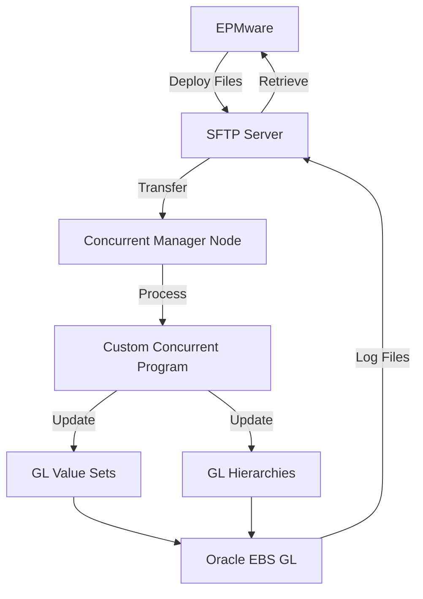
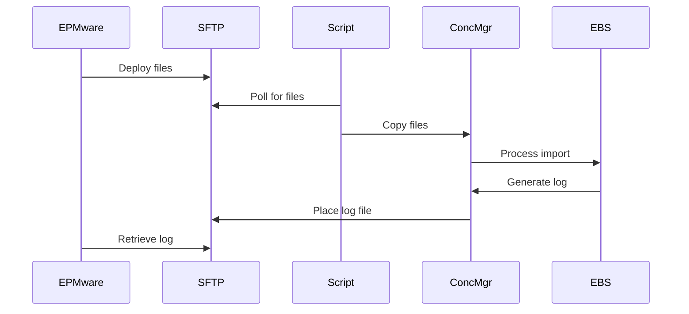

# Oracle EBS GL Integration

This appendix provides comprehensive instructions for configuring Oracle E-Business Suite General Ledger integration with EPMware, enabling automated metadata deployment through concurrent programs.


*Oracle EBS GL integration architecture with EPMware*

## Overview

The Oracle EBS GL integration enables EPMware to deploy Chart of Accounts (COA) metadata to Oracle E-Business Suite through a secure SFTP-based file transfer mechanism with concurrent program processing.

## Solution Architecture


*Complete solution architecture showing SFTP and concurrent program flow*



---

## Prerequisites

<div class="grid cards">
  <div class="card">
    <h3>📄 Database Objects</h3>
    <p>PL/SQL packages and views installed in EBS database</p>
  </div>
  
  <div class="card">
    <h3>⚙️ Concurrent Programs</h3>
    <p>Custom programs registered in Oracle EBS</p>
  </div>
  
  <div class="card">
    <h3>🔐 SFTP Server</h3>
    <p>Secure file transfer server accessible by both systems</p>
  </div>
  
  <div class="card">
    <h3>👤 Service Accounts</h3>
    <p>EBS user with GL responsibilities</p>
  </div>
</div>

---

## Component Overview

| Component | Supplied By | Configured By | Purpose |
|-----------|------------|---------------|---------|
| **Database Code** | EPMware | Customer DBA | Process metadata updates |
| **Concurrent Programs** | EPMware | GL Administrator | Execute import/export |
| **SFTP Server** | Customer | EPMware | File transfer |
| **EPMware Agent** | EPMware | EPMware | Orchestrate deployment |

---

## Step 1: Install Database Objects

### Required Objects

Install in the following order using APPS schema:

1. **Database View**
   ```sql
   -- xxps_gl_epmware_coa_v.sql
   -- Provides COA structure view
   @xxps_gl_epmware_coa_v.sql
   ```

2. **Package Specification**
   ```sql
   -- xxps_gl_epmware_coa_pkg.pks
   -- Defines package interface
   @xxps_gl_epmware_coa_pkg.pks
   ```

3. **Package Body**
   ```sql
   -- xxps_gl_epmware_coa_pkg.pkb
   -- Contains processing logic
   @xxps_gl_epmware_coa_pkg.pkb
   ```

!!! important "Installation Order"
    Objects must be installed in the exact order shown above to resolve dependencies.

### Verification

```sql
-- Verify installation
SELECT object_name, object_type, status
FROM user_objects
WHERE object_name LIKE 'XXPS_GL_EPMWARE%'
ORDER BY object_type, object_name;
```

---

## Step 2: Configure Concurrent Programs

### Option A: Import via LDT Files

Quick setup using delivered LDT files:

```bash
# Import concurrent programs
FNDLOAD apps/password 0 Y UPLOAD $FND_TOP/patch/115/import/afcpprog.lct XXPS_GL_EPMWARE_IMPORT_COA.ldt
FNDLOAD apps/password 0 Y UPLOAD $FND_TOP/patch/115/import/afcpprog.lct XXPS_GL_EPMWARE_EXPORT_COA.ldt
```

### Option B: Manual Configuration

#### Register Executables

**Executable 1: Export**


*Registering XXPS_GL_EPMWARE_EXPORT_COA executable*

| Field | Value |
|-------|-------|
| **Executable Name** | XXPS_GL_EPMWARE_EXPORT_COA |
| **Short Name** | XXPS_GL_EXP |
| **Application** | General Ledger |
| **Execution Method** | PL/SQL Stored Procedure |
| **Execution File Name** | xxps_gl_epmware_coa_pkg.export_coa |

**Executable 2: Import**


*Registering XXPS_GL_EPMWARE_IMPORT_COA executable*

| Field | Value |
|-------|-------|
| **Executable Name** | XXPS_GL_EPMWARE_IMPORT_COA |
| **Short Name** | XXPS_GL_IMP |
| **Application** | General Ledger |
| **Execution Method** | PL/SQL Stored Procedure |
| **Execution File Name** | xxps_gl_epmware_coa_pkg.import_coa |

#### Create Concurrent Programs

**Program 1: Export COA Files**


*EPMWARE - Export COA Files concurrent program definition*

| Field | Value |
|-------|-------|
| **Program Name** | EPMWARE - Export COA Files |
| **Short Name** | XXPS_GL_EXPORT |
| **Application** | General Ledger |
| **Executable** | XXPS_GL_EPMWARE_EXPORT_COA |
| **Output Format** | Text |
| **Save Output** | Yes |

**Program 2: Import COA Files**


*EPMWARE - Import COA Files concurrent program definition*

| Field | Value |
|-------|-------|
| **Program Name** | EPMWARE - Import COA Files |
| **Short Name** | XXPS_GL_IMPORT |
| **Application** | General Ledger |
| **Executable** | XXPS_GL_EPMWARE_IMPORT_COA |
| **Output Format** | Text |
| **Save Output** | Yes |

#### Configure Incompatibilities


*Setting concurrent program incompatibilities*

Set programs as incompatible with themselves:

1. Navigate to concurrent program definition
2. Click **Incompatibilities** button
3. Add program to its own incompatibility list
4. Save

!!! warning "Critical Setting"
    Incompatibility prevents concurrent execution conflicts when multiple requests are submitted.

---

## Step 3: Configure Parameters

### Parameter Setup

Both programs require the following parameters:

#### Export Program Parameters


*COA Code parameter configuration*


*Database Directory parameter configuration*


*Segment Name parameter configuration*


*Send Email parameter configuration*


*Email Server parameter configuration*

#### Import Program Parameters


*Import program COA Code parameter*


*Import program Database Directory parameter*


*Import program Segment Name parameter*

| Parameter | Type | Default | Description |
|-----------|------|---------|-------------|
| **COA Code** | Char(30) | Your COA | Chart of Accounts identifier |
| **Database Directory** | Char(100) | EW_DATA_DIR | Oracle directory for files |
| **Segment Name** | Char(30) | Specific segment | GL segment to process |
| **Send Email** | Char(1) | N | Email notification flag |
| **Email Server** | Char(100) | smtp.company.com | SMTP server address |

### Directory Configuration

Create Oracle directory:
```sql
-- As SYS or SYSTEM user
CREATE OR REPLACE DIRECTORY EW_DATA_DIR AS '/u01/app/epmware/data';
GRANT READ, WRITE ON DIRECTORY EW_DATA_DIR TO APPS;
```

---

## Step 4: Add to Request Group


*Adding concurrent programs to GL Request Group*

Add concurrent programs to appropriate request group:
1. Navigate to System Administrator responsibility
2. Security → Responsibility → Request
3. Find GL request group
4. Add both EPMWARE programs
5. Save

---

## Step 5: Configure SFTP Server

### EPMware Configuration

1. **Create Server Entry**
   ```
   Configuration → Infrastructure → Servers
   ```


*SFTP server configuration in EPMware*

| Field | Value |
|-------|-------|
| **Server Name** | ebs-sftp.company.com |
| **On-Premise** | Unchecked |
| **User Name** | sftpuser |
| **Password/Key** | Configure authentication |
| **Port** | 22 |

2. **Test Connection**
   - Click "Test Connection"
   - Verify success message

### Directory Structure

Configure on SFTP server:
```
/sftp/epmware/
├── inbound/      # EPMware places files here
├── outbound/     # EBS places log files here
└── archive/      # Processed files
```

---

## Step 6: Application Configuration

### EPMware Application Setup

1. **Application Properties**
   ```
   Configuration → Applications → Configuration
   ```


*Oracle EBS application configuration in EPMware*

| Field | Value |
|-------|-------|
| **Application Type** | ORACLE-EBS |
| **Deployment** | File |
| **Deployment Server** | SFTP server created above |

2. **Application-Specific Properties**


*Application properties for Oracle EBS GL integration*

| Property | Default | Description |
|----------|---------|-------------|
| `FLEX_CODE` | GL# | Flexfield code |
| `FLEXFIELD_STRUCTURE_CODE` | OPERATIONS | Structure identifier |
| `DEPLOYMENT_REMOTE_DIR_INBOUND` | ./inbound | SFTP inbound directory |
| `DEPLOYMENT_REMOTE_DIR_OUTBOUND` | ./outbound | SFTP outbound directory |
| `DEPLOYMENT_LOG_FILE_RETRIEVE` | Y | Retrieve log files |
| `DEPLOYMENT_LOG_FILE_DELETE_AFTER_RETRIEVAL` | Y | Clean up logs |

### Dimension Properties


*Dimension properties for deployment file naming*

Configure for each GL segment:

| Property | Description | Example |
|----------|-------------|---------|
| `OVERRIDE_HIERARCHY_DEPLOY_FILE_NAME` | Custom hierarchy file name | `<DIM_NAME>_HIERARCHIES_DDMONRRRR.txt` |
| `OVERRIDE_VALUESET_DEPLOY_FILE_NAME` | Custom value set file name | `<DIM_NAME>_VALUESET_DDMONRRRR.txt` |

**Supported Tags**:
- `<DIM_NAME>` - Dimension name
- `DDMONRRRR` - Date stamp
- `DDMONRRRR_HH24MISS` - Date/time stamp

---

## Step 7: Schedule Processing

### Concurrent Request Scheduling


*Scheduling EPMWARE Import concurrent request*

1. **Submit Import Program**
   - Responsibility: GL Super User
   - Program: EPMWARE - Import COA Files
   - Schedule: Every 15 minutes

2. **Scheduling Options**
   
   | Option | Setting |
   |--------|---------|
   | **Periodicity** | Every 15 minutes |
   | **Start Time** | 00:00 |
   | **End Date** | No end date |
   | **Save Output** | Yes |

### File Processing Workflow



---

## File Specifications

### Deployment File Format

**Value Set File** (`ACCOUNT_VALUESET_20250115.txt`):
```csv
VALUE,DESCRIPTION,ENABLED_FLAG,START_DATE,END_DATE,SUMMARY_FLAG,POSTING_FLAG
1000,Cash,Y,01-JAN-2020,,N,Y
1001,Petty Cash,Y,01-JAN-2020,,N,Y
```

**Hierarchy File** (`ACCOUNT_HIERARCHIES_20250115.txt`):
```csv
PARENT_VALUE,CHILD_VALUE,RANGE_ATTRIBUTE
ASSETS,1000,S
ASSETS,1001,S
```

### Log File Format

Log files returned by EBS:
```
LOG_ACCOUNT_VALUESET_20250115.log
LOG_ACCOUNT_HIERARCHIES_20250115.log
```

---

## Testing & Validation

### Test Deployment

1. **Create Test Request**
   - Add new GL value
   - Submit through workflow
   - Approve request

2. **Monitor Deployment**
   - Check EPMware deployment monitor
   - Verify file on SFTP server
   - Monitor concurrent request


*Monitoring concurrent request execution status*

3. **Validate in EBS**
   - Query value set
   - Verify hierarchy
   - Check effective dates

### Validation Queries

```sql
-- Check value set values
SELECT flex_value, description, enabled_flag
FROM fnd_flex_values_vl
WHERE flex_value_set_id = (
    SELECT flex_value_set_id
    FROM fnd_flex_value_sets
    WHERE flex_value_set_name = 'YOUR_VALUE_SET'
);

-- Check hierarchies
SELECT parent_flex_value, child_flex_value
FROM fnd_flex_value_norm_hierarchy
WHERE flex_value_set_id = (
    SELECT flex_value_set_id
    FROM fnd_flex_value_sets
    WHERE flex_value_set_name = 'YOUR_VALUE_SET'
);
```

---

## Troubleshooting

### Common Issues

| Issue | Symptom | Solution |
|-------|---------|----------|
| **Files not processing** | Files remain on SFTP | Check concurrent program schedule |
| **Import errors** | Concurrent request errors | Review log files for details |
| **Missing values** | Values not in EBS | Verify file format and delimiters |
| **Permission denied** | Directory access errors | Check Oracle directory grants |
| **Connection timeout** | SFTP connection fails | Verify network and credentials |

### Debug Checklist

1. **EPMware Side**
   - [ ] Deployment monitor shows success
   - [ ] Files created on SFTP
   - [ ] Correct file naming
   - [ ] Valid file format

2. **EBS Side**
   - [ ] Concurrent program enabled
   - [ ] Schedule active
   - [ ] Directory accessible
   - [ ] Database objects valid

3. **Network/SFTP**
   - [ ] SFTP server accessible
   - [ ] Permissions correct
   - [ ] Sufficient disk space
   - [ ] File transfer complete

### Log Analysis


*Viewing concurrent request log file for debugging*

Check concurrent request log:
```sql
SELECT request_id, phase_code, status_code, 
       logfile_name, outfile_name
FROM fnd_concurrent_requests
WHERE concurrent_program_id = (
    SELECT concurrent_program_id
    FROM fnd_concurrent_programs_vl
    WHERE user_concurrent_program_name = 'EPMWARE - Import COA Files'
)
ORDER BY request_date DESC;
```

---

## Best Practices

### Security
- 🔐 Use SSH keys for SFTP authentication
- 👤 Dedicated service accounts
- 📝 Enable audit trails
- 🔒 Restrict directory access

### Performance
- ⚡ Process files in batches
- 📊 Monitor file sizes
- 🕐 Schedule during low usage
- 🗂️ Archive processed files

### Maintenance
- 📋 Document custom code
- 🔄 Regular testing
- 🗑️ Cleanup old files
- 📈 Monitor disk usage

---

## Quick Reference

### File Naming Patterns

| Pattern | Example | Description |
|---------|---------|-------------|
| Static | `ACCOUNT_VALUESET.txt` | Fixed name |
| Date | `ACCOUNT_VALUESET_20250115.txt` | With date stamp |
| DateTime | `ACCOUNT_VALUESET_20250115_143022.txt` | With timestamp |

### Concurrent Program Commands

```sql
-- Check program status
SELECT user_concurrent_program_name, enabled_flag
FROM fnd_concurrent_programs_vl
WHERE user_concurrent_program_name LIKE 'EPMWARE%';

-- View recent executions
SELECT request_id, actual_start_date, actual_completion_date,
       phase_code, status_code
FROM fnd_concurrent_requests
WHERE program_application_id = 101  -- GL application ID
  AND concurrent_program_id IN (
    SELECT concurrent_program_id
    FROM fnd_concurrent_programs
    WHERE concurrent_program_name LIKE 'XXPS_GL%'
  )
ORDER BY request_id DESC;
```

---

## Migration Checklist

### Pre-Implementation
- [ ] Document current COA structure
- [ ] Identify segments to manage
- [ ] Plan deployment schedule
- [ ] Setup test environment

### Implementation
- [ ] Install database objects
- [ ] Configure concurrent programs
- [ ] Setup SFTP server
- [ ] Configure EPMware

### Testing
- [ ] Test file transfer
- [ ] Validate concurrent program
- [ ] Test full deployment
- [ ] Verify in EBS

### Go-Live
- [ ] Production deployment
- [ ] Monitor first cycle
- [ ] Document issues
- [ ] Train users

---

## Support Resources

### EPMware Support
📧 **Email**: support@epmware.com  
📞 **Phone**: 408-614-0442

### Oracle Resources
- My Oracle Support (MOS)
- EBS Documentation Library
- Oracle Forums

### Related Documentation
- [Application Configuration](../configuration/applications.md)
- [Deployment Management](../deployment/index.md)
- [ERP Import Module](../erp-import/index.md)

!!! tip "Performance Tip"
    For large hierarchies (>10,000 members), consider splitting segments into multiple concurrent programs running in parallel to improve processing time.