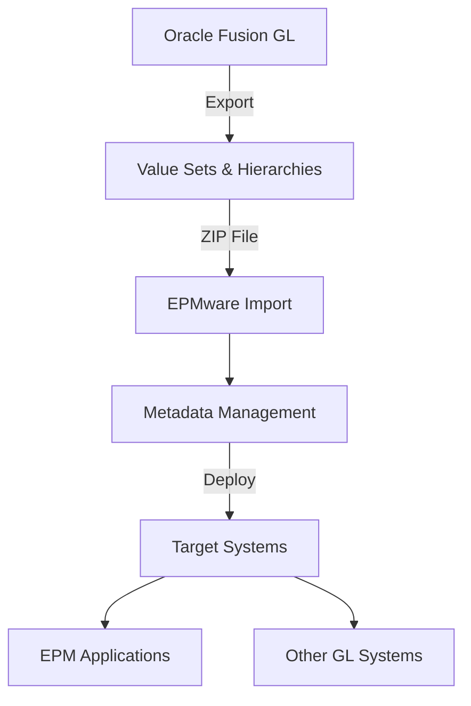

# Oracle Fusion GL Integration

This appendix provides detailed instructions for configuring Oracle Fusion General Ledger integration with EPMware, enabling metadata export from Fusion GL and import into EPMware for centralized management.

## Overview

The Oracle Fusion GL integration allows EPMware to manage Chart of Accounts (COA) hierarchies and value sets, providing centralized control over financial dimensions with automated deployment capabilities.

## Integration Architecture



---

## Configuration Steps

<div class="grid cards">
  <div class="card">
    <h3>1️⃣ Export from Fusion</h3>
    <p>Extract value sets and hierarchies from Oracle Fusion GL</p>
    <a href="#step-1-export-fusion-metadata" class="md-button">Configure →</a>
  </div>
  
  <div class="card">
    <h3>2️⃣ Prepare Files</h3>
    <p>Format and package files for EPMware import</p>
    <a href="#step-2-prepare-import-files" class="md-button">Prepare →</a>
  </div>
  
  <div class="card">
    <h3>3️⃣ Configure EPMware</h3>
    <p>Setup application and dimension configuration</p>
    <a href="#step-3-configure-epmware" class="md-button">Setup →</a>
  </div>
  
  <div class="card">
    <h3>4️⃣ Import & Validate</h3>
    <p>Load metadata and verify configuration</p>
    <a href="#step-4-import-metadata" class="md-button">Import →</a>
  </div>
</div>

---

## Step 1: Export Fusion Metadata

### Export Value Set Values

1. **Access Value Sets**
   - Login to Oracle Fusion
   - Navigate to **Setup and Maintenance**
   - Open **Chart of Accounts Value Set Values**

2. **Search and Select**
   - Search for your Chart of Accounts
   - Select the Value Set to export
   - Click **Manage Values**

3. **Export Process**
   - Click **Search** to display all values
   - Select **Actions → Export to Excel**
   - Save file as `<DIMENSION_NAME>.xls`

!!! important "File Naming"
    File names must match dimension names exactly. For example, if your dimension is "Account", save as `Account.xls`

### Export Hierarchies

1. **Access Hierarchies**
   - Navigate to **Manage Account Hierarchies**
   - Select the tree to export

2. **Export Hierarchy**
   - Open hierarchy tree view
   - Click **Export** icon
   - Save as `<DIMENSION_NAME>_Hierarchies.xls`

### File Naming Convention

| File Type | Naming Pattern | Example |
|-----------|---------------|---------|
| **Value Sets** | `<DimensionName>.xls` | `Account.xls` |
| **Hierarchies** | `<DimensionName>_Hierarchies.xls` | `Account_Hierarchies.xls` |

---

## Step 2: Prepare Import Files

### Create ZIP Package

Package exported files for EPMware import:

```
fusion_gl_export.zip
├── Account.xls
├── Account_Hierarchies.xls
├── CostCenter.xls
├── CostCenter_Hierarchies.xls
├── Company.xls
└── Company_Hierarchies.xls
```

### File Structure Requirements

#### Value Set File Format

| Column | Description | Required |
|--------|-------------|----------|
| Value | Segment value code | ✅ |
| Description | Value description | ✅ |
| Enabled | Y/N flag | ✅ |
| Start Date | Effective from | ✅ |
| End Date | Effective to | Optional |
| Sort Order | Display sequence | Optional |

#### Hierarchy File Format

| Column | Description | Required |
|--------|-------------|----------|
| Parent Value | Parent node | ✅ |
| Range Size | Single/Range | ✅ |
| Child Value | Child node | ✅ |

---

## Step 3: Configure EPMware

### Application Setup

1. **Create Application**
   ```
   Configuration → Applications → Configuration
   ```
   
   | Field | Value |
   |-------|-------|
   | **Application Name** | User-defined (e.g., "Fusion_GL") |
   | **Target Application** | Same as Application Name |
   | **Application Type** | ORACLE-FUSION-CLOUD |
   | **Deployment** | File or Direct |

2. **Configure Properties**
   
   Navigate to **Properties** tab and configure:

   | Property | Description | Example |
   |----------|-------------|---------|
   | `COA_CODE` | Chart of Accounts identifier | US_COA |
   | `DEPLOYMENT_METHOD` | Integration approach | REST_API |
   | `SEGMENT_SEPARATOR` | Hierarchy delimiter | . (period) |

### Dimension Configuration

1. **Register Dimensions**
   
   For each value set, create a dimension:

   ```
   Configuration → Dimensions → Configuration
   ```

   | Dimension Class | Dimension Name | Description |
   |-----------------|----------------|-------------|
   | Account | Account | GL Natural Account |
   | Generic | CostCenter | Cost Center Hierarchy |
   | Generic | Company | Legal Entity Structure |

2. **Configure Properties**
   
   For each dimension, set properties:

   | Property | Value | Description |
   |----------|-------|-------------|
   | `MAX_LENGTH` | 30 | Maximum value length |
   | `VALIDATION_TYPE` | Independent | Value set type |
   | `SECURITY_ENABLED` | Y/N | Enable security rules |

### Dimension Properties Reference

Review Value Set configuration in Fusion to determine properties:

1. Navigate to **Manage Account Hierarchies** in Fusion
2. Note the following settings:
   - Maximum value length
   - Format type (Char/Number)
   - Validation type
   - Security rules

---

## Step 4: Import Metadata

### Import Process

1. **Upload ZIP File**
   - Navigate to **Configuration → Applications**
   - Click Import icon for your application
   - Select **Manual Import**
   - Browse and select ZIP file

2. **Import Execution**
   - Click **Import** button
   - Monitor progress bar
   - Review import status

3. **Validation**
   - Check hierarchy structure
   - Verify properties imported
   - Validate member counts

### Import Status Indicators

| Status | Description | Action |
|--------|-------------|--------|
| ✅ **Success** | All data imported | Review hierarchies |
| ⚠️ **Warning** | Partial import | Check warnings log |
| ❌ **Error** | Import failed | Review error details |

---

## Deployment Configuration

### Deployment to Fusion GL

Configure EPMware to deploy changes back to Fusion GL:

1. **REST API Configuration**
   ```javascript
   // Example REST endpoint configuration
   {
     "endpoint": "https://fusion-instance.oraclecloud.com/fscmRestApi/resources",
     "method": "POST",
     "authentication": "Basic",
     "content-type": "application/json"
   }
   ```

2. **Deployment Properties**
   
   | Property | Value | Description |
   |----------|-------|-------------|
   | `DEPLOY_URL` | Fusion REST endpoint | Target URL |
   | `BATCH_SIZE` | 100 | Records per batch |
   | `TIMEOUT` | 300 | Seconds |

### Process Monitoring

#### Check Fusion Process Status

1. **Access Scheduled Processes**
   - Login to Fusion
   - Navigate to **Tools → Scheduled Processes**

2. **View Request Status**
   - Check process status
   - Review log files
   - Verify completion

#### Request ID Tracking

| View Type | Purpose | Usage |
|-----------|---------|-------|
| **Flat List** | Simple status view | Quick checks |
| **Hierarchical** | Parent-child processes | Detailed analysis |

---

## Validation & Testing

### Pre-Import Validation

- [ ] All value sets exported
- [ ] Hierarchies complete
- [ ] File names match dimensions
- [ ] ZIP structure correct

### Post-Import Validation

- [ ] Member counts match
- [ ] Hierarchies intact
- [ ] Properties populated
- [ ] No orphaned members

### Test Deployment

1. Create test request
2. Make minor change
3. Deploy to Fusion
4. Verify in target

---

## Best Practices

### Data Management
- 📅 **Schedule regular exports** - Keep EPMware synchronized
- 🔍 **Validate before import** - Check file formats
- 📊 **Monitor batch sizes** - Optimize performance
- 🔄 **Test in non-production** - Validate changes safely

### Security Considerations
- 🔐 Use service accounts for integration
- 🔑 Rotate credentials regularly
- 📝 Audit all changes
- 🛡️ Encrypt sensitive data

### Performance Optimization
- ⚡ Import during off-peak hours
- 📦 Batch large updates
- 🎯 Target specific dimensions
- 📈 Monitor processing times

---

## Troubleshooting

### Common Issues

| Issue | Cause | Solution |
|-------|-------|----------|
| **Import fails** | Incorrect file format | Verify Excel format and column headers |
| **Missing hierarchies** | Export incomplete | Re-export with all levels included |
| **Duplicate values** | Multiple value sets | Check value set assignments |
| **Property mismatch** | Configuration error | Review dimension properties |

### Debug Steps

1. **Check EPMware Logs**
   ```
   Administration → Services → View Logs
   ```

2. **Verify Fusion Configuration**
   - Value set settings
   - Hierarchy definitions
   - Security rules

3. **Test Connectivity**
   - REST API endpoints
   - Authentication
   - Network access

---

## Dimension Property Reference

### Required Dimension Properties

Configure these in EPMware for each Fusion GL dimension:

| Property Name | Description | Example | Required |
|--------------|-------------|---------|----------|
| `FLEX_VALUE_SET_NAME` | Value set identifier | ACCOUNT_VALUES | ✅ |
| `FLEX_VALUE_SET_ID` | Numeric ID | 1000234 | ✅ |
| `MAXIMUM_SIZE` | Max value length | 30 | ✅ |
| `ALPHANUMERIC_ALLOWED` | Allow letters | Y | ✅ |
| `UPPERCASE_ONLY` | Force uppercase | N | Optional |
| `NUMERIC_MODE` | Numbers only | N | Optional |
| `MIN_VALUE` | Range minimum | 1000 | Optional |
| `MAX_VALUE` | Range maximum | 9999 | Optional |

---

## Quick Reference

### File Specifications

| Specification | Requirement |
|---------------|-------------|
| **File Format** | Excel (.xls/.xlsx) |
| **Encoding** | UTF-8 |
| **Max File Size** | 50 MB per file |
| **Compression** | ZIP format |

### API Endpoints

| Operation | Endpoint |
|-----------|----------|
| **Value Sets** | `/fscmRestApi/resources/latest/valueSets` |
| **Hierarchies** | `/fscmRestApi/resources/latest/accountHierarchies` |
| **Validation** | `/fscmRestApi/resources/latest/glValidationRules` |

---

## Migration Checklist

Use this checklist for production migration:

### Preparation
- [ ] Document current COA structure
- [ ] Identify all value sets
- [ ] Map to EPMware dimensions
- [ ] Plan deployment schedule

### Configuration
- [ ] Create EPMware application
- [ ] Configure dimensions
- [ ] Set properties
- [ ] Setup security

### Testing
- [ ] Import test data
- [ ] Validate hierarchies
- [ ] Test deployment
- [ ] Verify audit trail

### Go-Live
- [ ] Production import
- [ ] User training
- [ ] Monitor first deployment
- [ ] Document issues

---

## Support Resources

### EPMware Support
📧 **Email**: support@epmware.com  
📞 **Phone**: 408-614-0442  

### Oracle Resources
- [Fusion GL Documentation](https://docs.oracle.com/en/cloud/saas/financials/)
- [REST API Guide](https://docs.oracle.com/en/cloud/saas/financials/rest-api/)
- Oracle Support Portal

### Related Documentation
- [Application Configuration](../configuration/applications.md)
- [Dimension Configuration](../configuration/dimensions.md)
- [ERP Import Module](../erp-import/index.md)

!!! tip "Integration Tip"
    Consider using EPMware's ERP Import module for automated, scheduled imports from Fusion GL. This provides better control over the integration process and comprehensive audit trails.