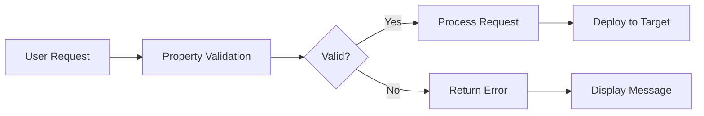

# Out of the Box Validations

EPMware provides comprehensive standard validations for supported applications, ensuring data integrity and compliance with target system requirements. These validations are automatically applied when applications are configured.


*Overview of standard validations in EPMware*

## Overview

All standard validations for supported application types are configured as Logic Scripts in the Logic Builder module. These validations are automatically assigned when an application is registered in EPMware.

### Key Features

- **Automatic Assignment** - Validations apply immediately upon application configuration
- **Property-Based** - Validations target specific member properties
- **Application-Specific** - Rules tailored to each target system's requirements
- **Customizable** - Clone and modify standard validations as needed


*Logic Builder module showing standard validation scripts with EW prefix*

---

## Validation Architecture

### How Validations Work



### Validation Assignment

When an application is imported or created, EPMware automatically:

1. Identifies the application type
2. Assigns corresponding validation scripts
3. Activates property-level checks
4. Enables real-time validation


*Association of standard validations to applications*

---

## Supported Applications

<div class="grid cards">
  <div class="card">
    <h3>☁️ Oracle Cloud EPM</h3>
    <ul>
      <li>PBCS - Planning & Budgeting</li>
      <li>FCCS - Financial Close</li>
      <li>TRCS - Tax Reporting</li>
      <li>ARCS - Account Reconciliation</li>
      <li>PCMCS - Profitability Management</li>
    </ul>
  </div>
  
  <div class="card">
    <h3>🏢 On-Premise EPM</h3>
    <ul>
      <li>HFM - Financial Management</li>
      <li>Essbase (ASO/BSO)</li>
      <li>Planning</li>
      <li>FDMEE - Data Management</li>
    </ul>
  </div>
  
  <div class="card">
    <h3>🔄 ERP Systems</h3>
    <ul>
      <li>Oracle Fusion Cloud</li>
      <li>Oracle EBS GL</li>
      <li>OneStream XF</li>
    </ul>
  </div>
</div>

---

## Oracle EPM Cloud Validations

### TRCS (Tax Reporting Cloud Service)

**Validation Script**: `EW_TRCS_VALIDATIONS`


*TRCS validation configuration in Property Validations*

#### Member Name & Alias Validations

| Validation | Rule | Max Length |
|------------|------|------------|
| **Member Name** | No trailing/leading spaces | 76 chars |
| **Alias** | Unique within alias table | 80 chars |
| **Special Characters** | Not allowed: `" ] [ \t` | - |
| **Reserved Prefixes** | Cannot start with: OEP_, OFS_, OCX_ | - |

#### Prohibited Starting Characters
```
@ \ [ ] ( ) , - . / ; = + _ { | } < > "
```

#### Reserved Words
The following words cannot be used as member names:

<details>
<summary>Click to expand full list of reserved words</summary>

- ALL, AND, ASSIGN, AVERAGE, CALC, CALCMBR
- COPYFORWARD, CROSSDIM, CURMBRNAME
- DIM, DIMNAME, DIV, DYNAMIC
- EMPTYPARM, EQ, EQOP, EXCEPT, EXP
- FLOAT, FUNCTION, GE, GEN, GROUP, GT
- INTEGER, LE, LOCAL, LT
- MBR, MBRNAME, MINUS, MISSING, MUL
- NE, NON, NONINPUT, NOT, OR
- PERCENT, PLUS, RELOP, SET
- SKIPBOTH, SKIPMISSING, SKIPNONE, SKIPZERO
- STATUS, TO, TOP, TYPE
- UMINUS, UPPER, VARORXMBR
- $$UNIVERSE$$, #MISSING, #MI

</details>

### PCMCS (Profitability & Cost Management)

**Validation Script**: `EW_PCMCS_VALIDATIONS`

Similar to TRCS with additional rules:
- Member name max length: 80 characters
- Supports POV-specific validations
- Additional cost allocation constraints

### PBCS/Planning

**Validation Script**: `EW_HP_VALIDATIONS`


*PBCS and Planning validation rules configuration*

#### Key Validations

1. **Data Storage Property**
   - Label Only members cannot be leaf members
   - Label Only members cannot have formulas

2. **Account Type Property**
   - If Account Type = Expense, Variance Reporting must be "Expense"

3. **Variance Reporting Property**
   - Must align with Account Type settings

---

## Essbase Validations

**Validation Script**: `EW_ESSBASE_VALIDATIONS`

### ASO-Specific Rules


*Essbase ASO-specific validation configuration*

| Rule | Description | Applies To |
|------|-------------|------------|
| **Consolidation** | Stored hierarchies require (+) aggregation | ASO only |
| **Member Formula** | Dynamic hierarchies only | ASO/BSO |
| **Data Storage** | Parent members use Dynamic Calc | BSO only |

### Automation Options

#### Auto-Configure Data Storage (BSO)

**Script**: `EW_EB_DATA_STORAGE_PROP`

This optional script automatically:
- Sets parent members to "Dynamic Calc"
- Sets base members to "Store"
- Triggers on hierarchy changes


*Configuring automatic Data Storage property for BSO applications*

**Configuration Steps**:
1. Navigate to **Configuration → Dimensions → Hierarchy Actions**
2. Assign script as Post Hierarchy Action
3. Select "Create Member" action
4. Apply to dimension


*Assigning post-hierarchy action script to dimension*

---

## HFM Validations

**Validation Script**: `EW_HFM_VALIDATIONS`

### Character Restrictions

| Character Type | Prohibited | Notes |
|---------------|------------|-------|
| **Special Chars** | `" # * + , - . / ; @ { }` | In member names |
| **Ampersand** | & | In aliases only |
| **ICP Rules** | - | Special validation logic |

### ICP Validation Rules

If "Is ICP" = Y or R, then "ICP Top Member" must be assigned (cannot be "ICP None")

---

## ERP System Validations

### Oracle Fusion Cloud

**Validation Script**: `EW_FUSION_VALIDATIONS`


*Oracle Fusion GL validation configuration*

#### Dimension-Specific Rules

| Property | Validation | Configuration |
|----------|------------|---------------|
| **Member Length** | Max defined by segment | Set in dimension properties |
| **Numeric Members** | Account dimension only | NUMERIC_MEMBER_NAME = Y |
| **Summary Flag** | Required for parents | Auto-set to Y |
| **Allow Posting** | Disabled for parents | Auto-set to N |


*Dimension properties affecting validation rules*

### OneStream

**Validation Script**: `EW_ONESTREAM_VALIDATIONS`

#### Reserved Words
- Account, All, Cons, Consolidation
- Default, DimType, Entity
- Flow, Origin, IC, None, POV, Parent, Root
- All Root*Dim variations

#### Special Character Restrictions
```
! # % & * + , - / ; < = > ? @ [ \ ] ^ { | } "
```

---

## FDMEE Validations

**Validation Script**: `EW_FDMEE_VALIDATIONS`


*FDMEE mapping validation rules*

### Mapping Type Rules

| Mapping Type | Validation Rule |
|--------------|----------------|
| **EXPLICIT** | Source and Target required |
| **BETWEEN** | One comma required in Source |
| **IN** | No commas allowed in Source |
| **LIKE** | Must contain * or ? wildcard |

---

## Custom Validations

### Creating Custom Validations

1. **Clone Standard Validation**
   - Select standard script in Logic Builder
   - Right-click → Clone
   - Modify as needed


*Cloning a standard validation script for customization*

2. **Create New Validation**
   - Logic Builder → Create Script
   - Type: Property Validation
   - Write custom logic

3. **Assign to Application**
   - Configuration → Property → Validations
   - Add validation rule
   - Select target properties


*Assigning custom validation to application properties*

### Validation Script Structure

```javascript
// Example validation script structure
function validateProperty(context) {
    var memberName = context.getMemberName();
    var propValue = context.getPropertyValue();
    
    // Validation logic
    if (propValue.length > 80) {
        return {
            valid: false,
            message: "Property exceeds maximum length of 80 characters"
        };
    }
    
    return { valid: true };
}
```

---

## Validation Management

### Enabling/Disabling Validations


*Managing validation status in Property Validations screen*

| Action | Steps | Impact |
|--------|-------|--------|
| **Disable** | Uncheck "Enabled" box | Validation skipped |
| **Enable** | Check "Enabled" box | Validation active |
| **Delete** | Right-click → Delete | Permanent removal |

### Validation Priority

When multiple validations apply:

1. **Member-level** validations execute first
2. **Property-specific** validations next
3. **Dimension-level** validations
4. **Application-level** validations last

---

## Best Practices

### DO's ✅
- Test custom validations thoroughly
- Document validation rules
- Use descriptive error messages
- Keep validation logic simple
- Monitor validation performance

### DON'Ts ❌
- Don't modify standard validations directly
- Don't disable critical validations
- Don't create overlapping rules
- Don't use complex SQL in validations
- Don't ignore validation errors

---

## Troubleshooting

### Common Validation Issues

| Issue | Cause | Solution |
|-------|-------|----------|
| **Validation not firing** | Script disabled | Enable in configuration |
| **False positives** | Logic error | Review script logic |
| **Performance impact** | Complex SQL | Optimize queries |
| **Missing validations** | Not assigned | Check property assignments |

### Debug Steps

1. **Check Script Status**
   - Logic Builder → View script
   - Verify "Enabled" status

2. **Review Assignment**
   - Configuration → Property → Validations
   - Confirm application mapping

3. **Test Manually**
   - Create test request
   - Trigger specific validation
   - Review error messages


*Debug screen showing validation execution details*

---

## Quick Reference

### Validation Scripts by Application

| Application Type | Script Name | Auto-Applied |
|-----------------|-------------|--------------|
| **TRCS** | EW_TRCS_VALIDATIONS | ✅ |
| **PCMCS** | EW_PCMCS_VALIDATIONS | ✅ |
| **PBCS/Planning** | EW_HP_VALIDATIONS | ✅ |
| **Essbase** | EW_ESSBASE_VALIDATIONS | ✅ |
| **HFM** | EW_HFM_VALIDATIONS | ✅ |
| **FDMEE** | EW_FDMEE_VALIDATIONS | ✅ |
| **Fusion GL** | EW_FUSION_VALIDATIONS | ✅ |
| **OneStream** | EW_ONESTREAM_VALIDATIONS | ✅ |

### Optional Enhancement Scripts

| Script | Purpose | Application |
|--------|---------|-------------|
| **EW_EB_DATA_STORAGE_PROP** | Auto-set data storage | Essbase BSO |
| **EW_DERIVE_CONSOLIDATION** | Calculate consolidation | All |
| **EW_SMART_LIST_VALIDATION** | Validate smart lists | Planning |

---

## Support

For validation assistance:

📧 **Email**: support@epmware.com  
📞 **Phone**: 408-614-0442  

### Related Documentation
- [Logic Builder Guide](../logic-builder/index.md)
- [Property Configuration](../configuration/member-properties.md)
- [Application Configuration](../configuration/applications.md)

!!! tip "Validation Tip"
    Always test validation changes in a non-production environment first. Use the Logic Builder's validate function to check syntax before saving.