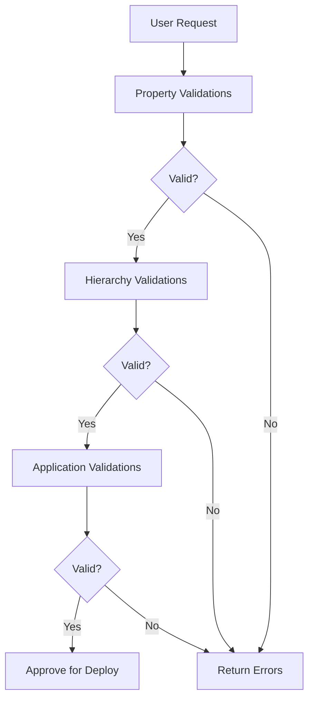

# Out of Box Validations

EPMware provides comprehensive standard validation rules for supported target applications, ensuring data integrity and compliance with application-specific requirements.

## Overview

Standard validations are pre-configured Logic Scripts that automatically enforce business rules and technical requirements for each supported application type. These validations prevent invalid metadata from being created or deployed, protecting your target systems from corruption and errors.

## Validation Framework



---

## Validation Categories

<div class="grid cards">
  <div class="card">
    <h3>📝 Member Name Rules</h3>
    <p>Character limits, reserved words, special characters</p>
  </div>
  
  <div class="card">
    <h3>🔤 Alias Validations</h3>
    <p>Uniqueness, length restrictions, character rules</p>
  </div>
  
  <div class="card">
    <h3>🏗️ Hierarchy Structure</h3>
    <p>Parent-child relationships, shared members, levels</p>
  </div>
  
  <div class="card">
    <h3>⚙️ Property Dependencies</h3>
    <p>Conditional rules, data storage, consolidation</p>
  </div>
</div>

---

## Application-Specific Validations

### Oracle EPM Cloud Applications

#### TRCS (Tax Reporting Cloud Service)

**Validation Script**: `EW_TRCS_VALIDATIONS`

| Validation Type | Rules | Examples |
|----------------|-------|----------|
| **Member Names** | • Max 76 characters<br>• No trailing/leading spaces<br>• Unique across dimensions | ✅ `TAX_2024`<br>❌ `TAX 2024 ` |
| **Aliases** | • Max 80 characters<br>• Unique within table<br>• No quotes, brackets, tabs | ✅ `Tax Year 2024`<br>❌ `Tax "2024"` |
| **Reserved Words** | Cannot use system terms | ❌ `CALC`, `MISSING`, `#MI` |
| **Prefixes** | Cannot begin with | ❌ `OEP_`, `FCCS_`, `TRCS_` |

**Special Characters Restrictions**:
- Cannot begin with: `@ \ [ , - = < ( . + " _ { | }`
- Cannot contain: `" ] [ \t`

#### PBCS (Planning and Budgeting Cloud Service)

**Validation Script**: `EW_HP_VALIDATIONS`

| Validation Type | Rules | Impact |
|----------------|-------|--------|
| **Length Limits** | 80 characters max | Prevents truncation |
| **Uniqueness** | Across all dimensions | Avoids conflicts |
| **Data Storage** | Label Only restrictions | Ensures calculation integrity |
| **Account Types** | Expense/Revenue rules | Maintains reporting accuracy |

**Conditional Validations**:
```
IF Account Type = "Expense" THEN
    Variance Reporting MUST = "Expense"
```

#### FCCS (Financial Consolidation)

Inherits PBCS validations plus:
- HFM legacy dimension mapping
- Consolidation method validations
- Intercompany rules

#### PCMCS (Profitability and Cost Management)

**Validation Script**: `EW_PCMCS_VALIDATIONS`

Similar to PBCS with additional:
- POV (Point of View) restrictions
- Assignment rule validations
- Driver dimension requirements

### On-Premise Applications

#### Essbase (ASO/BSO)

**Validation Script**: `EW_ESSBASE_VALIDATIONS`

| Validation Area | BSO Rules | ASO Rules |
|----------------|-----------|-----------|
| **Member Names** | 80 char limit | 80 char limit |
| **Consolidation** | Any operator | (+) only for stored |
| **Formulas** | Accounts only | Dynamic only |
| **Data Storage** | Parent/Child rules | Stored hierarchy rules |

**Special BSO Automation**: `EW_EB_DATA_STORAGE_PROP`
- Auto-sets parent members to "Dynamic Calc"
- Sets base members to "Store"

#### HFM (Hyperion Financial Management)

**Validation Script**: `EW_HFM_VALIDATIONS`

| Validation | Rule | Example |
|-----------|------|---------|
| **Special Characters** | No `# * + , - . / ; @ { }` | ✅ `CORP_2024` |
| **ICP Rules** | If IsICP=Y, then ICP Top required | Ensures ICP integrity |
| **Alias Restrictions** | No ampersand (&) | ✅ `Sales and Marketing` |

#### Planning (On-Premise)

Uses same validation as PBCS (`EW_HP_VALIDATIONS`)

### ERP Systems

#### Oracle Fusion Cloud

**Validation Script**: `EW_FUSION_VALIDATIONS`

| Validation | Requirement | Configuration |
|-----------|-------------|---------------|
| **Member Length** | Per segment definition | Set in dimension properties |
| **Numeric Values** | If NUMERIC_MEMBER_NAME=Y | Account codes only |
| **Date Rules** | End Date >= Start Date | Effective dating |
| **Posting Rules** | Parents: Summary=Y, Posting=N | Hierarchy integrity |

#### OneStream

**Validation Script**: `EW_ONESTREAM_VALIDATIONS`

| Category | Restrictions |
|----------|--------------|
| **Reserved Words** | Account, All, Cons, Default, Entity, None, POV, Parent, Root |
| **Special Characters** | `! # % & * + , - / ; < = > ? @ [ \ ] ^ { | } "` |
| **Length Limits** | 80 characters for names and aliases |

#### Oracle EBS GL

Custom validations based on:
- Flexfield definitions
- Value set rules
- Security rules
- Cross-validation rules

#### FDMEE (Data Management)

**Validation Script**: `EW_FDMEE_VALIDATIONS`

| Mapping Type | Validation Rules |
|-------------|------------------|
| **EXPLICIT** | Source and Target required |
| **BETWEEN** | One comma in source value |
| **IN** | No comma in source value |
| **LIKE** | Must contain * or ? |

---

## Validation Management

### Viewing Validations

1. **Logic Builder**
   ```
   Scripts → Logic Builder
   Filter: EW_*_VALIDATIONS
   ```

2. **Property Validations**
   ```
   Configuration → Properties → Validations
   View assigned validations by application
   ```

### Customizing Validations

!!! warning "Modification Best Practice"
    Never modify standard validations directly. Instead:
    1. Clone the standard validation
    2. Modify the clone
    3. Disable original if replacing

#### Creating Custom Validations

1. **Clone Existing**:
   ```sql
   -- Example: Custom member name validation
   CREATE OR REPLACE FUNCTION custom_member_validation
   RETURN VARCHAR2 IS
   BEGIN
     -- Your custom logic here
     RETURN 'VALID';
   END;
   ```

2. **Add Additional**:
   - Create new Logic Script
   - Assign to property/dimension
   - Multiple validations can coexist

### Validation Priority

Validations execute in order:
1. Property-level validations
2. Dimension-level validations
3. Application-level validations
4. Custom validations

---

## Common Validation Patterns

### Character Restrictions

```javascript
// Standard pattern for special characters
const invalidChars = /[@\[\]"#\*\+,\-\.\/;{}\|<>=]/;
if (invalidChars.test(memberName.charAt(0))) {
    return "Member name cannot begin with special characters";
}
```

### Length Validations

```javascript
// Length check with application-specific limits
const maxLength = {
    'TRCS': 76,
    'PBCS': 80,
    'HFM': 80,
    'ESSBASE': 80
};

if (memberName.length > maxLength[appType]) {
    return `Member name exceeds ${maxLength[appType]} characters`;
}
```

### Uniqueness Checks

```sql
-- Check uniqueness across dimensions
SELECT COUNT(*) 
FROM ew_members 
WHERE UPPER(member_name) = UPPER(:new_member_name)
  AND app_id = :app_id;
```

### Conditional Property Rules

```javascript
// Example: Account type and variance reporting
if (accountType === 'Expense' && varianceReporting !== 'Expense') {
    return "Expense accounts must have Expense variance reporting";
}
```

---

## Troubleshooting Validation Errors

### Common Error Messages

| Error | Cause | Resolution |
|-------|-------|------------|
| "Member name contains invalid characters" | Special characters present | Remove or replace characters |
| "Alias must be unique" | Duplicate alias exists | Use unique alias or modify existing |
| "Reserved word used" | System keyword conflict | Choose different name |
| "Property dependency violation" | Conditional rule failed | Check related property values |

### Debug Process

1. **Identify Validation**
   - Check error message
   - Note property/dimension
   - Find associated script

2. **Review Script Logic**
   - Open in Logic Builder
   - Understand conditions
   - Test scenarios

3. **Verify Data**
   - Check existing members
   - Review property values
   - Validate dependencies

4. **Test Fix**
   - Modify data
   - Re-run validation
   - Confirm resolution

---

## Performance Considerations

### Optimization Tips

- **Cache Results**: Store validation results for reuse
- **Batch Validation**: Process multiple members together
- **Index Queries**: Ensure database indexes exist
- **Limit Scope**: Validate only changed items

### Validation Timing

| Phase | Validations Run | Performance Impact |
|-------|-----------------|-------------------|
| **Entry** | Basic format checks | Minimal |
| **Save** | Property validations | Low |
| **Submit** | Full validation suite | Medium |
| **Deploy** | Final verification | Low |

---

## Best Practices

### 1. Validation Strategy
- ✅ Enable all standard validations
- ✅ Test custom validations thoroughly
- ✅ Document validation rules
- ✅ Train users on requirements

### 2. Custom Development
- ✅ Follow naming conventions (CUSTOM_*)
- ✅ Include error messages
- ✅ Handle null values
- ✅ Test edge cases

### 3. Maintenance
- ✅ Review after upgrades
- ✅ Monitor validation performance
- ✅ Archive old validations
- ✅ Document changes

---

## Validation Reference

### Reserved Words (Common)

<details>
<summary>Click to expand full list</summary>

```
ALL, AND, ASSIGN, AVERAGE, CALC, CALCMBR, COPYFORWARD,
CROSSDIM, CURMBRNAME, DIM, DIMNAME, DIV, DYNAMIC,
EMPTYPARM, EQ, EQOP, EXCEPT, EXP, EXPERROR, FLOAT,
FUNCTION, GE, GEN, GENRANGE, GROUP, GT, ID, IDERROR,
INTEGER, LE, LEVELRANGE, LOCAL, LOOPBLOCK, LOOPPARMS,
LT, MBR, MBRNAME, MBRONLY, MINUS, MISSING, MUL, MULOP,
NE, NON, NONINPUT, NOT, OR, PAREN, PARENPARM, PERCENT,
PLUS, RELOP, SET, SKIPBOTH, SKIPMISSING, SKIPNONE,
SKIPZERO, STATUS, TO, TOLOCALRATE, TOP, TRAILMISSING,
TRAILSUM, TYPE, UMINUS, UPPER, VARORXMBR, XMBRONLY,
$$UNIVERSE$$, #MISSING, #MI
```

</details>

### Application Prefixes (Restricted)

| Application | Restricted Prefixes |
|-------------|-------------------|
| Oracle Cloud | OEP_, OFS_, OCX_, OWP_, OPF_, FCCS_, TRCS_, ARCS_ |
| OneStream | Root*, DimType, EntityDefault |
| Essbase | ESS_, HSP_ |

---

## Quick Actions

<div class="grid cards">
  <div class="card">
    <h3>📋 View All Validations</h3>
    <p>See complete list in Logic Builder</p>
    <a href="../logic-builder" class="md-button">Logic Builder →</a>
  </div>
  
  <div class="card">
    <h3>⚙️ Configure Validations</h3>
    <p>Assign validations to properties</p>
    <a href="../configuration/member-properties" class="md-button">Property Config →</a>
  </div>
  
  <div class="card">
    <h3>🔧 Create Custom</h3>
    <p>Build custom validation scripts</p>
    <a href="../logic-builder" class="md-button">Script Guide →</a>
  </div>
</div>

---

## Support

For validation assistance:

📧 **Email**: support@epmware.com  
📞 **Phone**: 408-614-0442

!!! tip "Validation Testing"
    Always test custom validations in a non-production environment first. Use the Logic Builder's validation feature to check syntax before saving.