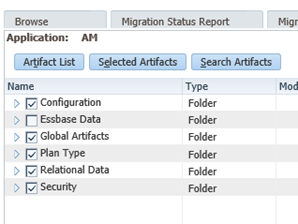

# Application Configuration

Application Configuration is the central hub for connecting EPMware to your target EPM systems. This module enables you to register applications, import metadata hierarchies, configure deployment settings, and manage application-specific properties for seamless integration with HFM, Planning, Essbase, PBCS, TRCS, FCCS, OneStream, and other supported platforms.

 
*Application configuration screen showing registered applications*

## Overview

Each EPMware application represents a target system where metadata will be deployed. Application configuration establishes the connection between EPMware and these target systems, imports existing metadata structures, and defines how metadata changes will be deployed. Proper application setup is essential for accurate metadata management and reliable deployments.

## Application Configuration Components

### Application Registration

Application registration creates the foundation for metadata management by linking EPMware to target EPM systems. Each application entry defines the connection details, deployment method, and security controls.

**Key Registration Elements:**

- **Application Name** - User-defined name for the EPMware application
- **Target Application** - Physical application name in the target system
- **Application Type** - Target platform (HFM, Planning, Essbase, PBCS, TRCS, Generic, etc.)
- **Version** - Target application version for compatibility
- **Security Class** - Controls user access to the application
- **Deployment Method** - Direct deployment, file-based, or interface table
- **Server Configuration** - Import and deployment server assignments

 
*Application registration dialog with configuration options*

---

## Application Create and Import

### Create an Application

Creating an application establishes the EPMware representation of your target system and prepares it for metadata import.

1. Select the **+** icon to display the **Add Application** popup.

2. Configure the application settings:
   - **Application Name** - User-defined name for the application
   - **Target Application** - Target application name in the EPM system
   - **Application Type** - Select from supported types (HFM, Planning, Essbase, PBCS, etc.)
   - **Version** - Target application version
   - **Display Sequence** - Order for display in dropdowns
   - **Security Class** - Assign security access control
   - **Deployment Method** - Select Direct, File, or Interface Table
   - **Import Server** - Server for metadata import
   - **Deployment Server** - Server for metadata deployment
   - **Target Application User Name** - Authentication username
   - **Target Application Password** - Authentication password

3. Select **Save** to create the application.

!!! note "Application Properties Required"
    Application Properties must be configured before importing metadata from the target application. See [Application Properties](#application-properties) below.

### Import Target Application Hierarchies

EPMware can automatically import existing metadata hierarchies from target applications, providing a complete view of your current metadata structure.

**Import Methods by Application Type:**

**Essbase:**

- Auto Import from target application

- Manual Import of XML export file:- Generate XML: `Export outline ASOALL.Basic all dimensions to xml_file "c:/temp/ASOALL02.xml";`

**Planning:**

- Auto Import from target application  

- Manual Import of LCM Extract .zip file: Create LCM Extract with the following artifacts:

 

- Import the “LCM Extract .zip” file

**HFM**

- Auto Import from target application

- Manual Import of Metadata Extract XML file (Note: .app files cannot be imported)

**PBCS/TRCS/ARCS/PCMCS** (Oracle EPM Cloud)
- Auto Import from target application
  - See [Appendix A](../appendices/oracle-epm-cloud.md) for cloud configuration requirements

**OneStream**
- Manual Import of application extract
  - Zip files: Metadata.xml, WorkflowChannels.xml, ApplicationProperties.xml, Security_Groups.xml
  - See [Appendix D](../appendices/onestream.md) for configuration details

**Generic Application**
- Manual Import of CSV files
  - Application properties, dimension classes, dimensions, hierarchies, members, lookups

**Oracle Fusion GL**
- Manual Import of Excel and hierarchy files
  - See [Appendix B](../appendices/oracle-fusion-gl.md) for configuration

**Oracle EBS GL**
- Manual Import of CSV hierarchy and value set files
  - See [Appendix E](../appendices/oracle-ebs-gl.md) for configuration

#### Import Procedure

1. Select the upload icon in the application grid row.

2. Choose import method:
   - **Auto Import** - Import directly from target application server
   - **Manual Import** - Browse and upload metadata file

3. Select the appropriate file format based on application type.

4. Monitor the import progress bar.

5. Review the **Application Import Status** popup when complete.

 
*Application import status showing successful dimension import*

!!! tip "Monitoring Import Progress"
    Click the info icon in the grid to redisplay the Application Import Status popup and check progress or view import logs.

---

## Application Properties

Application Properties define target-specific configuration parameters that control how EPMware interacts with each application type. These properties must be configured before importing metadata or deploying changes.

### Common Application Properties

**All Applications:**
- `ALLOW_REQUEST_DELETE_AFTER_DEPLY` - Allow request deletion after deployment (Y/N)
- `ENABLE_CUSTOM_PROPERTIES_BACKUP` - Backup custom properties before deployment (Y/N)
- `ENABLE_NODE_LEVEL_SECURITY` - Enable member-level security (Y/N)

### HFM Application Properties

Configure HFM-specific properties for on-premise deployments:

- `HYPERION_CLUSTER_NAME` - HFM cluster name
- `HYPERION_HOME` - Hyperion Home directory path on application server

 
*HFM application properties configuration*

### Planning Application Properties

Configure Planning-specific properties for on-premise deployments:

- `EPM_INSTANCE_NAME` - Hyperion instance name
- `HYPERION_HOME` - Hyperion Home directory path
- `OUTLINE_LOAD_SWITCHES` - Custom outline load switches (e.g., /IDU)
- `PASSWORD_FILE` - Path to Hyperion password file (pwd.txt)
- `PROJECT_FOLDER_NAME` - Shared Services project folder name
- `PlanCapexName` - Capex Plan name (if applicable)
- `PlanWorkforceName` - Workforce Plan name (if applicable)

### Essbase Application Properties

Configure Essbase-specific properties:

- `EPM_INSTANCE_NAME` - Hyperion instance name
- `ESSBASE_DATABASE_NAME` - Essbase database name
- `ESSBASE_SERVER_NAME` - Essbase server name
- `ESSBASE_TYPE_ENABLED` - Enable typed measures (Y/N)
- `HYPERION_HOME` - Hyperion Home directory path
- `DEPLOY_ALIAS_FOR_SHARED_MEMBERS` - Deploy aliases for shared members (Y/N)

### PBCS/FCCS Application Properties

Configure Oracle Planning and Budgeting Cloud Service or Financial Consolidation Cloud Service:

- `PBCS_APP_NAME` - Cloud application name (e.g., "Vision")
- `PBCS_APP_VERSION` - Oracle REST API version (default: 11.1.2.3.600)
- `PBCS_DEPLOY_JOB_FILE_NAME` - Import job CSV filename
- `PBCS_DEPLOY_JOB_NAME` - Import job name created in PBCS
- `PBCS_DEPLOY_METADATA_URL` - REST API deployment endpoint
- `PBCS_LCM_EXPORT_URL` - REST API export endpoint
- `PBCS_LCM_SNAPSHOT_NAME` - Snapshot name (e.g., "EW_LCM_EXPORT")
- `PBCS_SERVER_URL` - Cloud service URL
- `PBCS_TENANT_NAME` - Oracle cloud tenant name
- `PBCS_DATA_CENTER` - Data center location (e.g., "us2")
- `PBCS_SERVICE_NAME` - Service name (e.g., "planning-test")

!!! important "PBCS Configuration Prerequisites"
    Before configuring PBCS properties, ensure the import job and snapshot are created in the target PBCS application. See [Appendix A](../appendices/oracle-epm-cloud.md) for detailed setup instructions.

### OneStream Application Properties

Configure OneStream-specific properties for REST API integration:

**Token Generation Options:**

**Option 1: Okta Authentication**
- `OS_REST_API_CLIENT_ID` - Okta M2M Client ID
- `OS_REST_API_CLIENT_SECRET_KEY` - Okta M2M Secret Key
- `OS_REST_API_SCOPE` - Okta Scope Name
- `OS_REST_API_URL` - Okta URL with authorization server ID
- `OS_REST_API_USERNAME` - OneStream API user (e.g., "REST API")

**Option 2: OneStream Identity Server (OIS)**
- `OS_REST_API_TOKEN` - Personal Access Token from OIS
- `OS_REST_API_USERNAME` - OneStream API user

**Common OneStream Properties:**
- `OS_REST_API_APP_NAME` - OneStream application name
- `OS_REST_API_SERVER_URL` - OneStream server URL
- `OS_REST_API_DM_GROUP_NAME` - Data Management group name
- `OS_REST_API_DM_SEQUENCE_NAME` - Data Management sequence name

 
*OneStream application properties with REST API configuration*

### Oracle Fusion GL Properties

Configure Oracle Fusion General Ledger properties:

- `FLEX_CODE` - Chart of Accounts flexfield code (e.g., "GL#")
- `FLEXFIELD_STRUCTURE_CODE` - Flexfield structure code

### Custom Application Properties

Administrators can add custom properties for internal use or integration purposes.

#### Add a Custom Property

1. Select the **+** icon to display the **Add Properties** popup.

2. Input the **Property Name**, **Property Value**, and **Description**.

3. Select **Save** to create the property.

---

## Application Import Errors

Common application import errors and resolutions:

**HTTP 400 Bad Request (PBCS)**
- Check Application Properties for correct PBCS Application Name, Data Center, Service Name, and Application URL

**HTTP 401 Unauthorized**
- Verify application username and password are correct
- Ensure user has appropriate permissions in target application

**HTTP 403 Forbidden**
- User authentication failed
- Check credentials and user security in target system

**Import Timeout**
- Increase timeout values in Global Settings
- Check network connectivity to target application
- Verify application server is accessible

!!! warning "Import Prerequisites"
    Ensure the target application is accessible, user credentials are valid, and all required application properties are configured before attempting an import.

---

## Application Management

### Edit an Application

1. Right-click on a row and select **Properties** from the menu.

2. Edit the properties as required.

3. Select **Save** to save the changes.

!!! note "Application Properties"
    Some application properties can only be edited on the Properties tab, not in the main application dialog.

### Enable/Disable an Application

1. Select the **Enabled** checkbox in the grid to enable the application.

2. Deselect to disable the application.

3. Select the save icon to save the change.

!!! tip
    Disabling an application prevents it from appearing in user dropdowns but preserves all configuration and metadata.

### Delete an Application

1. Right-click on a row and select **Delete** from the menu.

2. Confirm the deletion in the popup.

3. Select **OK** to delete the application.

!!! warning "Deletion Warning"
    Deleting an application removes all associated dimensions, properties, and metadata. This action cannot be undone. Consider disabling the application instead.

---

## Application Configuration Workflow

Follow this recommended workflow when configuring a new application:

### Phase 1: Application Setup

1. **Configure Infrastructure** - Ensure target server is configured in Infrastructure
2. **Create Application** - Register the application in EPMware
3. **Configure Application Properties** - Set target-specific properties
4. **Test Connection** - Verify connectivity to target application

### Phase 2: Metadata Import

5. **Prepare Target System** - Configure target application for import (if required)
6. **Import Hierarchies** - Import metadata from target application
7. **Review Import Status** - Check for errors and validate import
8. **Verify Dimensions** - Confirm all dimensions imported correctly

### Phase 3: Configuration Refinement

9. **Configure Dimension Properties** - Set dimension-specific settings
10. **Configure Member Properties** - Define property attributes and categories
11. **Set Up Mappings** - Map dimensions and properties across applications
12. **Configure Security** - Assign security classes to application and dimensions

!!! tip "Best Practices"
    - Always test imports in a non-production environment first
    - Document custom properties and their purposes
    - Maintain consistent naming conventions across applications
    - Regular backups of application configuration before major changes

---

## Related Topics

- [Infrastructure Configuration](infrastructure.md) - Configure servers for application connectivity
- [Dimension Configuration](dimensions.md) - Set up dimension structure and mappings
- [Member Properties](member-properties.md) - Configure metadata properties
- [Deployment Manager](../deployment/index.md) - Deploy metadata to target applications
- [Appendices](../appendices/index.md) - Target application-specific configuration guides

---

## Quick Links

-   :material-plus-circle:{ .lg .middle } **Create Application**

    ---

    Register a new target application in EPMware

    [:material-arrow-right: Create application](#create-an-application)

-   :material-cloud-download:{ .lg .middle } **Import Metadata**

    ---

    Import hierarchies from target applications

    [:material-arrow-right: Import hierarchies](#import-target-application-hierarchies)

-   :material-cog:{ .lg .middle } **Configure Properties**

    ---

    Set application-specific properties

    [:material-arrow-right: Configure properties](#application-properties)

-   :material-alert-circle:{ .lg .middle } **Troubleshoot Import**

    ---

    Resolve common import errors

    [:material-arrow-right: View errors](#application-import-errors)

