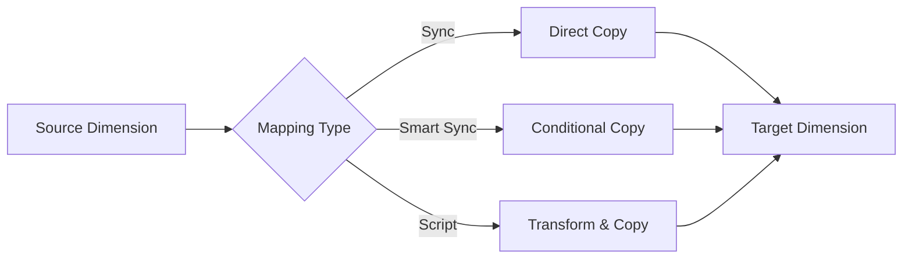

# Dimensions

Dimensions contain the hierarchies for the application and provide the foundation for metadata management in EPMware. This section covers the configuration and management of dimension classes, hierarchies, properties, mapping, and hierarchy actions.

## Overview

The Dimensions module is comprised of the following components:

- **[Dimension Classes](#dimension-classes)** - Highest level component that groups dimensions
- **[Dimension Configuration](#dimension-configuration)** - Define dimension attributes and settings
- **[Dimension Properties](#dimension-properties)** - Configure dimension-specific properties
- **[Dimension Mapping](#dimension-mapping)** - Associate dimensions across applications
- **[Hierarchy Actions](#hierarchy-actions)** - Configure actions for dimension hierarchies

## Quick Links

<div class="grid cards">
  <div class="card">
    <h3>📊 Dimension Classes</h3>
    <p>Configure dimension classes to group related dimensions</p>
    <a href="#dimension-classes" class="md-button">Learn More →</a>
  </div>
  
  <div class="card">
    <h3>⚙️ Configuration</h3>
    <p>Set up dimension attributes and enable features</p>
    <a href="#dimension-configuration" class="md-button">Learn More →</a>
  </div>
  
  <div class="card">
    <h3>🔗 Mapping</h3>
    <p>Map dimensions across multiple applications</p>
    <a href="#dimension-mapping" class="md-button">Learn More →</a>
  </div>
  
  <div class="card">
    <h3>🎯 Hierarchy Actions</h3>
    <p>Define actions and scripts for hierarchy management</p>
    <a href="#hierarchy-actions" class="md-button">Learn More →</a>
  </div>
</div>

---

## Dimension Classes

Dimension classes are the highest level component of dimensions. A dimension class can contain one or many dimensions, providing a logical grouping for related hierarchies.

### Key Features

- **Hierarchical Organization** - Group related dimensions under a single class
- **Action Set Assignment** - Assign hierarchy action sets to control available operations
- **Inheritance** - Dimensions inherit properties from their parent class
- **Security Integration** - Apply security at the class level

### Common Dimension Classes

| Class Type | Description | Typical Dimensions |
|------------|-------------|-------------------|
| **Financial** | Core financial reporting dimensions | Account, Entity, Currency |
| **Organizational** | Business structure dimensions | Department, Cost Center, Region |
| **Product** | Product and service hierarchies | Product Line, Brand, Category |
| **Generic** | Flexible, multi-purpose dimensions | Custom1-8, User Defined |

!!! tip "Best Practice"
    Create dimension classes that align with your business structure. This simplifies administration and improves user experience.

### Configuration Steps

1. Navigate to **Configuration → Dimensions → Classes**
2. Click the **+** icon to create a new class
3. Configure class attributes:
   - **Name** - Unique identifier for the class
   - **Hierarchy Action Set** - Select from predefined sets
   - **Description** - Document the class purpose
   - **Security Class** - Optional security assignment

[View Detailed Configuration Guide →](dimensions.md#dimension-classes)

---

## Dimension Configuration

Dimension configuration defines the attributes and behavior of individual dimensions within EPMware.

### Core Attributes

| Attribute | Description | Impact |
|-----------|-------------|--------|
| **Enabled** | Activates dimension in EPMware | Controls visibility and usability |
| **Security Class** | Assigns dimension-level security | Restricts access to authorized users |
| **Read Only** | Prevents modifications | Useful for reference dimensions |
| **Derived** | Flags as calculated dimension | Values populated via SQL scripts |
| **Default Alias** | Sets primary alias table | Determines default display names |

### Advanced Configuration

#### Derived Dimensions

Derived dimensions are read-only hierarchies populated through SQL scripts:

```sql
-- Example: Derive organization hierarchy from source system
SELECT parent_code, child_code, consolidation
FROM source_system.org_hierarchy
WHERE active_flag = 'Y'
```

#### Security Configuration

Apply security at multiple levels:
1. **Dimension Class** - Broadest level
2. **Individual Dimension** - Specific dimension access
3. **Member Level** - Granular node security

!!! warning "Security Precedence"
    Member-level security takes precedence over dimension security, which takes precedence over class security.

[View Detailed Configuration Guide →](dimensions.md#dimension-configuration)

---

## Dimension Properties

Dimension properties store configuration values specific to each dimension, controlling behavior and integration settings.

### Property Categories

<div class="property-grid">
  <div class="property-category">
    <h4>System Properties</h4>
    <ul>
      <li>Hierarchy type (Stored/Dynamic)</li>
      <li>Consolidation settings</li>
      <li>Data storage options</li>
      <li>Calculation rules</li>
    </ul>
  </div>
  
  <div class="property-category">
    <h4>Integration Properties</h4>
    <ul>
      <li>Source system mappings</li>
      <li>Import/export settings</li>
      <li>Validation rules</li>
      <li>Transformation logic</li>
    </ul>
  </div>
  
  <div class="property-category">
    <h4>Custom Properties</h4>
    <ul>
      <li>User-defined attributes</li>
      <li>Business metadata</li>
      <li>Reporting tags</li>
      <li>Workflow parameters</li>
    </ul>
  </div>
</div>

### Managing Properties

Properties can be added, edited, or removed based on business requirements:

1. **System Properties** - Predefined, cannot be deleted
2. **Application Properties** - Imported from target systems
3. **Custom Properties** - User-created for specific needs

[View Detailed Configuration Guide →](dimensions.md#dimension-properties)

---

## Dimension Mapping

Dimension mapping enables synchronization between dimensions across different applications, ensuring consistency in master data.

### Mapping Options

| Option | Description | Use Case |
|--------|-------------|----------|
| **Sync** | Full synchronization of members | Homogeneous hierarchies |
| **Smart Sync** | Conditional synchronization | Heterogeneous hierarchies |
| **Script** | Custom logic-based sharing | Complex transformations |

### Mapping Workflow



### Configuration Example

**Scenario**: Map Account dimension between HFM and Planning applications

1. Select dimensions to map
2. Choose mapping type (Sync/Smart Sync/Script)
3. Configure options:
   - Parent validation
   - Property mapping
   - Conflict resolution

!!! note
    Each mapped dimension creates a line item in the request workflow, allowing reviewers to approve changes per application.

[View Detailed Configuration Guide →](dimensions.md#dimension-mapping)

---

## Hierarchy Actions

Hierarchy actions define the operations users can perform on dimension hierarchies, with optional pre and post-action scripts.

### Available Actions

<div class="action-grid">
  <div class="action-card">
    <h4>📝 Create Member</h4>
    <p>Add new members to hierarchy</p>
  </div>
  <div class="action-card">
    <h4>✏️ Edit Properties</h4>
    <p>Modify member attributes</p>
  </div>
  <div class="action-card">
    <h4>🔄 Move Member</h4>
    <p>Relocate within hierarchy</p>
  </div>
  <div class="action-card">
    <h4>🗑️ Delete Member</h4>
    <p>Remove from hierarchy</p>
  </div>
  <div class="action-card">
    <h4>📋 Copy/Paste</h4>
    <p>Duplicate structures</p>
  </div>
  <div class="action-card">
    <h4>🔗 Insert Shared</h4>
    <p>Create shared members</p>
  </div>
</div>

### Action Scripts

Enhance hierarchy actions with Logic Builder scripts:

- **Pre-Action Scripts** - Validate before executing
- **Post-Action Scripts** - Automate follow-up tasks

#### Example: Auto-position in Shared Hierarchy

```javascript
// Post-action script for Create Member
function positionInSharedHierarchy(member) {
    if (isPrimaryHierarchy(member.parent)) {
        var sharedParent = findSharedParent(member.type);
        if (sharedParent) {
            createSharedMember(member, sharedParent);
        }
    }
}
```

### Security Integration

Assign security classes to specific actions:

- Restrict "Delete Member" to administrators
- Limit "Edit Properties" to data managers
- Control "Create Member" by dimension

[View Detailed Configuration Guide →](dimensions.md#dimension-hierarchy-actions)

---

## Best Practices

### 1. Dimension Design

- **Standardize Naming** - Use consistent naming conventions
- **Document Purpose** - Maintain clear descriptions
- **Plan Hierarchies** - Design before implementation
- **Consider Growth** - Allow for future expansion

### 2. Performance Optimization

- **Limit Depth** - Keep hierarchies reasonably shallow
- **Optimize Scripts** - Test and tune SQL/Logic scripts
- **Archive Inactive** - Remove or hide obsolete members
- **Index Properly** - Ensure database indexes are maintained

### 3. Security & Governance

- **Layer Security** - Apply at appropriate levels
- **Audit Changes** - Enable comprehensive logging
- **Review Regularly** - Periodic access reviews
- **Document Policies** - Maintain governance documentation

### 4. Integration Management

- **Test Mappings** - Validate in non-production first
- **Monitor Sync** - Check mapping logs regularly
- **Handle Conflicts** - Define resolution strategies
- **Version Control** - Track configuration changes

---

## Troubleshooting

### Common Issues

| Issue | Possible Cause | Solution |
|-------|---------------|----------|
| Members not syncing | Mapping disabled | Check mapping configuration and enable |
| Hierarchy actions grayed out | Insufficient permissions | Verify security class assignments |
| Derived dimension empty | SQL error | Review SQL script and test independently |
| Import failures | Property mismatch | Validate property mappings |

### Getting Help

- Check the [detailed configuration guide](dimensions.md)
- Review [application-specific requirements](../appendices/index.md)
- Contact EPMware support for assistance

---

## Related Topics

- [Application Configuration](applications.md)
- [Member Properties](member-properties.md)
- [Security Classes](../security/index.md#security-classes)
- [Workflow Builder](../workflow/index.md)
- [Logic Builder](../logic-builder/index.md)
