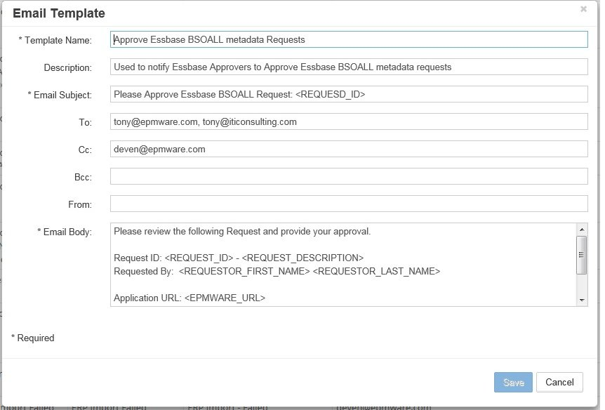

# Email Templates

Email Templates are utilized in Workflows to notify Requestors, Reviewers, and Approvers of actions taken during the Request and Workflow process. Templates support dynamic content through variable tags, custom scripting, and formatted tables for comprehensive communication.

<br/>
*Email Template Grid displaying all available templates*

## Overview

Email templates provide automated communication throughout the workflow lifecycle:

- **Request Notifications** - Submission, updates, and status changes
- **Review Notifications** - Tasks assigned, completed, or escalated  
- **Approval Notifications** - Approval requests, decisions, and reminders
- **Deployment Notifications** - Success, failure, and completion status
- **Custom Notifications** - Business-specific communications

## Quick Links

<div class="grid cards">
  <div class="card">
    <h3>📝 Template Creation</h3>
    <p>Build dynamic email templates with variable tags</p>
    <a href="#creating-email-templates" class="md-button">Create Templates →</a>
  </div>
  
  <div class="card">
    <h3>🏷️ Variable Tags</h3>
    <p>Use system and custom variables for dynamic content</p>
    <a href="#variable-tags" class="md-button">View Tags →</a>
  </div>
  
  <div class="card">
    <h3>📊 Email Tables</h3>
    <p>Insert formatted tables with request and validation data</p>
    <a href="#email-body-tables" class="md-button">Add Tables →</a>
  </div>
  
  <div class="card">
    <h3>🔧 Advanced Features</h3>
    <p>Custom tags, attachments, and Logic Builder integration</p>
    <a href="#advanced-features" class="md-button">Learn More →</a>
  </div>
</div>

---

## Variable Tags

Variable tags dynamically insert content into email templates, making them context-aware and personalized.

### System Variable Tags

| Tag | Description | Example Output |
|-----|-------------|----------------|
| `<REQUEST_ID>` | Unique request identifier | REQ-2024-001234 |
| `<EPMWARE_URL>` | Application URL from global settings | https://demo.epmwarecloud.com |
| `<REQUEST_DESCRIPTION>` | Request description text | Q4 Entity Reorganization |
| `<REQUESTOR>` | Requestor's email address | john.smith@company.com |
| `<REQUESTED_BY_USERNAME>` | Requestor's username | JSMITH |
| `<REQUESTED_BY_FIRST_NAME>` | Requestor's first name | John |
| `<REQUESTED_BY_LAST_NAME>` | Requestor's last name | Smith |
| `<DUE_DATE>` | Request due date | 12/31/2024 |
| `<REQUEST_DATE>` | Request creation date | 12/01/2024 |
| `<PRIORITY>` | Workflow priority level | High |
| `<UDF1>` | User Defined Field 1 | Budget Adjustment |
| `<UDF2>` | User Defined Field 2 | FY2024 |
| `<UDF3>` | User Defined Field 3 | Corporate |
| `<WF_NAME>` | Workflow name | Standard Approval |
| `<TASK_STATUS>` | Current task status | Pending Review |
| `<USER_NAME>` | Current user's username | JADMIN |
| `<USER_FIRST_NAME>` | Current user's first name | Jane |
| `<USER_LAST_NAME>` | Current user's last name | Admin |
| `<NOTES>` | User comments from recall/reject | Please revise account codes |

### Security Group Tags

Send notifications to entire security groups:

```html
<SEC_GROUP_NAME:Group Name>
```

**Examples:**
- `<SEC_GROUP_NAME:Tax Approvers>` - All tax approvers
- `<SEC_GROUP_NAME:Business Reviewers>` - Business review team
- `<SEC_GROUP_NAME:IT Administrators>` - IT admin group

!!! tip "Multiple Groups"
    You can include multiple group tags to notify different teams in a single email template.

---

## Email Body Tables

Insert formatted tables directly into email bodies to display structured data without attachments.

### Available Table Types

| Table Tag | Description | Use Case |
|-----------|-------------|----------|
| `<TABLE:VALIDATION_RESULT>` | Validation results for request | Review notifications |
| `<TABLE:REQUEST_LINES>` | Request line item details | Approval summaries |
| `<TABLE:REQUEST_LINES_WITH_PROPS>` | Lines with all properties | Detailed reviews |
| `<TABLE:REQUEST_LINES_WITH_PROPS_DELTA_ONLY>` | Only changed properties | Change summaries |
| `<TABLE:REQUEST_USER_NOTES>` | All request comments | Comment history |
| `<TABLE:REQUEST_ATTACHMENTS>` | File list and attachments | Document notifications |
| `<TABLE:ERP_REQUESTS>` | ERP import request IDs | ERP integration emails |
| `<TABLE:DEPLOYMENT_RESULT>` | Deployment summary | Deployment notifications |
| `<TABLE:DEPLOYMENT_DETAILS>` | Detailed deployment info | Technical notifications |

### Table Implementation Example

```html
Dear <REQUESTED_BY_FIRST_NAME>,

Your request <REQUEST_ID> has been deployed successfully.

Deployment Summary:
<TABLE:DEPLOYMENT_RESULT>

Detailed Results:
<TABLE:DEPLOYMENT_DETAILS>

Best regards,
EPMware System
```

<br/>
*Example email template using deployment result table*

---

## Creating Email Templates

### Add New Template

1. Navigate to **Configuration → Email → Templates**
2. Click the **+** icon to open the template editor
3. Configure template properties

<br/>
*Email Template Properties dialog for creating new templates*

### Template Configuration

#### Required Fields

| Field | Description | Best Practice |
|-------|-------------|---------------|
| **Template Name** | Unique identifier | Use descriptive naming: `WF_Review_Assigned` |
| **Subject** | Email subject line | Include request ID: `Review Required: <REQUEST_ID>` |
| **Body** | Email content | Use HTML for formatting |
| **Active** | Enable/disable template | Disable unused templates |

#### Template Structure

```html
<!DOCTYPE html>
<html>
<head>
    <style>
        body { font-family: Arial, sans-serif; }
        .header { background-color: #f0f0f0; padding: 10px; }
        .content { padding: 20px; }
        .footer { color: #666; font-size: 12px; }
    </style>
</head>
<body>
    <div class="header">
        <h2>Request <REQUEST_ID> - Action Required</h2>
    </div>
    <div class="content">
        <p>Dear <USER_FIRST_NAME>,</p>
        
        <p>A request requires your review:</p>
        
        <table>
            <tr><td><strong>Request ID:</strong></td><td><REQUEST_ID></td></tr>
            <tr><td><strong>Description:</strong></td><td><REQUEST_DESCRIPTION></td></tr>
            <tr><td><strong>Requestor:</strong></td><td><REQUESTED_BY_USERNAME></td></tr>
            <tr><td><strong>Priority:</strong></td><td><PRIORITY></td></tr>
            <tr><td><strong>Due Date:</strong></td><td><DUE_DATE></td></tr>
        </table>
        
        <p><a href="<EPMWARE_URL>/request/<REQUEST_ID>">Click here to review</a></p>
        
        <TABLE:REQUEST_LINES>
        
        <p>Best regards,<br/>EPMware System</p>
    </div>
    <div class="footer">
        <p>This is an automated message. Please do not reply.</p>
    </div>
</body>
</html>
```

### Email Template Example

<br/>
*Complete email template example with variable tags and formatting*

---

## Advanced Features

### Custom Tags

Use Logic Builder Email API to create custom tags with dynamic values:

```javascript
// Logic Builder script to add custom tags
function addCustomEmailTags(context) {
    var customTags = {
        'DEPARTMENT': getDepartmentName(context.requestId),
        'COST_CENTER': getCostCenter(context.requestId),
        'APPROVAL_LEVEL': calculateApprovalLevel(context.amount),
        'BUSINESS_UNIT': getBusinessUnit(context.entityId)
    };
    
    return customTags;
}
```

**Usage in template:**
```html
Department: <CUSTOM:DEPARTMENT>
Cost Center: <CUSTOM:COST_CENTER>
Approval Level: <CUSTOM:APPROVAL_LEVEL>
Business Unit: <CUSTOM:BUSINESS_UNIT>
```

!!! note "Custom Tag Documentation"
    Refer to the Logic Builder guide for detailed information on creating and implementing custom email tags.

### Conditional Content

Implement conditional logic in templates using Logic Builder:

```javascript
// Show different content based on priority
function getConditionalContent(priority) {
    if (priority === 'High') {
        return '<p style="color:red">URGENT: Immediate action required</p>';
    } else if (priority === 'Medium') {
        return '<p style="color:orange">Please review at your earliest convenience</p>';
    }
    return '<p>Please review when possible</p>';
}
```

### Attachments Configuration

Configure email attachments through deployment settings:

| Attachment Type | Configuration | Use Case |
|----------------|---------------|----------|
| **Deployment Files** | Enable in Deployment Manager | Send metadata files |
| **Log Files** | Enable log attachment | Technical troubleshooting |
| **Request Attachments** | Use `<TABLE:REQUEST_ATTACHMENTS>` | Include user uploads |
| **Generated Reports** | Via Logic Builder | Custom reports |

---

## Template Management

### Edit Existing Template

1. Right-click on template row
2. Select **Properties** from menu
3. Modify template configuration
4. Click **Save** to apply changes

<br/>
*Edit template properties dialog*

### Delete Template

1. Right-click on template row
2. Select **Delete** from menu
3. Confirm deletion

!!! warning "Template Dependencies"
    Ensure the template is not assigned to any active workflow tasks before deletion.

### Template Organization

Best practices for managing templates:

1. **Naming Convention** - Use consistent prefixes:
   - `REQ_` - Request templates
   - `REV_` - Review templates  
   - `APP_` - Approval templates
   - `DEP_` - Deployment templates
   - `ERR_` - Error notifications

2. **Version Control** - Clone templates before major changes
3. **Documentation** - Maintain template purpose in description
4. **Testing** - Test with sample data before activation

---

## Logo Configuration

Configure a company logo for all email notifications:

1. Navigate to **Configuration → Misc → Global Settings**
2. Select **Application Settings** tab
3. Configure logo properties:

| Setting | Description | Example |
|---------|-------------|---------|
| **Organization Logo URL** | Public URL of logo image | https://company.com/logo.png |
| **Organization Logo Width** | Width in pixels | 172 |
| **Organization Logo Height** | Height in pixels | 25 |
| **Organization Name** | Company name for alt text | EPMware Inc. |

<br/>
*Global settings for email logo configuration*

!!! tip "Logo Requirements"
    - Use publicly accessible URL
    - Recommended size: 172x25 pixels
    - Supported formats: PNG, JPG, GIF
    - Logo appears in email headers and audit reports

---

## Template Types by Workflow Stage

### Request Stage Templates

**Purpose:** Notify about request creation and updates

**Common Variables:**
- `<REQUEST_ID>`
- `<REQUEST_DESCRIPTION>`
- `<REQUESTED_BY_USERNAME>`
- `<TABLE:REQUEST_LINES>`

**Example Template Names:**
- `REQ_Submitted_Requestor`
- `REQ_Recalled_Notification`
- `REQ_Updated_Reviewers`

### Review Stage Templates

**Purpose:** Task assignments and review actions

**Common Variables:**
- `<USER_NAME>`
- `<TASK_STATUS>`
- `<TABLE:REQUEST_LINES_WITH_PROPS>`
- `<SEC_GROUP_NAME:Reviewers>`

**Example Template Names:**
- `REV_Task_Assigned`
- `REV_Changes_Required`
- `REV_Completed_Notification`

### Approval Stage Templates

**Purpose:** Approval requests and decisions

**Common Variables:**
- `<PRIORITY>`
- `<DUE_DATE>`
- `<TABLE:VALIDATION_RESULT>`
- `<TABLE:REQUEST_USER_NOTES>`

**Example Template Names:**
- `APP_Approval_Required`
- `APP_Approved_Notification`
- `APP_Rejected_Reason`

### Deployment Stage Templates

**Purpose:** Deployment status and results

**Common Variables:**
- `<TABLE:DEPLOYMENT_RESULT>`
- `<TABLE:DEPLOYMENT_DETAILS>`
- Attachment configurations

**Example Template Names:**
- `DEP_Started_Notification`
- `DEP_Success_Summary`
- `DEP_Failed_Alert`

---

## Best Practices

### 1. Content Design

- **Clear Subject Lines** - Include request ID and action required
- **Structured Content** - Use tables for data presentation
- **Call to Action** - Include direct links to EPMware
- **Mobile Friendly** - Test rendering on mobile devices

### 2. Variable Usage

- **Validate Tags** - Test all variables with sample data
- **Fallback Values** - Handle potential null values
- **Consistent Format** - Standardize date and number formats
- **Security Groups** - Verify group names are correct

### 3. Performance

- **Optimize Tables** - Limit table rows for large requests
- **Attachment Size** - Monitor attachment file sizes
- **Template Length** - Keep templates concise
- **HTML Optimization** - Minimize inline CSS

### 4. Maintenance

- **Regular Review** - Audit template usage quarterly
- **Update URLs** - Verify links after system changes
- **Test Changes** - Use test workflows for validation
- **Archive Old** - Disable rather than delete templates

---

## Troubleshooting

### Common Issues

| Issue | Possible Cause | Solution |
|-------|---------------|----------|
| Variables not replaced | Incorrect tag syntax | Check tag spelling and format |
| Table not rendering | Invalid table tag | Verify table tag is supported |
| Email not sent | Template not assigned | Check workflow task configuration |
| Group not receiving | Group name mismatch | Verify exact group name in tag |
| Logo not displaying | URL not accessible | Use public URL for logo |
| Formatting issues | HTML errors | Validate HTML syntax |

### Testing Templates

1. **Create Test Workflow** - Dedicated workflow for testing
2. **Use Test Data** - Sample requests with known values
3. **Check Rendering** - Review in multiple email clients
4. **Verify Links** - Test all hyperlinks
5. **Monitor Logs** - Check email service logs

### Email Service Configuration

Verify email settings in **Global Settings → Email Settings**:

- **From Email Address** - Must be verified (AWS SES)
- **Override Email Address** - For testing environments
- **Failed Email Address** - For error notifications
- **Email Subject Prefix** - Environment identifier

---

## Related Topics

- [Workflow Tasks](../workflow/index.md#workflow-tasks) - Assign templates to tasks
- [Global Settings](../global-settings/index.md) - Configure email service
- [Logic Builder](../logic-builder/index.md) - Create custom email logic
- [Deployment Manager](../deployment/index.md) - Configure deployment emails
- [ERP Import](../erp-import/index.md) - ERP-specific email templates
