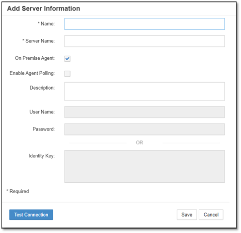

# Infrastructure Configuration

The Infrastructure module contains the fundamental configuration for EPMware's connection to target systems and environment management. This section covers server configuration and multi-environment setup.

## Servers

Server Configuration enables administrators to configure the connection details that EPMware uses to communicate with target systems (e.g., HFM, Essbase, Planning, PBCS). Each server entry stores credentials and connection information for secure communication.

 
*Server configuration screen showing connection settings*

### Server Configuration Fields

- **Name** - User-defined label for the server
- **Server Name** - Hostname or IP address for on-premise applications; any label for cloud applications
- **On-Premise** - Enable for on-premise servers; disable for cloud applications
- **Agent Polling** - Enable to allow agent polling
- **Description** - Optional description of the server
- **User Name** - Required if On-Premise Agent is not installed
- **Password or Identity Key** - Authentication credentials (not required when using On-Premise Agent)

!!! note
    If the **On-Premise Agent** is checked, the User Name, Password, and Identity Key fields are disabled as the agent uses the REST API to establish connections.

### Add a Server

1. Select the **+** icon to display the **Add Server** popup.

2. Input a **Name** (label) for the server.

3. Input the **Server Name** for on-premise applications or any label for cloud applications.

4. Check **On-Premise** for on-premise servers or leave unchecked for cloud applications.

5. Check to enable **Agent Polling** if required.

6. Input a **Description** *(Optional)*.

7. Input **User Name** and **Password** or **Identity Key** (only needed if the On-Premise agent is not installed).

8. Select **Save** to save the configuration.

 
*Add Server dialog with configuration fields*

!!! tip "Test Connection"
    Click the **Test Connection** button to verify communication with the server before saving.

### Edit a Server

1. Right-click on a row and select **Edit Properties** from the menu.

2. Edit the properties as required.

3. Select **Save** to save the changes.

!!! warning
    Changes to server configuration may affect existing deployments and application imports. Test connections after making changes.

### Delete a Server

1. Right-click on a row and select **Delete** from the menu.

2. The confirmation popup will display.

3. Select **OK** to delete the server.

!!! note
    Only one server can be deleted at a time. You cannot delete a server that is currently in use by an active application.

---

## Multi-Environment Configuration

A multi-environment configuration allows EPMware to deploy metadata to multiple environments (e.g., Development, UAT, and Production) using a single workflow. This enables consistent metadata management across the entire application lifecycle.

### Configuration Overview

Multi-environment deployment consists of the following components:

1. **Shell Applications** - Non-production application representations
2. **Environments** - Logical environment definitions
3. **Deploy Stages** - Workflow stages for each environment
4. **Deploy Tasks** - Tasks assigned to each deployment stage
5. **Environment Mapping** - Application-to-environment relationships

### Environments

Environment configuration creates the foundation for multi-environment deployments. Each environment represents a tier in your application landscape.

 
*Environment configuration showing deployment order*

#### Add an Environment

1. Select **Configuration → Infrastructure → Environments**.

2. Select the **+** icon to display the **Add Environment** popup.

3. Input a **Name** (label) for the environment.

4. Input the **Deployment Order** for the environment.
   - Lower numbers deploy first (e.g., Development = 1, UAT = 2, Production = 3)

5. Select **Save** to create the environment.

#### Edit an Environment

1. Right-click on a row and select **Edit Properties** from the menu.

2. Edit the properties as required.

3. Select **Save** to save the changes.

#### Delete an Environment

1. Right-click on a row and select **Delete** from the menu.

2. Confirm the deletion in the popup.

3. Select **OK** to delete the environment.

!!! warning
    Deleting an environment will affect any workflows configured to deploy to that environment.

### Environment Mapping

Environment mapping associates application names with their respective environments. This allows EPMware to understand which applications belong to which environment tier.

 
*Environment mapping showing production and UAT applications*

In the example above:
- **CXF** is the HFM Production application managed in EPMware
- **EXP** is the HFM UAT "shell" application (metadata not managed in EPMware)

!!! note "Shell Applications"
    UAT and Development applications should be created as "shell" applications in EPMware. These are logical mappings only—their metadata is not managed in EPMware. A security class should restrict these shell applications to administrators only.

### Configure Multi-Environment Deployment

#### Step 1: Create Shell Applications

1. Navigate to **Configuration → Applications → Configuration**.

2. Create application entries for non-production environments (UAT, Dev, etc.).

3. Assign a restricted security class to prevent general user access.

!!! important
    Shell applications appear in the application dropdown but have no dimensions in EPMware.

#### Step 2: Create Deploy Stages

1. Navigate to **Workflow → Workflow Builder**.

2. Select the workflow from the dropdown.

3. Click **Actions** and select **Create Stage**.

4. Configure the deploy stage:
   - Input a **Stage #** to define order
   - Input the **Stage Name**
   - Select **Deploy** for the **Action**
   - Input an optional **Description**

5. Select **Save** to add the stage.

6. Repeat for each environment in your configuration.

#### Step 3: Create Deploy Tasks

1. Navigate to **Workflow → Tasks**.

2. Click the **+** icon to create a new task.

3. Select **Deploy** from the **Action** dropdown.

4. Select the **Environment** from the dropdown.

5. Configure additional task properties as needed.

6. Select **Save** to create the task.

#### Step 4: Assign Deploy Tasks to Stages

1. Return to **Workflow → Workflow Builder**.

2. Select the deploy stage from the workflow diagram.

3. Select **Assign Task** from the **Actions** dropdown.

4. Select the deploy task created in Step 3.

5. Select **Save** to assign the task to the stage.

---

## Related Topics

- [Application Configuration](applications.md)
- [Workflow Builder](../workflow/index.md)
- [Deployment Manager](../deployment/index.md)
