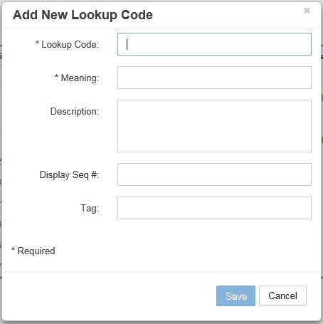

# Lookups

Lookups configure dropdown list values used throughout the EPMware application. They provide centralized management of selection lists for properties, user-defined fields, workflow priorities, and other configurable options across all modules.

<br/>
*Lookups configuration screen with search and navigation*

## Overview

Navigate to **Configuration → Misc → Lookups** to manage lookup tables that populate dropdown controls throughout EPMware. Lookups consist of:

- **Lookup Header** - Defines the lookup name and description
- **Lookup Codes** - Individual values within each lookup
- **System Lookups** - Seeded, read-only lookups required by EPMware
- **Custom Lookups** - User-created lookups for business-specific needs

## Quick Links

<div class="grid cards">
  <div class="card">
    <h3>➕ Create Lookups</h3>
    <p>Add new lookup tables for custom dropdowns</p>
    <a href="#creating-lookups" class="md-button">Create New →</a>
  </div>
  
  <div class="card">
    <h3>📝 Manage Codes</h3>
    <p>Add and configure lookup values</p>
    <a href="#lookup-codes" class="md-button">Configure Values →</a>
  </div>
  
  <div class="card">
    <h3>🔒 System Lookups</h3>
    <p>View and understand seeded lookups</p>
    <a href="#system-lookups" class="md-button">View System →</a>
  </div>
  
  <div class="card">
    <h3>🔗 Integration</h3>
    <p>Use lookups in UDFs and properties</p>
    <a href="#lookup-usage" class="md-button">Learn More →</a>
  </div>
</div>

---

## Lookup Structure

### Lookup Components

Each lookup consists of two parts:

1. **Lookup Header**
   - **Name** - Unique identifier (no spaces, uppercase recommended)
   - **Description** - Business-friendly description

2. **Lookup Codes**
   - **Enabled** - Active/inactive flag
   - **Lookup Code** - Stored value in database
   - **Meaning** - Display value in UI
   - **Description** - Additional context or help text
   - **Display Seq.#** - Sort order for display

### Navigation Controls

Use the navigation bar to browse lookups:

- **Search by Name** - Find lookups by identifier
- **Search by Description** - Find lookups by description text
- **Arrow Buttons** - Navigate through lookup records
- **Page Controls** - Jump to specific pages

<br/>
*Navigation controls for browsing lookups*

---

## Creating Lookups

### Add New Lookup

1. Click the **+** icon in the header section
2. Enter lookup details:

<br/>
*Creating a new lookup header*

| Field | Description | Example |
|-------|-------------|---------|
| **Name** | Unique identifier | REQUEST_TYPES |
| **Description** | Business description | Types of metadata requests |

3. Click **Save** to create the lookup header

!!! note "Naming Convention"
    Use UPPER_CASE_WITH_UNDERSCORES for lookup names to maintain consistency and improve readability.

### Delete Lookup

1. Click the trash icon in the header section
2. Confirm deletion

!!! warning "Lookup Dependencies"
    Ensure the lookup is not referenced in any configuration before deletion. Check:
    - User Defined Fields
    - Property configurations
    - Logic Builder scripts

---

## Lookup Codes

After creating a lookup header, add individual values (codes) that will appear in the dropdown.

### Add Lookup Code

1. Navigate to or search for the lookup
2. Click the **+** icon in the codes section
3. Configure the lookup code:

<br/>
*Add New Lookup Code dialog*

| Field | Required | Description | Example |
|-------|----------|-------------|---------|
| **Enabled** | Yes | Activate/deactivate code | Checked |
| **Lookup Code** | Yes | Value stored in database | NEW |
| **Meaning** | Yes | Value displayed to users | New Request |
| **Description** | No | Additional information | Create new metadata |
| **Display Seq.#** | Yes | Sort order (lower = first) | 10 |

4. Click **Save** to add the code

### Edit Lookup Code

1. Right-click on a code row
2. Select **Properties** from menu
3. Modify fields as needed
4. Click **Save** to apply changes

<br/>
*Lookup Code Properties dialog*

### Delete Lookup Code

1. Right-click on a code row
2. Select **Delete** from menu
3. Confirm deletion

!!! info "Single Deletion"
    Only one lookup code can be deleted at a time.

### Managing Display Order

Control the sequence of values in dropdowns using **Display Seq.#**:

- Values are sorted by Display Seq.# (ascending)
- Use increments of 10 for easy reordering
- Example sequence: 10, 20, 30, 40...

---

## System Lookups

EPMware includes seeded lookups that are essential for system operation. These lookups are **read-only** and cannot be modified or deleted.

<br/>
*Example of read-only system lookups*

### Common System Lookups

| Lookup Name | Purpose | Used In |
|-------------|---------|---------|
| **WORKFLOW_PRIORITY** | Request priority levels | Workflows |
| **DEPLOYMENT_TYPE** | Deployment method options | Deployment Manager |
| **VALIDATION_STATUS** | Validation result statuses | Request validation |
| **TASK_ACTION** | Workflow task actions | Workflow Builder |
| **USER_TYPE** | User authentication types | Security |
| **DATA_TYPE** | Property data types | Property configuration |
| **DISPLAY_TYPE** | Property display options | Property configuration |

!!! caution "Read-Only"
    System lookups are marked as read-only and cannot be edited. They are maintained by EPMware and updated through system upgrades.

### Viewing System Lookups

While system lookups cannot be modified, you can:
- View their values for reference
- Understand available options
- Use them in configurations
- Reference in Logic Builder scripts

---

## Lookup Usage

### User Defined Fields (UDFs)

Lookups are commonly used to populate dropdowns in User Defined Fields:

1. Navigate to **Configuration → Misc → Global Settings**
2. Select **User Defined Settings** tab
3. Configure UDF with lookup:

```
Display Type: Lookup
Lookup: REQUEST_TYPES
```

<br/>
*Configuring UDF to use a lookup*

### Property Configuration

Use lookups for member property values:

1. Navigate to **Configuration → Properties → Configuration**
2. Set property Display Type to "List of Values"
3. Reference lookup in configuration

### Logic Builder Integration

Reference lookup values in scripts:

```javascript
// Check if value exists in lookup
function validateLookupValue(lookupName, value) {
    var sql = `
        SELECT COUNT(*) 
        FROM ew_lookups l, ew_lookup_codes c
        WHERE l.lookup_id = c.lookup_id
          AND l.name = :lookupName
          AND c.lookup_code = :value
          AND c.enabled = 'Y'
    `;
    
    return executeSQL(sql, {lookupName: lookupName, value: value}) > 0;
}
```

---

## Common Lookup Examples

### Example 1: Request Types

```
Lookup Name: REQUEST_TYPES
Description: Types of metadata change requests
```

**Codes:**
| Code | Meaning | Description | Seq |
|------|---------|-------------|-----|
| NEW | New Member | Add new hierarchy member | 10 |
| CHANGE | Change Properties | Modify member properties | 20 |
| DELETE | Delete Member | Remove from hierarchy | 30 |
| MOVE | Move Member | Relocate in hierarchy | 40 |

### Example 2: Approval Status

```
Lookup Name: APPROVAL_STATUS
Description: Request approval status options
```

**Codes:**
| Code | Meaning | Description | Seq |
|------|---------|-------------|-----|
| PENDING | Pending Review | Awaiting review | 10 |
| APPROVED | Approved | Request approved | 20 |
| REJECTED | Rejected | Request rejected | 30 |
| HOLD | On Hold | Temporarily paused | 40 |

### Example 3: Business Units

```
Lookup Name: BUSINESS_UNITS
Description: Company business unit codes
```

**Codes:**
| Code | Meaning | Description | Seq |
|------|---------|-------------|-----|
| CORP | Corporate | Corporate headquarters | 10 |
| NA | North America | NA operations | 20 |
| EMEA | Europe, Middle East, Africa | EMEA region | 30 |
| APAC | Asia Pacific | APAC region | 40 |
| LATAM | Latin America | LATAM region | 50 |

### Example 4: Cost Center Types

```
Lookup Name: COST_CENTER_TYPES
Description: Types of cost centers
```

**Codes:**
| Code | Meaning | Description | Seq |
|------|---------|-------------|-----|
| DIRECT | Direct | Direct cost center | 10 |
| INDIRECT | Indirect | Indirect/overhead | 20 |
| ADMIN | Administrative | Admin support | 30 |
| CAPITAL | Capital | Capital projects | 40 |

---

## Best Practices

### 1. Naming Conventions

- **Lookup Names**: Use UPPERCASE_WITH_UNDERSCORES
- **Descriptive Names**: Make purpose clear (e.g., REQUEST_PRIORITY not just PRIORITY)
- **Avoid Spaces**: Never use spaces in lookup names
- **Consistent Prefixes**: Group related lookups (e.g., FIN_ACCOUNT_TYPES, FIN_CURRENCIES)

### 2. Code Management

- **Meaningful Codes**: Use recognizable abbreviations
- **Consistent Format**: Maintain consistent code patterns
- **Sequence Gaps**: Use increments of 10 for flexibility
- **Description Usage**: Provide helpful descriptions for complex codes

### 3. Performance

- **Limit Size**: Keep lookups under 500 values
- **Enable/Disable**: Use enabled flag instead of deleting
- **Optimize Queries**: Index lookup tables properly
- **Cache Frequently Used**: Consider caching static lookups

### 4. Maintenance

- **Document Purpose**: Clear descriptions for all lookups
- **Regular Review**: Audit lookups quarterly
- **Archive Unused**: Disable rather than delete old codes
- **Version Control**: Track changes through migration

---

## Integration Points

### Where Lookups Are Used

| Module | Usage | Configuration Location |
|--------|-------|------------------------|
| **User Defined Fields** | Dropdown values | Global Settings → UDF Settings |
| **Property Configuration** | Property LOVs | Configuration → Properties |
| **Workflow Builder** | Priority levels | Workflow → Builder |
| **Email Templates** | Template selection | Configuration → Email |
| **Reports** | Filter options | Audit → Reports |
| **Logic Builder** | Validation lists | Logic Builder scripts |

### Dynamic vs. Static Lookups

**Static Lookups** - Defined in Lookups module:
- Fixed set of values
- Maintained by administrators
- Version controlled
- Cached for performance

**Dynamic Lookups** - Generated via SQL:
- Values from queries
- Real-time data
- Context-sensitive
- Used in LOV SQL

---

## Troubleshooting

### Common Issues

| Issue | Cause | Solution |
|-------|-------|----------|
| Lookup not appearing in dropdown | Not enabled or wrong name | Verify enabled flag and exact name match |
| Values in wrong order | Display sequence incorrect | Adjust Display Seq.# values |
| Cannot edit lookup | System lookup | System lookups are read-only |
| Duplicate values showing | Multiple enabled codes with same meaning | Check for duplicate enabled codes |
| Lookup deletion fails | Referenced in configuration | Remove all references before deleting |

### Validation Queries

Test lookup configuration:

```sql
-- Check lookup exists and is active
SELECT l.name, l.description, COUNT(c.lookup_code) code_count
FROM ew_lookups l
LEFT JOIN ew_lookup_codes c ON l.lookup_id = c.lookup_id
WHERE l.name = 'YOUR_LOOKUP_NAME'
  AND c.enabled = 'Y'
GROUP BY l.name, l.description;

-- View all codes for a lookup
SELECT lookup_code, meaning, description, display_seq_num
FROM ew_lookup_codes c
JOIN ew_lookups l ON l.lookup_id = c.lookup_id
WHERE l.name = 'YOUR_LOOKUP_NAME'
  AND c.enabled = 'Y'
ORDER BY display_seq_num;
```

### Migration Considerations

When migrating lookups between environments:

1. **Export Order**:
   - Export lookups before configurations that reference them
   - Include both header and codes

2. **Dependencies**:
   - Check UDF configurations
   - Verify property configurations
   - Review Logic Builder scripts

3. **Environment-Specific**:
   - Some lookups may be environment-specific
   - Document which lookups vary by environment

---

## Related Topics

- [User Defined Settings](../global-settings/index.md#user-defined-settings) - Configure UDFs with lookups
- [Property Configuration](../member-properties/index.md#property-configuration) - Use lookups in properties
- [Logic Builder](../logic-builder/index.md) - Reference lookups in scripts
- [Migration](../administration/migration.md) - Export/import lookups
- [Workflow Builder](../workflow/index.md) - Priority lookups in workflows
