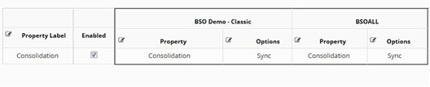

# Member Properties

Member property configuration defines property attributes, categories, and how properties are mapped, validated, and derived across applications and dimensions. This module provides comprehensive control over member metadata and its behavior throughout the EPMware system.

<br/>
*Member Properties module showing configuration options across applications and dimensions*

## Overview

The Member Properties module is comprised of the following components:

- **[Property Configuration](#property-configuration)** - Define property attributes and behavior
- **[Property Categories](#property-categories)** - Group and organize properties for display
- **[Property Mapping](#property-mapping)** - Synchronize properties across applications
- **[Property Validation](#property-validation)** - Enforce business rules and data quality
- **[Property Derivation](#property-derivation)** - Calculate property values dynamically

## Quick Links

<div class="grid cards">
  <div class="card">
    <h3>⚙️ Configuration</h3>
    <p>Set up property attributes, defaults, and display options</p>
    <a href="#property-configuration" class="md-button">Configure Properties →</a>
  </div>
  
  <div class="card">
    <h3>📁 Categories</h3>
    <p>Organize properties with workflow and node filtering</p>
    <a href="#property-categories" class="md-button">Manage Categories →</a>
  </div>
  
  <div class="card">
    <h3>🔗 Mapping</h3>
    <p>Synchronize property values across dimensions</p>
    <a href="#property-mapping" class="md-button">Set Up Mapping →</a>
  </div>
  
  <div class="card">
    <h3>✓ Validation</h3>
    <p>Implement business rules and data quality checks</p>
    <a href="#property-validation" class="md-button">Add Validations →</a>
  </div>
</div>

---

## Property Configuration

Property configuration defines the attributes for applications imported from target systems or generic applications created in EPMware.

<br/>
*Property Configuration screen showing properties filtered by application, dimension class, and category*

### Property Attribute Groups

Properties are organized into five main attribute groups:

<br/>
*Property configuration tabs showing different attribute groups*

#### 1. General Attributes

Configure basic property settings and derived SQL logic:

| Attribute | Description | Use Case |
|-----------|-------------|----------|
| **Property Name** | Unique identifier | System reference |
| **Display Label** | User-friendly name | UI display |
| **Data Type** | String, Numeric, Date, Boolean | Data validation |
| **Display Type** | Input, LOV, Multi-select | User interaction |
| **Derived Flag** | Calculate value dynamically | Read-only values |
| **Derived SQL** | SQL logic for derived values | Dynamic calculations |

##### Derived SQL Example

```sql
-- Get description from another application
SELECT ew_hierarchy.get_member_desc(
    p_app_name => 'EBS',
    p_dim_name => 'Account',
    p_member_name => :member_name
)
FROM dual
```

!!! note "Derived SQL Parameters"
    Available runtime parameters:
    - `:app_id` - Application ID
    - `:app_dimension_id` - Dimension ID
    - `:member_id` - Member ID
    - `':member_name'` - Member Name (use quotes)
    - `:hierarchy_id` - Node ID
    - `':prop_name'` - Property Name (use quotes)

#### 2. Default Attributes

Set default values for new members:

| Setting | Description | Example |
|---------|-------------|---------|
| **Default Value** | Static default | "Active" |
| **Default Value SQL** | Dynamic default | Based on parent |
| **Shared Member Default** | For shared instances | Inherit from primary |
| **Root Member Default** | For top-level members | Special handling |

##### Default Value SQL Example

```sql
-- Assign UDA based on parent member prefix
SELECT CASE 
    WHEN ew_global.chk_lookup_code_exists(
        p_name => 'IT_MEMBERS',
        p_code => SUBSTR(h.parent_member_name,1,1)
    ) = 'Y'
    THEN 'IT'
    ELSE 'Non-IT'
END prop_value
FROM ew_hierarchy_details_v h
WHERE h.app_dimension_id = :app_dimension_id
  AND h.hierarchy_id = :hierarchy_id
```

#### 3. Display Attributes

Control property visibility and interaction:

<br/>
*Display attributes configuration with conditional logic*

| Attribute | Description | Example Use |
|-----------|-------------|-------------|
| **Conditional Display SQL** | Show/hide dynamically | Role-based visibility |
| **Conditional Gray Out SQL** | Make read-only conditionally | Dependent properties |
| **Dynamic Label SQL** | Change label dynamically | Context-sensitive labels |
| **List of Values SQL** | Populate dropdown options | Dynamic lookups |
| **Mask SQL** | Hide sensitive data | Security masking |

##### LOV SQL Example

```sql
-- Get online stores for Products dimension
SELECT m.member_name lookup_code,
       m.member_name || ' - ' || 
       ew_hierarchy.get_member_desc(m.member_id) meaning,
       NULL description,
       rownum seq_num
FROM ew_members_v m,
     ew_app_dimensions_v d
WHERE d.app_dimension_id = :app_dimension_id
  AND d.app_id = m.app_id
  AND m.dim_name = 'Stores'
  AND ew_hierarchy.is_base_member(p_member_id => m.member_id) = 'Y'
  AND 'Y' = ew_hierarchy.chk_primary_branch_exists(
      p_app_dimension_id => m.app_dimension_id,
      p_parent_member_name => 'Online',
      p_member_name => m.member_name
  )
ORDER BY m.member_name
```

#### 4. Deploy Attributes

Control deployment behavior:

| Attribute | Description | Impact |
|-----------|-------------|--------|
| **Deploy Flag** | Include in deployment | Controls export |
| **Conditional Deploy SQL** | Deploy based on conditions | Selective deployment |
| **Deploy Format** | Format for target system | System-specific |
| **Deploy Sequence** | Order in deployment file | Processing order |

##### Conditional Deploy SQL Example

```sql
-- Don't deploy UDA for seeded members
SELECT CASE 
    WHEN ew_hierarchy.get_member_prop_value(
        p_prop_label => 'Operation',
        p_hierarchy_id => :hierarchy_id,
        p_app_dimension_id => :app_dimension_id
    ) IS NULL
    THEN 'Y'
    ELSE 'N'
END deploy_flag
FROM dual
```

#### 5. Associations

Link properties to applications and dimensions:

- **Application Association** - Which applications use this property
- **Dimension Association** - Which dimensions include this property
- **Category Assignment** - Property categorization
- **Security Class** - Access control

---

## Property Categories

Property categories group properties for organized display on the Metadata Explorer and Request pages, with advanced filtering capabilities.

<br/>
*Property Categories configuration showing categories by dimension class*

### Category Configuration

Right-click on a category to configure:

<br/>
*Category Properties dialog with workflow and node filtering options*

### Key Features

#### Workflow Filtering

Restrict property categories to specific workflows for better user experience:

<br/>
*Step 1: Enable Workflow Filtering on category*

<br/>
*Step 2: Assign workflows to the category*

**Use Cases:**
- **Create Entities Workflow** - Show only creation properties
- **Edit Properties Workflow** - Display editable attributes only
- **Approval Workflow** - Include review-specific fields

!!! info "Workflow Filtering Scope"
    Workflow filtering applies only to the Request page, not to Metadata Explorer.

#### Node Level Filtering

Control category visibility based on hierarchy position:

<br/>
*Node filtering configuration with multiple criteria options*

**Filtering Options:**

| Filter Type | Description | Example |
|-------------|-------------|---------|
| **Base/Parent** | Member type filtering | Base members only |
| **Generation/Level** | Hierarchy depth filtering | Levels 4 and 5 only |
| **Specific Nodes** | Named member filtering | TB or ALT_TB nodes |
| **Custom SQL** | Complex logic filtering | Business rule based |

<br/>
*Example: Category visible only for specific nodes*

### Assigning Properties to Categories

Right-click on a category and select "Assign Properties":

<br/>
*Property assignment dialog for category configuration*

---

## Property Mapping

Property mapping synchronizes property values across dimensions in different applications, ensuring data consistency.

<br/>
*Property Mapping configuration showing synchronization across applications*

### Mapping Configuration

Property maps work in conjunction with dimension mapping to automatically populate shared properties across applications.

#### Key Concepts

- **Property Label** - Common identifier across mappings
- **Sync Options** - Direct sync or script-based transformation
- **Reviewer Override** - Allow target application reviewers to modify values
- **Mapping Direction** - One-way or bi-directional sync

### Creating Property Maps

1. Click the **+** icon to add a mapping row
2. Input a **Property Label** for reference
3. Select properties to map in each application column
4. Choose sync option for each property:
   - **Sync** - Direct value copy
   - **Script** - Custom transformation logic

<br/>
*Example: Mapping Consolidation property between BSO Demo Classic and BSOALL*

!!! warning "Save Required"
    Changes are not committed until the Save icon is clicked. Rows are automatically sorted alphabetically after saving.

!!! note "Request Line Generation"
    Each mapped property creates a line item in the Request page for applications configured with Sync.

### Mapping Best Practices

1. **Consistent Naming** - Use standard property labels across mappings
2. **Test Scripts** - Validate transformation logic in development
3. **Document Mappings** - Maintain mapping documentation
4. **Monitor Sync** - Review sync logs regularly

---

## Property Validation

Property validations provide additional business rule enforcement beyond standard application validations.

<br/>
*Property Validations configuration showing active validation rules*

### Creating Validations

<br/>
*Create Property Validation dialog with script selection*

**Configuration Steps:**

1. Select **Application Name**
2. Select **Dimension Name**
3. Select **Property Name** to validate
4. Choose **Validation Script** from Logic Builder
5. Enable/Disable validation
6. Add description for documentation

### Validation Script Example

```javascript
// Validate account code format
function validateAccountCode(context) {
    var accountCode = context.propertyValue;
    var pattern = /^[0-9]{4}-[A-Z]{3}-[0-9]{3}$/;
    
    if (!pattern.test(accountCode)) {
        return {
            valid: false,
            message: "Account code must be in format: 9999-XXX-999"
        };
    }
    
    return { valid: true };
}
```

!!! tip "Multiple Validations"
    You can assign multiple validation scripts to a single property for comprehensive checking.

### Edit Property Validation

<br/>
*Edit Property Validation dialog*

---

## Property Derivation

Property derivation automatically calculates property values using Logic Builder scripts.

<br/>
*Property Derivations configuration showing derivation rules*

### Creating Derivations

<br/>
*Create Derivation dialog with script configuration*

**Configuration Elements:**

1. **Application Name** - Target application
2. **Dimension Name** - Target dimension
3. **Property Name** - Property to derive
4. **Derivation Script** - Logic Builder script
5. **Enabled** - Activate/deactivate derivation
6. **Description** - Documentation

### Derivation Script Example

```javascript
// Derive full account name from components
function deriveFullAccountName(context) {
    var entity = context.getMemberProperty('Entity');
    var account = context.getMemberProperty('Account');
    var project = context.getMemberProperty('Project');
    
    if (entity && account) {
        return entity + '-' + account + (project ? '-' + project : '');
    }
    
    return null;
}
```

### Edit Derivation

<br/>
*Edit Derivation dialog for modifying derivation rules*

!!! note "Script Management"
    All validation and derivation scripts are created and managed in the Logic Builder module.

---

## Best Practices

### 1. Property Design

- **Standardize Names** - Use consistent property naming across applications
- **Document Purpose** - Maintain clear descriptions for all properties
- **Group Logically** - Use categories to organize related properties
- **Plan Dependencies** - Map property relationships before implementation

### 2. Performance Optimization

- **Optimize SQL** - Test and tune all SQL statements
- **Cache Lookups** - Use efficient LOV queries
- **Limit Derivations** - Avoid complex nested derivations
- **Index Properly** - Ensure database indexes support queries

### 3. Data Quality

- **Validate Input** - Implement comprehensive validation rules
- **Default Values** - Set sensible defaults for required properties
- **Audit Changes** - Enable property change tracking
- **Test Thoroughly** - Validate all scripts in development

### 4. User Experience

- **Intuitive Categories** - Create logical property groupings
- **Clear Labels** - Use descriptive, user-friendly names
- **Help Text** - Provide property descriptions and guidance
- **Conditional Display** - Show only relevant properties

---

## Troubleshooting

### Common Issues

| Issue | Possible Cause | Solution |
|-------|---------------|----------|
| Property not visible | Category filtering | Check workflow/node filter settings |
| Validation not firing | Script disabled | Enable validation in configuration |
| Derivation returns null | Script error | Test script in Logic Builder |
| LOV empty | SQL returns no rows | Debug SQL with test parameters |
| Property not syncing | Mapping disabled | Verify property mapping configuration |
| Mask not working | Mask SQL error | Check SQL syntax and permissions |

### Debugging SQL

Test SQL statements directly in database:

```sql
-- Test LOV SQL with parameters
SELECT lookup_code, meaning, description, seq_num
FROM your_lov_query
WHERE :app_dimension_id = 123  -- Test value
ORDER BY seq_num;
```

### Getting Help

- Review [Logic Builder documentation](../logic-builder/index.md)
- Check application-specific validations in [Appendix C](../appendices/validations.md)
- Contact EPMware support with:
  - Error messages
  - Configuration screenshots
  - Sample data

---

## Related Topics

- [Dimension Configuration](../dimensions/index.md)
- [Logic Builder](../logic-builder/index.md) - Create validation and derivation scripts
- [Security Classes](../security/index.md#security-classes)
- [Workflow Builder](../workflow/index.md) - Configure workflow-specific properties
- [Out of Box Validations](../appendices/validations.md) - Standard application validations
