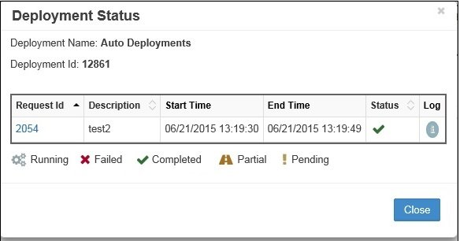
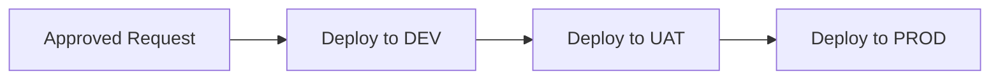

# Deployment

The Deployment module manages the automated deployment of approved metadata changes to target applications. It provides centralized control over when and how metadata is deployed, with comprehensive monitoring, scheduling, and multi-environment support.

<br/>
*Deployment module showing Manager, Monitor, and Schedule tabs*

## Overview

The Deployment module consists of three integrated components:

- **[Deployment Manager](#deployment-manager)** - Create and configure deployment definitions
- **[Deployment Monitor](#deployment-monitor)** - Track deployment execution and status
- **[Deployment Schedule](#deployment-schedule)** - View and manage scheduled deployments

Key capabilities include:
- Direct deployment to target applications
- File-based deployment for manual processing
- Interface table deployment for integrations
- Multi-environment cascade deployments
- Pre and post-deployment scripting
- Comprehensive email notifications

## Quick Links

<div class="grid cards">
  <div class="card">
    <h3>⚙️ Manager</h3>
    <p>Configure deployment types, scripts, and notifications</p>
    <a href="#deployment-manager" class="md-button">Manage Deployments →</a>
  </div>
  
  <div class="card">
    <h3>📊 Monitor</h3>
    <p>Track deployment status and view logs</p>
    <a href="#deployment-monitor" class="md-button">Monitor Status →</a>
  </div>
  
  <div class="card">
    <h3>📅 Schedule</h3>
    <p>Configure automated deployment timing</p>
    <a href="#scheduling-deployments" class="md-button">Set Schedule →</a>
  </div>
  
  <div class="card">
    <h3>🔄 Redeployment</h3>
    <p>Handle failed deployments and retries</p>
    <a href="#redeployment" class="md-button">Learn More →</a>
  </div>
</div>

---

## Deployment Manager

Deployment Manager creates and manages deployment configurations that determine what, when, and how metadata is deployed.

<br/>
*Deployment Manager showing configured deployments*

### Deployment Components

| Component | Description | Options |
|-----------|-------------|---------|
| **Name** | Deployment identifier | User-defined |
| **Description** | Deployment purpose | Optional text |
| **Type** | Deployment scope | Application, Workflow, Request |
| **Pre-Deployment Scripts** | Scripts run before deployment | Logic Builder scripts |
| **Post-Deployment Scripts** | Scripts run after deployment | Logic Builder scripts |
| **Email Templates** | Success/error notifications | From Email Templates |
| **Attachments** | Files to include | Deployment files, logs |
| **Environment** | Target environment | Multi-environment only |

### Deployment Types

#### Application Deployment
Deploys all approved requests for an entire application:
- Processes all pending requests
- Batches changes together
- Most efficient for regular updates
- Typically scheduled

#### Workflow Deployment  
Deploys approved requests from specific workflows:
- Workflow-specific processing
- Useful for different SLAs
- Segregates by business process
- Can have different schedules

#### Request Deployment
Deploys individual or grouped requests:
- Selective deployment
- Emergency changes
- Failed request redeployment
- Manual control

### Creating Deployments

<br/>
*Add Deployment configuration dialog*

1. Navigate to **Deployment → Manager**
2. Click the **+** icon
3. Configure deployment:

| Field | Required | Description |
|-------|----------|-------------|
| **Deployment Name** | Yes | Unique identifier |
| **Description** | No | Deployment purpose |
| **Deployment Type** | Yes | Application/Workflow/Request |
| **Pre-Deployment Script** | No | Logic Builder script to run before |
| **Post-Deployment Script** | No | Logic Builder script to run after |
| **Email on Success** | No | Success notification template |
| **Email on Error** | No | Error notification template |
| **Attach Deployment Files** | No | Include metadata files |
| **Attach Log Files** | No | Include execution logs |
| **Enabled** | Yes | Activate deployment |
| **Environment** | Conditional | For multi-environment setups |

4. Click **Save**

#### Example: Production Application Deployment

```
Name: PROD_HFM_Daily
Description: Daily HFM production deployment
Type: Application
Pre-Deployment Script: BACKUP_HFM_METADATA
Post-Deployment Script: REFRESH_ESSBASE_CALC
Email on Success: DEP_Success_Summary
Email on Error: DEP_Failed_Alert
Attach Deployment Files: ✓
Attach Log Files: ✓
Enabled: ✓
```

### Editing Deployments

<br/>
*Deployment Properties edit dialog*

1. Right-click on deployment row
2. Select **Edit Properties**
3. Modify configuration
4. Click **Save**

### Request-Based Deployment

For selective or failed request redeployment:

1. Create Request-type deployment
2. Click **Save**
3. Click "Requests" link in grid
4. Select **Ready for Deployment** radio button
5. Choose specific requests
6. Click **Save**
7. Schedule deployment

<br/>
*Request selection for targeted deployment*

---

## Scheduling Deployments

Configure when deployments execute automatically.

<br/>
*Schedule Deployment configuration options*

### Schedule Types

#### Auto (Immediate)
Deploys as soon as requests are ready:
- Real-time processing
- No delay
- Best for urgent changes
- Continuous monitoring

#### Daily
Runs at specified time each day:

<br/>
*Daily schedule configuration*

```
Frequency: Daily
Time: 11:00 PM
Days: All days
```

#### Weekly
Runs on selected days of the week:

<br/>
*Weekly schedule with day selection*

```
Frequency: Weekly
Days: Monday, Wednesday, Friday
Time: 10:00 PM
```

#### Monthly
Runs on specific day each month:

<br/>
*Monthly schedule configuration*

```
Frequency: Monthly
Day: Last day of month
Time: 11:30 PM
```

#### One Time
Single execution at specified datetime:

<br/>
*One-time schedule configuration*

```
Frequency: One Time
Date: 12/31/2024
Time: 11:59 PM
```

#### Hourly
Runs every specified number of hours:

<br/>
*Hourly schedule interval*

```
Frequency: Hourly
Interval: Every 4 hours
Starting: 8:00 AM
```

#### By Minutes
Runs at minute intervals:

<br/>
*Minute-based schedule*

```
Frequency: By Minutes
Interval: Every 15 minutes
```

### Scheduling Process

1. Click schedule icon (📅) for deployment
2. Select schedule type
3. Configure parameters
4. Click **Save**

!!! tip "Schedule Best Practices"
    - **Production**: Daily during maintenance window
    - **UAT**: Hourly or by minutes for testing
    - **Development**: Auto for immediate feedback

---

## Deployment Monitor

Monitor deployment execution status and access logs.

<br/>
*Deployment Monitor showing execution history*

### Monitor Grid Columns

| Column | Description | Information |
|--------|-------------|-------------|
| **Deployment Id** | Unique execution ID | Click for details |
| **Name** | Deployment name | From Manager tab |
| **Description** | Deployment description | User-defined |
| **Type** | Deployment type | Application/Workflow/Request |
| **Start Time** | Execution start | Timestamp |
| **End Time** | Execution completion | Timestamp |
| **Status** | Current state | Running/Completed |
| **Log** | Execution log | Click to view |

### Grid Controls

#### Filter
Filter deployments by criteria:

<br/>
*Deployment search and filter options*

- Date range
- Status
- Deployment name
- Type

#### Auto Refresh
Enable automatic grid updates:

<br/>
*Auto refresh toggle*

- Updates every 60 seconds (configurable)
- Shows real-time status
- Useful during deployments

### Deployment Status Details

Click on **Deployment ID** to view detailed status:

<br/>
*Deployment Status showing request details*

| Column | Description |
|--------|-------------|
| **Request ID** | Request identifier |
| **Application** | Target application |
| **Status** | Deployment result |
| **Start/End Time** | Processing times |
| **Error Message** | Failure details |

### Status Icons

<br/>
*Deployment status icon legend*

| Icon | Status | Description |
|------|--------|-------------|
| ✅ | **Completed** | Successfully deployed |
| ⏳ | **Pending** | Awaiting action |
| ⚠️ | **Partial** | Some items failed |
| ❌ | **Failed** | Deployment failed |
| 🔄 | **Running** | Currently executing |

---

## Redeployment

Handle failed or partial deployments through redeployment.

### Redeployment Options

#### Full Deployment Retry
Redeploy all failed requests in a deployment:

1. Right-click on deployment row in Monitor
2. Select **Redeploy**
3. Failed requests return to deployment pool
4. Wait for next scheduled run

#### Individual Request Retry
Redeploy specific failed requests:

1. Click **Deployment ID** in Monitor
2. Right-click on failed request
3. Select **Redeploy**
4. Request queued for next run

!!! note "Redeployment Behavior"
    Redeployed requests are added to the deployment pool and processed during the next scheduled execution.

### Handling Partial Deployments

When deployment status shows **Partial**:

1. **Identify Failed Items**:
   - Click Deployment ID
   - Review failed request lines
   - Note error messages

2. **Resolution Options**:
   - Fix data issues and redeploy
   - Cancel failed lines
   - Manually close deployment

3. **Prevention**:
   - Add validation stages
   - Improve pre-deployment scripts
   - Test in lower environments

---

## Multi-Environment Deployment

Deploy metadata through multiple environments in sequence.

### Configuration Overview



### Setup Components

1. **Shell Applications** - Logical non-production apps
2. **Environments** - Define tiers (DEV, UAT, PROD)
3. **Deployment Order** - Sequence of deployments
4. **Environment Mapping** - Link apps to environments

### Example Configuration

#### Define Environments

| Environment | Deployment Order | Description |
|-------------|-----------------|-------------|
| Development | 1 | First deployment |
| UAT | 2 | After DEV success |
| Production | 3 | Final deployment |

#### Create Environment-Specific Deployments

```
Deployment 1:
Name: DEP_Development
Environment: Development
Schedule: Auto

Deployment 2:
Name: DEP_UAT
Environment: UAT
Schedule: Daily 6:00 PM

Deployment 3:
Name: DEP_Production
Environment: Production
Schedule: Daily 11:00 PM
```

---

## Deployment Scripts

Enhance deployments with Logic Builder scripts.

### Pre-Deployment Scripts

Execute before metadata deployment:

```javascript
// Backup current metadata
function preDeploymentBackup(context) {
    var timestamp = new Date().toISOString();
    var backupName = context.applicationName + "_" + timestamp;
    
    // Create backup
    backupMetadata(context.applicationId, backupName);
    
    // Validate target system availability
    if (!isSystemAvailable(context.targetServer)) {
        throw new Error("Target system unavailable");
    }
    
    return {
        status: "SUCCESS",
        backupName: backupName
    };
}
```

### Post-Deployment Scripts

Execute after successful deployment:

```javascript
// Refresh dependent systems
function postDeploymentRefresh(context) {
    // Refresh Essbase outline
    refreshEssbaseOutline(context.applicationName);
    
    // Clear and reload Smart View
    clearSmartViewCache();
    
    // Send notification to users
    notifyUsers(context.deploymentId, "Deployment completed");
    
    // Update audit log
    logDeployment(context);
    
    return { status: "SUCCESS" };
}
```

---

## Deployment Schedule Tab

View all scheduled deployments in one place.

<br/>
*Deployment Schedule showing upcoming executions*

### Schedule Grid Information

| Column | Description |
|--------|-------------|
| **Name** | Deployment name |
| **Description** | Deployment purpose |
| **Next Deployment Date** | Next execution time |
| **Frequency** | Schedule type |
| **Type** | Deployment type |

### Managing Schedules

- **Modify**: Change via Manager tab
- **Disable**: Uncheck enabled in Manager
- **View History**: Check Monitor tab
- **Upcoming**: Sort by next deployment date

---

## Best Practices

### 1. Deployment Strategy

- **Batch Similar Changes** - Group related updates
- **Off-Peak Scheduling** - Deploy during maintenance windows
- **Environment Progression** - DEV → UAT → PROD
- **Backup First** - Always backup before deployment
- **Test Scripts** - Validate pre/post scripts

### 2. Schedule Optimization

- **Production** - Daily at 11 PM or later
- **UAT** - Multiple times daily
- **Development** - Auto or frequent
- **Emergency** - One-time deployments
- **Batch Size** - Limit requests per deployment

### 3. Monitoring

- **Enable Auto-Refresh** - During deployments
- **Check Logs** - Review for warnings
- **Track Patterns** - Identify recurring issues
- **Set Alerts** - Email on failures
- **Archive Logs** - Maintain history

### 4. Error Handling

- **Immediate Notification** - Email on error
- **Log Attachment** - Include in notifications
- **Redeploy Strategy** - Define retry approach
- **Root Cause Analysis** - Track failure patterns
- **Rollback Plans** - Document procedures

---

## Troubleshooting

### Common Issues

| Issue | Cause | Solution |
|-------|-------|----------|
| Deployment not running | Not scheduled or disabled | Check schedule and enabled status |
| Stuck in Running | Timeout or system issue | Check logs, restart service |
| Partial deployment | Some requests failed | Review errors, redeploy failed |
| No requests found | Wrong type or filter | Verify deployment type configuration |
| Email not sent | Template not configured | Check email template assignment |
| Script error | Logic Builder issue | Debug script independently |
| Wrong environment | Mapping incorrect | Verify environment configuration |

### Deployment Logs

Access detailed logs:

1. Click log icon in Monitor grid
2. Review for:
   - Error messages
   - Warning indicators
   - Processing times
   - Request details

### Service Management

Check deployment service:

1. Navigate to **Administration → Services**
2. Verify **Deployment Service** status
3. Start/stop as needed
4. Check service interval settings

### Performance Tuning

Optimize deployment performance:

```
Global Settings → Application Settings:
- Maximum # of Minutes for Deployment: 180
- Deployment Service Sleep Interval: 5
- File Size Limits: Adjust as needed
```

---

## Integration Points

### Workflow Integration

Deploy stages in workflows:
- Create deploy task
- Assign to deploy stage
- Configure environment
- Link to deployment

### Email Templates

Deployment notifications:
- Success templates
- Error templates
- Custom variables
- Table insertions

### Logic Builder

Pre/post scripts:
- Validation logic
- Backup procedures
- System integration
- Custom processing

### Multi-Environment

Environment configuration:
- Infrastructure setup
- Application mapping
- Deployment order
- Shell applications

---

## Related Topics

- [Workflow Builder](../workflow/index.md) - Configure deploy stages
- [Email Templates](../email-templates/index.md) - Deployment notifications
- [Logic Builder](../logic-builder/index.md) - Pre/post scripts
- [Infrastructure](../infrastructure/index.md#multi-environment-configuration) - Environment setup
- [Global Settings](../global-settings/index.md) - Timeout and interval configuration
- [Services](../administration/index.md#services) - Deployment service management
