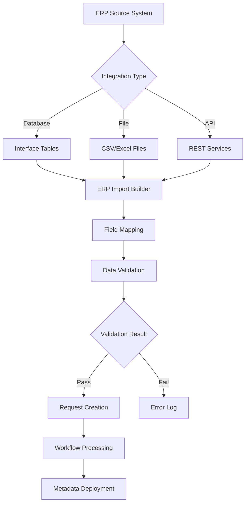

# ERP Import

The ERP Import module automates metadata import from ERP source systems into EPMware through configurable interfaces. It enables seamless integration with enterprise systems to maintain synchronized metadata across financial and operational applications.

<br/>
*ERP Import module showing Builder, Mapping, and Monitor components*

## Overview

ERP Import provides automated data synchronization between source ERP systems and EPMware-managed applications through:

- **[ERP Import Builder](#erp-import-builder)** - Create and configure import definitions
- **[ERP Import Mapping](#erp-import-mapping)** - Map source data to target properties
- **[ERP Import Monitor](#erp-import-monitor)** - Track execution status and troubleshoot

The module supports multiple integration patterns:
- Interface table-based integration
- File-based imports (CSV, Excel)
- REST API integration (Cloud deployments)
- Scheduled batch processing
- Real-time synchronization

## Quick Links

<div class="grid cards">
  <div class="card">
    <h3>🔧 Builder</h3>
    <p>Configure import definitions and settings</p>
    <a href="#erp-import-builder" class="md-button">Build Imports →</a>
  </div>
  
  <div class="card">
    <h3>🔗 Mapping</h3>
    <p>Map source fields to EPMware properties</p>
    <a href="#erp-import-mapping" class="md-button">Configure Mapping →</a>
  </div>
  
  <div class="card">
    <h3>📊 Monitor</h3>
    <p>Track import execution and status</p>
    <a href="#erp-import-monitor" class="md-button">View Monitor →</a>
  </div>
  
  <div class="card">
    <h3>⚡ Integration</h3>
    <p>Connect to Oracle, SAP, and other ERPs</p>
    <a href="#erp-integration-patterns" class="md-button">Setup Integration →</a>
  </div>
</div>

---

### ERP Import Architecture

Understanding the ERP Import data flow helps in designing efficient integrations:



### Integration Components

| Component | Purpose | Location |
|-----------|---------|----------|
| **Source System** | ERP data origin | External |
| **Interface Layer** | Data staging | Database/Files |
| **Import Engine** | Processing logic | EPMware |
| **Validation Layer** | Data quality | Logic Builder |
| **Request Engine** | Change management | Workflow |
| **Deployment** | Target update | Applications |

---

## ERP Import Builder

The Builder creates and manages import configurations that define how data flows from source systems into EPMware.

<br/>
*ERP Import Builder showing configured imports*

### Creating Import Configurations

#### Basic Configuration

<br/>
*Create ERP Import configuration dialog*

1. Navigate to **Administration → ERP Import → Builder**
2. Click the **+** icon
3. Configure import settings:

| Field | Required | Description | Example |
|-------|----------|-------------|---------|
| **Interface Name** | Yes | Unique identifier | GL_ACCOUNT_IMPORT |
| **Description** | No | Import purpose | Monthly GL account updates |
| **Application** | Yes | Target application | HFM_PROD |
| **Dimension** | Yes | Target dimension | Account |
| **Workflow Priority** | Yes | Request priority | High/Medium/Low |
| **Workflow** | Yes | Processing workflow | Auto_Approval |

#### Advanced Settings

| Field | Default | Description | Impact |
|-------|---------|-------------|--------|
| **Partial Allowed** | No | Continue on errors | Allows partial success |
| **Enabled** | Yes | Active status | Controls visibility |
| **Ignore Records That Have Not Changed** | No | Skip unchanged data | Reduces processing |
| **Launch Workflow** | Yes | Auto-start workflow | Immediate processing |
| **Interface Table Name** | ew_if_lines | Source table | Data location |

#### Script Integration

Configure pre and post-processing scripts:

| Script Type | Purpose | Example Use |
|-------------|---------|-------------|
| **Pre-Execution** | Data preparation | Validate source data |
| **Post-Execution** | Cleanup/Archive | Move processed records |

Example Pre-Execution Script:
```javascript
function validateGLData(context) {
    // Check for required fields
    var errors = context.executeQuery(
        "SELECT COUNT(*) cnt FROM ew_if_lines WHERE member_name IS NULL"
    );
    
    if (errors[0].cnt > 0) {
        throw new Error("Found records with missing member names");
    }
    
    // Validate account codes
    var invalid = context.executeQuery(
        "SELECT member_name FROM ew_if_lines WHERE NOT REGEXP_LIKE(member_name, '^[0-9]{6}$')"
    );
    
    if (invalid.length > 0) {
        context.log("ERROR", "Invalid account codes found");
        return { status: "FAILED", message: "Invalid account format" };
    }
    
    return { status: "SUCCESS" };
}
```

#### Email Configuration

Set up notifications:

| Template | When Used | Recipients |
|----------|-----------|------------|
| **Email on Success** | Import completes | Administrators |
| **Email on Error** | Import fails | Support team |

### File-Based Import

Import data from uploaded files instead of interface tables:

<br/>
*File upload for direct import*

#### File Upload Process

1. Click upload icon (📁) on import row
2. Browse and select file (CSV/Excel)
3. Click **Upload**
4. System displays field mapping screen

<br/>
*Map file columns to properties*

#### Supported File Formats

| Format | Extension | Requirements |
|--------|-----------|-------------|
| **CSV** | .csv | Header row required |
| **Excel** | .xlsx, .xls | First sheet used |
| **Tab-delimited** | .txt, .tsv | Tab separator |
| **Pipe-delimited** | .txt | Pipe separator |

#### File Structure Example

```csv
MEMBER_NAME,PARENT,DESCRIPTION,CURRENCY,STATUS
100000,Total_Revenue,Product Revenue,USD,Active
100100,100000,Hardware Sales,USD,Active
100200,100000,Software Sales,USD,Active
100300,100000,Services Revenue,USD,Active
```

!!! note "Cloud Deployment"
    EPMware Cloud uses REST API for file uploads, not direct database access to ew_if_lines table.

### Managing Import Configurations

#### Edit Import

<br/>
*Edit import configuration*

1. Right-click on import row
2. Select **Edit Properties**
3. Modify settings
4. Click **Save**

#### Delete Import

1. Right-click on import row
2. Select **Delete**
3. Confirm deletion

!!! warning "Active Import Deletion"
    Cannot delete imports with pending executions. Complete or cancel active jobs first.

---

## ERP Import Mapping

Mapping defines how source data fields correspond to EPMware properties for both request headers and line items.

<br/>
*Import mapping configuration interface*

### Mapping Types

The system supports two mapping levels:

#### Header Mapping

Maps source fields to request header attributes:

<br/>
*Header mapping configuration*

**Common Header Mappings:**

| Source Column | Target Field | Mapping Type | Value/Logic |
|--------------|--------------|--------------|-------------|
| BATCH_ID | Request Description | Import | Direct from source |
| LOAD_DATE | Due Date | Constant | SYSDATE + 7 |
| SYSTEM | UDF1 | Import | Source system name |
| USER_ID | UDF2 | Derived | Lookup requestor |
| PRIORITY | Priority | Derived | Based on record count |

#### Line Mapping

Maps source fields to request line properties:

<br/>
*Line mapping configuration*

**Common Line Mappings:**

| Source Column | Property Name | Mapping Type | Value/Logic |
|--------------|---------------|--------------|-------------|
| ACCOUNT_CODE | Member Name | Import | Direct |
| PARENT_CODE | Parent | Import | Direct |
| ACCOUNT_DESC | Description | Import | Direct |
| CURRENCY_CODE | Currency | Import | Direct |
| ACTIVE_FLAG | Status | Derived | Y='Active', N='Inactive' |
| GL_TYPE | Account Type | Import | Direct |

### Mapping Configuration Process

1. **Select Import** - Choose from dropdown
2. **Choose Level** - Header or Line radio button
3. **Add Mapping** - Click + icon
4. **Configure Fields**:

| Field | Description | Options |
|-------|-------------|---------|
| **Column Name** | Source field | From interface table |
| **Property Name** | Target property | From dimension |
| **Mapping Type** | Transformation | Import/Constant/Derived |
| **Custom Value** | Static/Formula | For Constant/Derived |

### Mapping Types Explained

#### Import (Direct)
Copies value directly from source:
```sql
SOURCE.FIELD_NAME → TARGET.PROPERTY
```

#### Constant
Uses fixed value for all records:
```sql
'Active' → STATUS
SYSDATE + 30 → DUE_DATE
'USD' → CURRENCY
```

#### Derived
Calculates value using logic:
```sql
CASE 
  WHEN amount > 1000000 THEN 'High'
  WHEN amount > 100000 THEN 'Medium'
  ELSE 'Low'
END → PRIORITY
```

### Advanced Mapping Features

#### Conditional Mapping

Use derived type with CASE logic:
```sql
CASE 
  WHEN source_system = 'SAP' THEN account_code
  WHEN source_system = 'Oracle' THEN 'GL' || account_code
  ELSE 'UNKNOWN'
END
```

#### Concatenation

Combine multiple source fields:
```sql
entity_code || '-' || account_code || '-' || product_code
```

#### Lookup Tables

Reference lookup values:
```sql
(SELECT meaning FROM ew_lookups WHERE code = source_value)
```

---

## ERP Import Monitor

Monitor tracks all import executions, providing visibility into status, errors, and performance.

<br/>
*Import monitor showing execution history*

### Monitor Grid

| Column | Description | Actions |
|--------|-------------|---------|
| **Execution ID** | Unique job identifier | Click for details |
| **Name** | Import configuration | Link to builder |
| **Start Time** | Execution start | Sort/filter |
| **End Time** | Completion time | Calculate duration |
| **Status** | Current state | Filter by status |
| **Message** | Status details/errors | View full text |
| **Log** | Detailed log | Download/view |

### Execution Status

#### Status Types

| Icon | Status | Description | Next Action |
|------|--------|-------------|-------------|
| ✅ | **Completed** | All records processed | Review requests |
| ⏳ | **Pending** | Queued for processing | Wait |
| ⚠️ | **Partial** | Some records failed | Review errors |
| ❌ | **Failed** | Import failed | Check logs |
| 🔄 | **Running** | Currently processing | Monitor |

#### Status Details

Click **Execution ID** for detailed information:

<br/>
*Detailed execution status popup*

**Details Include:**
- Request IDs created
- Total records processed
- Success/failure counts
- Error messages
- Processing time
- Memory usage

### Monitor Features

#### Filtering and Search

<br/>
*Filter options for monitor*

**Filter Options:**
- Date range
- Status (multi-select)
- Import name
- Execution ID
- Error message contains

#### Auto-Refresh

Enable automatic grid updates:
- Default: 60 seconds
- Configurable in Global Settings
- Manual refresh button available

#### Log Analysis

Access detailed logs:

1. Click log icon in grid
2. Review log sections:
   - Initialization
   - Validation results
   - Record processing
   - Error details
   - Performance metrics

**Log Example:**
```
[2024-03-15 10:30:00] INFO: Starting import GL_ACCOUNT_IMPORT
[2024-03-15 10:30:01] INFO: Found 1,234 records to process
[2024-03-15 10:30:02] INFO: Validation passed
[2024-03-15 10:30:05] INFO: Created request REQ-2024-0315
[2024-03-15 10:30:10] INFO: Processed 1,234 records successfully
[2024-03-15 10:30:11] INFO: Import completed
```

---

## ERP Integration

### Oracle EBS Integration

For Oracle E-Business Suite integration:

#### Configuration Requirements

1. **Database Objects** (See Appendix E)
   - Interface views
   - PL/SQL packages
   - Concurrent programs

2. **EPMware Configuration**
   ```
   Interface Name: EBS_GL_IMPORT
   Interface Table: xxps_gl_interface_v
   Pre-Script: VALIDATE_EBS_GL
   ```

3. **Mapping Example**
   ```sql
   -- Header Mapping
   LEDGER_NAME → UDF1
   PERIOD_NAME → UDF2
   
   -- Line Mapping
   SEGMENT1 → Entity
   SEGMENT2 → Account
   SEGMENT3 → Product
   ```

### Oracle Fusion Integration

For Oracle Fusion Cloud integration:

#### REST API Configuration

```javascript
function importFromFusion(context) {
    var endpoint = context.getSystemProperty("FUSION_REST_URL");
    var auth = context.getSystemProperty("FUSION_AUTH_TOKEN");
    
    var response = context.httpRequest({
        url: endpoint + "/fscmRestApi/resources/latest/accounts",
        method: "GET",
        headers: {
            "Authorization": "Bearer " + auth
        }
    });
    
    // Process response
    var accounts = JSON.parse(response.body);
    return processAccounts(accounts);
}
```

### SAP Integration

For SAP integration via RFC or IDoc:

#### Interface Table Structure

```sql
CREATE TABLE sap_gl_interface (
    company_code    VARCHAR2(4),
    gl_account     VARCHAR2(10),
    account_group  VARCHAR2(4),
    short_text     VARCHAR2(20),
    long_text      VARCHAR2(50),
    currency       VARCHAR2(3),
    status         VARCHAR2(1),
    load_date      DATE,
    process_flag   VARCHAR2(1)
);
```

---

## Scheduling and Automation

### Scheduled Imports

Configure automatic import execution:

<br/>
*Schedule configuration options*

**Schedule Types:**
- **Immediate** - Run on file upload
- **Daily** - Fixed time each day
- **Weekly** - Specific days
- **Monthly** - Day of month
- **Interval** - Every X hours/minutes

### Automation Best Practices

1. **Off-Peak Processing** - Schedule during low usage
2. **Incremental Loads** - Process only changes
3. **Error Recovery** - Auto-retry failed records
4. **Notification Chain** - Alert on success/failure
5. **Archive Strategy** - Clean up processed data

---

## Best Practices

### 1. Data Quality

- **Source Validation** - Check data before import
- **Required Fields** - Enforce mandatory attributes
- **Format Standards** - Consistent codes/formats
- **Duplicate Detection** - Prevent redundant imports
- **Referential Integrity** - Validate relationships

### 2. Performance Optimization

- **Batch Sizing** - Optimal record counts
- **Index Usage** - Index interface tables
- **Parallel Processing** - Multiple concurrent imports
- **Memory Management** - Configure heap sizes
- **Archive Old Data** - Maintain performance

### 3. Error Handling

- **Partial Loads** - Allow continuation on error
- **Error Logging** - Detailed error capture
- **Retry Logic** - Automatic retry for transient errors
- **Notification** - Alert on failures
- **Recovery Procedures** - Document recovery steps

### 4. Security

- **Access Control** - Restrict import configuration
- **Data Encryption** - Secure sensitive data
- **Audit Trail** - Log all import activities
- **Credential Management** - Secure storage
- **Data Masking** - Hide sensitive values

---

## Troubleshooting

### Common Issues

| Issue | Cause | Solution |
|-------|-------|----------|
| Import not starting | Service stopped | Start ERP Import Service |
| Records not found | Wrong interface table | Verify table name |
| Mapping errors | Property mismatch | Check dimension properties |
| Validation failures | Data quality issues | Review pre-execution script |
| Timeout errors | Large dataset | Increase timeout, reduce batch |
| Duplicate imports | Multiple executions | Check execution history |
| Workflow not launching | Configuration issue | Verify workflow setting |

### Debugging Queries

#### Check Interface Table

```sql
-- View interface records
SELECT COUNT(*), status, error_message
FROM ew_if_lines
GROUP BY status, error_message
ORDER BY COUNT(*) DESC;

-- Find stuck records
SELECT * FROM ew_if_lines
WHERE status = 'PROCESSING'
  AND last_update_date < SYSDATE - 1/24;
```

#### Monitor Service Status

```sql
-- Check service health
SELECT service_name, status, last_run_date, next_run_date
FROM ew_services
WHERE service_name = 'ERP_IMPORT_SERVICE';

-- View recent executions
SELECT * FROM ew_erp_import_log
WHERE execution_date > SYSDATE - 1
ORDER BY execution_date DESC;
```

#### Clean Up Interface

```sql
-- Archive processed records
INSERT INTO ew_if_lines_archive
SELECT * FROM ew_if_lines
WHERE status = 'PROCESSED'
  AND created_date < SYSDATE - 7;

-- Delete archived records
DELETE FROM ew_if_lines
WHERE status = 'PROCESSED'
  AND created_date < SYSDATE - 7;
```

### Performance Tuning

1. **Global Settings** - Adjust timeouts and intervals
2. **Database Indexes** - Add indexes on interface tables
3. **Batch Size** - Optimize record count per execution
4. **Memory Allocation** - Increase JVM heap if needed
5. **Parallel Processing** - Configure multiple import threads

---

## Integration Points

### Workflow Integration

ERP imports seamlessly integrate with workflows:
- Automatic request creation
- Workflow selection and launch
- Priority assignment
- Due date calculation
- User assignment

### Email Notifications

Configure comprehensive notifications:
- Import start/completion
- Error alerts with details
- Summary statistics
- File attachments
- Distribution lists

### Logic Builder Scripts

Enhance imports with custom logic:
- Data validation
- Transformation rules
- Error handling
- Post-processing
- Integration calls

### Global Settings

Configure system-wide parameters:
```
Maximum # of Minutes for ERP Import Task: 180
ERP Import Service Sleep Interval: 5 seconds
Maximum file size for ERP Import: 50 MB
```

---

## Related Topics

- [Administration Services](../administration/index.md#services) - Manage ERP Import Service
- [Workflow Builder](../workflow/index.md) - Configure import workflows
- [Logic Builder](../logic-builder/index.md) - Create validation scripts
- [Email Templates](../email-templates/index.md) - Import notifications
- [Global Settings](../global-settings/index.md) - System parameters
- [Appendix B: Oracle Fusion GL](../appendices/oracle-fusion-gl.md) - Fusion integration guide
- [Appendix E: Oracle EBS GL](../appendices/oracle-ebs-gl.md) - EBS integration guide
