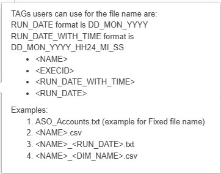

# Export Metadata

The Export Metadata module enables extraction of hierarchy and property data from EPMware to various file formats. It provides flexible configuration for exporting metadata to files, database views, or custom formats for reporting, backup, and integration purposes.

<br/>
*Export module showing the five configuration tabs*

## Overview

The Export module consists of five integrated components:

- **[Export Profile](#export-profile)** - Define export configurations and formats
- **[Export Details](#export-details)** - Specify dimensions and properties to export
- **[Export Format](#export-format)** - Configure output structure and columns
- **[Export](#executing-exports)** - Execute exports and download results
- **[Export Book](#export-book)** - Group multiple exports for batch execution

Key capabilities include:
- Multiple export formats (Parent-Child, Generations, Custom)
- Property selection and filtering
- Pre/post-processing scripts
- Database view integration
- Batch export books
- Multi-environment support

## Quick Links

<div class="grid cards">
  <div class="card">
    <h3>📋 Profiles</h3>
    <p>Create export configurations with format options</p>
    <a href="#export-profile" class="md-button">Create Profile →</a>
  </div>
  
  <div class="card">
    <h3>📊 Details</h3>
    <p>Select dimensions and properties to export</p>
    <a href="#export-details" class="md-button">Configure Details →</a>
  </div>
  
  <div class="card">
    <h3>📁 Formats</h3>
    <p>Define output structure and columns</p>
    <a href="#export-format" class="md-button">Set Format →</a>
  </div>
  
  <div class="card">
    <h3>📚 Books</h3>
    <p>Create export collections for batch processing</p>
    <a href="#export-book" class="md-button">Build Books →</a>
  </div>
</div>

---

## Export Profile

Export profiles define the overall configuration for metadata exports, including format type, generation settings, and processing scripts.

<br/>
*Export Profile configuration screen*

### Profile Configuration

<br/>
*Create Profile dialog with format options*

#### Creating Profiles

1. Select **Export Profile** tab
2. Click the **+** icon
3. Configure profile settings:

| Field | Required | Description | Options |
|-------|----------|-------------|---------|
| **Profile Name** | Yes | Unique identifier | User-defined |
| **Description** | No | Profile purpose | Text |
| **Export Format** | Yes | Output structure | See formats below |
| **# of Generations** | Conditional | For Generation format | 1-20 |
| **Show Member Name in Generations** | Conditional | Include names | Y/N |
| **Fill Generations** | Conditional | Fill empty cells | From dropdown |
| **Column Delimiter** | Conditional | Custom format delimiter | Comma, Tab, Pipe |
| **Text Qualifier** | Conditional | Text enclosure | Quotes, None |
| **Pre Logic Script** | No | Pre-processing | Logic Builder script |
| **Post Logic Script** | No | Post-processing | Logic Builder script |
| **Database View** | Conditional | View name | For DB view format |
| **Environment** | Conditional | Target environment | Multi-environment only |

### Export Formats

#### Parent-Child Format
Standard hierarchical export:
```
Parent,Child,Property1,Property2
Total_Entity,NA_Entity,USA Operations,Active
NA_Entity,USA,United States,Active
NA_Entity,Canada,Canada,Active
```

#### Generations Format
Columnar generation/level format:
```
Gen1,Gen2,Gen3,Property1,Property2
Total_Entity,NA_Entity,USA,USA Operations,Active
Total_Entity,NA_Entity,Canada,Canada Operations,Active
Total_Entity,EMEA_Entity,UK,UK Operations,Active
```

Configuration options:
- **# of Generations**: Maximum depth to export
- **Show Member Name**: Include member names in generation columns
- **Fill Generations**: How to handle empty cells
  - Leave blank
  - Repeat parent
  - Use placeholder

#### Custom File Format
User-defined delimited format:
- Choose delimiter (comma, tab, pipe, custom)
- Set text qualifiers
- Configure column order
- Apply filters

#### Custom Database View
Export directly to database view:
- Select predefined view
- Map columns to view fields
- Apply SQL transformations

### Profile Examples

#### Example 1: Planning Dimension Export
```
Name: PLAN_ENTITY_EXPORT
Description: Entity dimension for Planning
Format: Parent-Child
Pre Script: VALIDATE_ENTITY_EXPORT
Post Script: ARCHIVE_EXPORT_FILE
Environment: Production
```

#### Example 2: Reporting Generation Export
```
Name: REPORT_ACCOUNT_GEN
Description: Account hierarchy in generation format
Format: Generations
# of Generations: 8
Show Member Name: Y
Fill Generations: Repeat Parent
```

!!! tip "Performance Optimization"
    For large exports, disable Export Tables in the profile to significantly improve execution performance.

---

## Export Details

Export Details specify which dimensions and properties to include in the export.

<br/>
*Export Details configuration screen*

### Configuring Details

<br/>
*Export Details configuration dialog*

1. Select **Export Details** tab
2. Select **Export Profile** from dropdown
3. Click **+** icon to add dimension
4. Configure dimension export:

| Field | Description | Example |
|-------|-------------|---------|
| **Application** | Source application | HFM_PROD |
| **Dimension** | Dimension to export | Entity |
| **Top Level Member** | Starting point | Total_Entity |
| **Member Name** | Specific member filter | US_Operations |
| **Export Sequence #** | Order in export | 10, 20, 30 |
| **Base Members Only** | Exclude parents | ✓ |
| **Include Shared Members** | Export shared instances | ✓ |
| **Show Properties for Shared** | Properties on shared | ✓ |

### Property Selection

Click **Properties** hyperlink to select specific properties:

<br/>
*Property selection for export*

Property options:
- **Select All** - Include all properties
- **Select Specific** - Choose individual properties
- **Categories** - Select by category
- **Required Only** - Export required properties

### Bulk Upload

Upload multiple dimensions via CSV:

1. Click upload icon
2. Select CSV file with format:
```csv
Application,Dimension,TopMember,Sequence
HFM_PROD,Entity,Total_Entity,10
HFM_PROD,Account,Total_Account,20
HFM_PROD,Custom1,Total_C1,30
```

### Filtering Options

Apply filters to export specific data:

- **Member filters** - Include/exclude patterns
- **Property filters** - Based on property values
- **Level filters** - Specific generation/level
- **Status filters** - Active/inactive members

---

## Export Format

Define the structure and columns for the export output.

<br/>
*Export Format configuration screen*

### Format Configuration

<br/>
*Format configuration with column mapping*

Configure output columns:

| Column Type | Description | Configuration |
|-------------|-------------|---------------|
| **Hierarchy Columns** | Parent/Child or Generation | Automatic based on format |
| **Property Columns** | Member properties | Select from available |
| **Calculated Columns** | Derived values | SQL expressions |
| **Static Columns** | Fixed values | Constants |

### Column Ordering

Control column sequence:
1. Drag columns to reorder
2. Hide/show columns
3. Set column headers
4. Apply formatting

### Custom Transformations

Apply transformations to column values:

```sql
-- Example: Format member name
UPPER(member_name) as MEMBER_CODE

-- Example: Concatenate properties
property1 || '_' || property2 as COMBINED_CODE

-- Example: Conditional value
CASE 
  WHEN status = 'A' THEN 'Active'
  WHEN status = 'I' THEN 'Inactive'
  ELSE 'Unknown'
END as STATUS_DESC
```

---

## Export Execution

Run configured exports and download results.

<br/>
*Export execution screen with history*

### Running Exports

1. Select **Export** tab
2. Choose export type:
   - **Profile** - Single profile export
   - **Book** - Export book execution
3. Select specific profile or book
4. Click **Export** button

### Export Progress

Monitor export execution:

<br/>
*Export progress indicator*

Progress indicators:
- Initialization
- Data extraction
- Transformation
- File generation
- Completion

### Export History

Each export creates a row in the grid:

| Column | Description |
|--------|-------------|
| **Execution ID** | Unique identifier |
| **Profile/Book** | Export name |
| **Start Time** | Execution start |
| **End Time** | Completion time |
| **Status** | Success/Failed |
| **Records** | Row count |
| **Download** | File download link |

### Downloading Results

1. Click download icon (📥) in grid row
2. File downloads to browser
3. File naming: `ProfileName_YYYYMMDD_HHMMSS.ext`

---

## Export Book

Export Books group multiple export profiles for batch execution.

<br/>
*Export Book configuration screen*

### Creating Books

<br/>
*Create Book dialog*

1. Select **Export Book** tab
2. Click **+** icon
3. Configure book:

| Field | Description | Example |
|-------|-------------|---------|
| **Name** | Book identifier | MONTHLY_EXPORTS |
| **Description** | Book purpose | Monthly hierarchy exports |
| **Enabled** | Active status | ✓ |
| **File Name** | Output pattern | Export_{DATE}_{TIME} |
| **Merge Files** | Combine exports | ✓ |
| **Compress Files** | ZIP output | ✓ |

### Adding Profiles to Books

1. Select book from grid
2. Click **Assign Profiles**
3. Move profiles from Available to Assigned
4. Set execution order
5. Click **Save**

### Book Execution

Books can:
- Execute all profiles in sequence
- Merge results into single file
- Compress output to ZIP
- Apply book-level scripts
- Send consolidated notifications

### Example: Complete System Export

```
Book Name: FULL_SYSTEM_BACKUP
Description: Complete metadata backup
Profiles:
  1. ENTITY_HIERARCHY
  2. ACCOUNT_HIERARCHY
  3. CUSTOM_DIMENSIONS
  4. SECURITY_ASSIGNMENTS
  5. PROPERTY_MAPPINGS
Merge Files: Yes
Compress: Yes
Output: BACKUP_20240315_230000.zip
```

---

## Export Examples

### Example 1: Financial Consolidation Export

**Profile Configuration:**
```
Name: FIN_CONSOLIDATION
Format: Parent-Child
Description: Financial consolidation hierarchies
```

**Details:**
```
Application: HFM_PROD
Dimensions:
  - Entity (all properties)
  - Account (selected properties)
  - Custom1 (base members only)
```

**Output:**
```csv
Parent,Child,Description,Currency,Status
Total_Entity,NA,North America,USD,Active
NA,USA,United States,USD,Active
NA,Canada,Canada,CAD,Active
```

### Example 2: Planning Generations Export

**Profile Configuration:**
```
Name: PLAN_GENERATIONS
Format: Generations
Generations: 6
Show Member Name: Y
```

**Output:**
```csv
Gen1,Gen2,Gen3,Gen4,Gen5,Gen6,Alias,UDA
Total,Revenue,Product_Rev,Hardware,Servers,Server_A,Server Model A,Critical
Total,Revenue,Product_Rev,Hardware,Servers,Server_B,Server Model B,Standard
```

### Example 3: Security Export

**Profile Configuration:**
```
Name: SECURITY_EXPORT
Format: Custom Database View
View: VW_SECURITY_EXPORT
```

**Details:**
```
Include:
  - Member security classes
  - Access levels
  - User assignments
```

---

## Best Practices

### 1. Profile Design

- **Naming Convention** - Use descriptive, consistent names
- **Documentation** - Maintain descriptions
- **Reusability** - Create generic profiles
- **Version Control** - Track profile changes
- **Testing** - Validate in non-production

### 2. Performance Optimization

- **Disable Export Tables** - For large exports
- **Filter Data** - Export only needed members
- **Batch Processing** - Use books for multiple exports
- **Off-Peak Execution** - Schedule during low usage
- **Compression** - ZIP large files

### 3. Data Quality

- **Validation Scripts** - Pre-export checks
- **Property Selection** - Export relevant properties only
- **Consistent Format** - Standardize across exports
- **Archive Exports** - Maintain history
- **Error Handling** - Check logs for issues

### 4. Integration

- **Scheduling** - Automate regular exports
- **File Naming** - Use patterns for downstream systems
- **Notifications** - Alert on completion/failure
- **Post-Processing** - Transform for target systems
- **Security** - Encrypt sensitive exports

---

## Troubleshooting

### Common Issues

| Issue | Cause | Solution |
|-------|-------|----------|
| Export timeout | Large data volume | Increase timeout, disable export tables |
| Missing properties | Not selected | Check property selection in Details |
| Wrong format | Profile misconfigured | Verify format settings |
| Empty export | Filters too restrictive | Review filter criteria |
| Generation columns empty | Depth insufficient | Increase # of generations |
| File not downloading | Browser blocked | Check download settings |
| Book fails | Profile error | Test profiles individually |

### Performance Tuning

Optimize export performance:

```
Global Settings → Application Settings:
- Maximum # of Minutes for Export Task: 180
- Disable Export Tables: For large exports
- Batch Size: Adjust for memory usage
```

### Export Logs

Review export logs for:
- Row counts
- Processing time
- Warning messages
- Error details
- Memory usage

### Database Views

For custom database view exports:

```sql
-- Verify view exists and is accessible
SELECT * FROM user_views WHERE view_name = 'VW_YOUR_EXPORT';

-- Check view permissions
SELECT * FROM user_tab_privs WHERE table_name = 'VW_YOUR_EXPORT';

-- Test view query
SELECT COUNT(*) FROM VW_YOUR_EXPORT;
```

---

## Integration Points

### Logic Builder

Pre/post-processing scripts:
- Data validation
- File archival
- Transformation logic
- Integration calls

### Scheduling

Automate exports:
- Regular backups
- Reporting cycles
- System integration
- Compliance requirements

### Email Notifications

Export notifications:
- Completion alerts
- Error notifications
- File attachments
- Distribution lists

### External Systems

Integration patterns:
- File-based integration
- Database views
- API consumption
- ETL processes

---

## Related Topics

- [Logic Builder](../logic-builder/index.md) - Create pre/post export scripts
- [Global Settings](../global-settings/index.md) - Export timeout configuration
- [Email Templates](../email-templates/index.md) - Export notifications
- [Migration](../administration/migration.md) - Export for environment migration
- [Report Generation](../audit/index.md) - Export-based reporting
