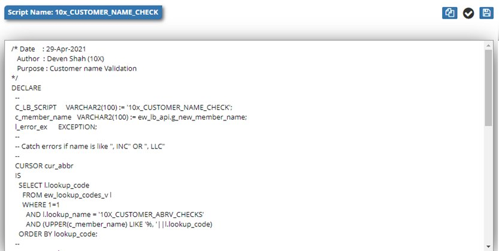

# Logic Builder

Logic Builder provides a comprehensive scripting environment for creating, managing, and validating business logic throughout EPMware. Scripts enable custom validations, data transformations, workflow automation, and system integrations across all modules.

<br/>
*Logic Builder interface showing script grid and editor*

## Overview

Logic Builder serves as the central automation engine for EPMware, enabling:

- **Validation Scripts** - Business rule enforcement and data quality checks
- **Derivation Scripts** - Dynamic property value calculations
- **Workflow Scripts** - Custom task automation and processing
- **Integration Scripts** - External system connectivity
- **Pre/Post Scripts** - Deployment and export processing

Scripts integrate seamlessly with all EPMware modules to extend functionality and enforce business requirements.

## Quick Links

<div class="grid cards">
  <div class="card">
    <h3>📝 Script Creation</h3>
    <p>Create and configure scripts for automation</p>
    <a href="#creating-scripts" class="md-button">Create Scripts →</a>
  </div>
  
  <div class="card">
    <h3>✏️ Editor</h3>
    <p>Edit and validate script code</p>
    <a href="#script-editor" class="md-button">Use Editor →</a>
  </div>
  
  <div class="card">
    <h3>🔧 Script Types</h3>
    <p>Understand different script categories</p>
    <a href="#script-types" class="md-button">View Types →</a>
  </div>
  
  <div class="card">
    <h3>📚 API Reference</h3>
    <p>Available functions and objects</p>
    <a href="#api-reference" class="md-button">View API →</a>
  </div>
</div>

---

## Script Management

### Script Grid

The main Logic Builder grid displays all scripts with management options:

<br/>
*Logic Builder grid showing script list*

| Column | Description | Actions |
|--------|-------------|---------|
| **Enabled** | Script active status | Check/uncheck to toggle |
| **Script Name** | Unique identifier | Click to load in editor |
| **Description** | Script purpose | Documentation |
| **Type** | Script category | Determines usage |
| **DB Function** | Database function name | For SQL scripts |
| **Upload** | File upload | Import script file |
| **Actions** | Row operations | Edit, delete |

### Navigation Features

- **Search** - Find scripts by name or description
- **Filter** - Show enabled/disabled/all
- **Sort** - Order by name, type, or date
- **Page** - Navigate through script pages

---

## Creating Scripts

### Add New Script

<br/>
*Create Script dialog with configuration options*

1. Click the **+** icon
2. Configure script properties:

| Field | Required | Description |
|-------|----------|-------------|
| **Script Name** | Yes | Unique identifier (no spaces) |
| **Description** | No | Script purpose and usage |
| **Script Type** | Yes | Category determining usage |
| **DB Function Name** | Conditional | For database functions |
| **Enabled** | Yes | Active status |

3. Click **Save** to create script

### Script Naming Conventions

Follow these patterns for consistency:

| Type | Pattern | Example |
|------|---------|---------|
| **Validation** | VAL_{MODULE}_{PURPOSE} | VAL_HFM_ACCOUNT_CODE |
| **Derivation** | DER_{PROPERTY}_{LOGIC} | DER_FULLNAME_CONCAT |
| **Workflow** | WF_{STAGE}_{ACTION} | WF_REVIEW_NOTIFY |
| **Integration** | INT_{SYSTEM}_{OPERATION} | INT_SAP_EXTRACT |
| **Custom** | CUST_{FUNCTION} | CUST_CALCULATE_RATIO |

### Upload Script File

<br/>
*Upload script file dialog*

1. Click upload icon on script row
2. Browse for script file (.js, .sql, .txt)
3. Click **Upload** to import

!!! note "File Upload"
    Script files can only be uploaded to existing scripts, not during creation.

---

## Script Types

### Validation Scripts

Enforce business rules and data quality:

```javascript
// Property validation example
function validateAccountCode(context) {
    var accountCode = context.propertyValue;
    var pattern = /^[0-9]{4}-[A-Z]{3}-[0-9]{3}$/;
    
    if (!pattern.test(accountCode)) {
        return {
            valid: false,
            message: "Account code format must be: 9999-XXX-999"
        };
    }
    
    // Additional business logic
    if (accountCode.substring(5, 8) === "RES" && !context.isRestricted) {
        return {
            valid: false,
            message: "Restricted codes require special approval"
        };
    }
    
    return { valid: true };
}
```

### Derivation Scripts

Calculate property values dynamically:

```javascript
// Derive concatenated description
function deriveFullDescription(context) {
    var entity = context.getMemberProperty("Entity");
    var account = context.getMemberProperty("Account");
    var currency = context.getMemberProperty("Currency");
    
    if (entity && account) {
        return entity + " - " + account + " (" + currency + ")";
    }
    
    return null;
}
```

### Workflow Scripts

Custom workflow task processing:

```javascript
// Custom approval routing
function routeToApprover(context) {
    var amount = context.getRequestProperty("AMOUNT");
    var department = context.getRequestProperty("DEPARTMENT");
    
    // Determine approver based on amount
    var approverGroup;
    if (amount > 1000000) {
        approverGroup = "EXEC_APPROVERS";
    } else if (amount > 100000) {
        approverGroup = "SENIOR_APPROVERS";
    } else {
        approverGroup = "DEPT_APPROVERS_" + department;
    }
    
    // Assign to group
    context.assignToGroup(approverGroup);
    
    // Send notification
    context.sendEmail({
        template: "APPROVAL_REQUIRED",
        group: approverGroup,
        priority: amount > 500000 ? "High" : "Normal"
    });
    
    return { status: "SUCCESS" };
}
```

### Pre/Post Processing Scripts

Execute before/after deployments or exports:

```javascript
// Pre-deployment backup
function preDeploymentBackup(context) {
    var timestamp = new Date().toISOString().replace(/:/g, '-');
    var backupName = context.applicationName + "_backup_" + timestamp;
    
    try {
        // Create metadata backup
        var result = context.executeDBFunction("CREATE_METADATA_BACKUP", {
            appName: context.applicationName,
            backupName: backupName
        });
        
        // Log backup creation
        context.log("INFO", "Backup created: " + backupName);
        
        // Validate target system
        if (!context.isTargetAvailable()) {
            throw new Error("Target system not responding");
        }
        
        return {
            status: "SUCCESS",
            backup: backupName
        };
        
    } catch (error) {
        context.log("ERROR", "Backup failed: " + error.message);
        return {
            status: "FAILED",
            error: error.message
        };
    }
}
```

### Integration Scripts

Connect with external systems:

```javascript
// REST API integration
function syncWithExternalSystem(context) {
    var endpoint = context.getSystemProperty("EXTERNAL_API_URL");
    var apiKey = context.getSystemProperty("EXTERNAL_API_KEY");
    
    // Prepare data
    var payload = {
        entities: context.getModifiedEntities(),
        timestamp: new Date().toISOString(),
        source: "EPMware"
    };
    
    // Call external API
    var response = context.httpRequest({
        url: endpoint + "/sync",
        method: "POST",
        headers: {
            "Authorization": "Bearer " + apiKey,
            "Content-Type": "application/json"
        },
        body: JSON.stringify(payload)
    });
    
    if (response.statusCode === 200) {
        return {
            status: "SUCCESS",
            syncId: response.body.syncId
        };
    } else {
        throw new Error("Sync failed: " + response.statusCode);
    }
}
```

---

## Script Editor

The built-in editor provides syntax highlighting, validation, and testing capabilities.

<br/>
*Script editor with syntax highlighting*

### Editor Features

| Feature | Description | Shortcut |
|---------|-------------|----------|
| **Syntax Highlighting** | Language-aware coloring | Automatic |
| **Auto-complete** | Code suggestions | Ctrl+Space |
| **Validation** | Syntax checking | Click validate |
| **Save** | Persist changes | Ctrl+S |
| **Copy** | Copy to clipboard | Ctrl+C |
| **Format** | Auto-format code | Ctrl+Shift+F |

### Using the Editor

<br/>
*Editor toolbar with action buttons*

1. **Load Script** - Click script name in grid
2. **Edit Code** - Modify in editor pane
3. **Validate** - Click validate icon (✓)
4. **Save Changes** - Click save icon
5. **Copy Code** - Click copy icon

### Validation Results

Script validation checks:
- Syntax errors
- Undefined variables
- Function signatures
- Return statements
- Exception handling

!!! tip "Validation Best Practice"
    Always validate scripts before saving, especially after major changes.

---

## API Reference

### Context Object

The context object provides access to EPMware data and functions:

```javascript
// Request context
context.requestId           // Current request ID
context.userId              // Current user ID
context.applicationId       // Application ID
context.dimensionId        // Dimension ID
context.workflowStage      // Current workflow stage

// Data access
context.getMemberProperty(propName)
context.getRequestProperty(propName)
context.getSystemProperty(propName)
context.getUserProperty(propName)

// Operations
context.log(level, message)
context.sendEmail(options)
context.executeDBFunction(name, params)
context.httpRequest(options)
context.assignToGroup(groupName)
```

### Database Functions

Execute SQL and PL/SQL:

```javascript
// Execute query
var results = context.executeQuery(
    "SELECT * FROM ew_members WHERE app_id = :appId",
    { appId: context.applicationId }
);

// Execute stored procedure
var result = context.executeDBFunction("VALIDATE_HIERARCHY", {
    p_app_id: context.applicationId,
    p_dim_id: context.dimensionId
});
```

### Utility Functions

Common helper functions:

```javascript
// Date formatting
function formatDate(date, pattern) {
    // pattern: "YYYY-MM-DD", "MM/DD/YYYY", etc.
    return context.formatDate(date, pattern);
}

// String manipulation
function padLeft(str, length, char) {
    return String(str).padStart(length, char);
}

// Number formatting
function formatCurrency(amount) {
    return new Intl.NumberFormat('en-US', {
        style: 'currency',
        currency: 'USD'
    }).format(amount);
}

// Array operations
function unique(array) {
    return [...new Set(array)];
}
```

---

## Script Examples

### Example 1: Member Name Validation

```javascript
// Validate member name format and uniqueness
function validateMemberName(context) {
    var memberName = context.propertyValue;
    var dimension = context.dimensionName;
    
    // Check format
    if (!/^[A-Z][A-Z0-9_]{2,49}$/.test(memberName)) {
        return {
            valid: false,
            message: "Member name must start with letter, 3-50 chars, uppercase/numbers/underscore only"
        };
    }
    
    // Check reserved words
    var reserved = ["ALL", "NONE", "NULL", "DEFAULT", "SYSTEM"];
    if (reserved.includes(memberName)) {
        return {
            valid: false,
            message: memberName + " is a reserved word"
        };
    }
    
    // Check uniqueness
    var exists = context.executeQuery(
        "SELECT COUNT(*) cnt FROM ew_members WHERE member_name = :name AND dim_name = :dim",
        { name: memberName, dim: dimension }
    );
    
    if (exists[0].cnt > 0) {
        return {
            valid: false,
            message: "Member name already exists in " + dimension
        };
    }
    
    return { valid: true };
}
```

### Example 2: Hierarchy Level Validation

```javascript
// Ensure hierarchy doesn't exceed maximum depth
function validateHierarchyDepth(context) {
    var maxDepth = 10;
    var parentId = context.parentMemberId;
    var depth = 0;
    
    // Traverse up to root
    while (parentId && depth < maxDepth + 1) {
        var parent = context.executeQuery(
            "SELECT parent_member_id FROM ew_hierarchy WHERE member_id = :id",
            { id: parentId }
        );
        
        if (parent.length > 0) {
            parentId = parent[0].parent_member_id;
            depth++;
        } else {
            break;
        }
    }
    
    if (depth >= maxDepth) {
        return {
            valid: false,
            message: "Hierarchy depth cannot exceed " + maxDepth + " levels"
        };
    }
    
    return { valid: true };
}
```

### Example 3: Email Custom Tags

```javascript
// Add custom tags to email templates
function addCustomEmailTags(context) {
    var requestId = context.requestId;
    
    // Get request details
    var request = context.executeQuery(
        "SELECT * FROM ew_request_headers WHERE request_id = :id",
        { id: requestId }
    );
    
    // Calculate custom values
    var customTags = {
        'REQUEST_AGE_DAYS': calculateAgeDays(request[0].created_date),
        'TOTAL_CHANGES': getTotalChanges(requestId),
        'RISK_LEVEL': calculateRiskLevel(requestId),
        'NEXT_REVIEWER': getNextReviewer(requestId),
        'ESTIMATED_COMPLETION': estimateCompletion(requestId)
    };
    
    return customTags;
}

function calculateAgeDays(createdDate) {
    var now = new Date();
    var created = new Date(createdDate);
    var diffMs = now - created;
    return Math.floor(diffMs / (1000 * 60 * 60 * 24));
}
```

---

## Best Practices

### 1. Code Organization

- **Modular Functions** - Small, focused functions
- **Clear Naming** - Descriptive function and variable names
- **Comments** - Document complex logic
- **Constants** - Define at script top
- **Error Handling** - Use try-catch blocks

### 2. Performance

- **Optimize Queries** - Use indexes and limits
- **Cache Results** - Store frequently used data
- **Batch Operations** - Process in groups
- **Async When Possible** - Don't block execution
- **Clean Up** - Release resources

### 3. Testing

- **Unit Tests** - Test individual functions
- **Edge Cases** - Handle nulls and extremes
- **Error Scenarios** - Test failure paths
- **Performance Tests** - Check with large datasets
- **Integration Tests** - Verify with connected systems

### 4. Security

- **Input Validation** - Never trust user input
- **SQL Injection** - Use parameterized queries
- **Access Control** - Check permissions
- **Audit Logging** - Log sensitive operations
- **Encrypt Sensitive Data** - Protect credentials

---

## Troubleshooting

### Common Issues

| Issue | Cause | Solution |
|-------|-------|----------|
| Script not appearing | Disabled | Enable in grid checkbox |
| Validation fails | Syntax error | Check error message, fix syntax |
| Script not executing | Not assigned | Verify script assignment in configuration |
| Timeout errors | Long-running operation | Optimize queries, add indexes |
| Null reference | Missing data | Add null checks |
| Permission denied | Access rights | Check user permissions |

### Debugging Techniques

#### Add Logging

```javascript
function debugScript(context) {
    context.log("DEBUG", "Starting script execution");
    context.log("DEBUG", "Input: " + JSON.stringify(context));
    
    try {
        // Your logic here
        var result = processData(context);
        context.log("DEBUG", "Result: " + JSON.stringify(result));
        return result;
        
    } catch (error) {
        context.log("ERROR", "Failed: " + error.message);
        context.log("ERROR", "Stack: " + error.stack);
        throw error;
    }
}
```

#### Test in Isolation

```javascript
// Create test harness
function testScript() {
    var mockContext = {
        propertyValue: "TEST123",
        dimensionName: "Entity",
        executeQuery: function(sql, params) {
            // Mock database response
            return [{ cnt: 0 }];
        }
    };
    
    var result = validateMemberName(mockContext);
    console.log("Test result:", result);
}
```

### Script Logs

Access script execution logs:

1. Navigate to **Administration → Logs**
2. Filter by script name
3. Review execution details
4. Check error messages
5. Analyze performance metrics

---

## Integration Points

### Property Configuration

Scripts integrate with member properties:
- **Validation Scripts** - Property value checking
- **Derivation Scripts** - Calculate values
- **Conditional Display** - Show/hide properties
- **Default Values** - Set initial values

### Workflow Tasks

Custom tasks execute Logic Builder scripts:
- **Review Logic** - Custom review processes
- **Approval Routing** - Dynamic routing
- **Notifications** - Enhanced emails
- **Integration Tasks** - External system calls

### Deployment

Pre/post deployment processing:
- **Backup Scripts** - Create backups
- **Validation Scripts** - Check readiness
- **Transformation Scripts** - Modify data
- **Notification Scripts** - Alert stakeholders

### Export

Export processing scripts:
- **Pre-Export** - Prepare data
- **Post-Export** - Archive/distribute
- **Transformation** - Format conversion
- **Validation** - Quality checks

---

## Related Topics

- [Property Validation](../member-properties/index.md#property-validation) - Assign validation scripts
- [Property Derivation](../member-properties/index.md#property-derivation) - Configure derivation scripts
- [Workflow Tasks](../workflow/index.md#workflow-tasks) - Custom task scripts
- [Deployment Manager](../deployment/index.md) - Pre/post deployment scripts
- [Export Metadata](../export-metadata/index.md) - Export processing scripts
- [Email Templates](../email-templates/index.md) - Custom email tags
