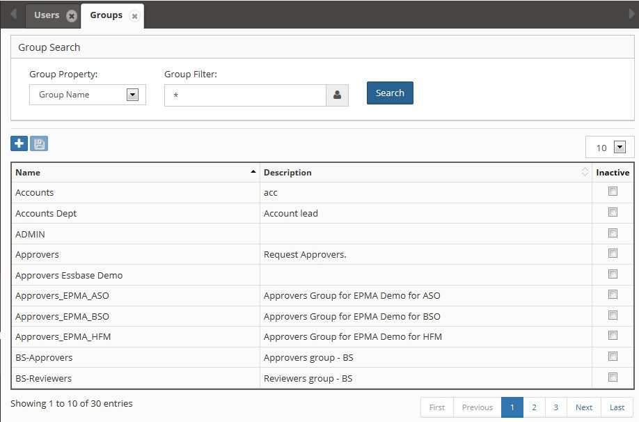

# Security

The Security module provides comprehensive access control and authentication management for EPMware. It implements a multi-tiered security model consisting of roles, modules, and security classes to ensure appropriate access to applications, dimensions, and functionality.

<br/>
*Security module showing the three-component model*

## Overview

The EPMware security model consists of three integrated components:

- **[Roles](#roles)** - Define functional capabilities (Requestor, Reviewer, Approver, Default)
- **[Modules](#modules)** - Control menu access and feature availability
- **[Security Classes](#security-classes)** - Manage access to applications, dimensions, and properties

These components are managed through:

- **[Users](#users)** - Individual user accounts and authentication
- **[Groups](#groups)** - Collections of users for simplified management
- **[Security Provisioning](#security-provisioning)** - Assignment of access rights
- **[SSO Configuration](#sso-configuration)** - Single sign-on integration
- **[Report Security](#report-security)** - Report and dashboard access control

## Quick Links

<div class="grid cards">
  <div class="card">
    <h3>👤 User Management</h3>
    <p>Create and manage user accounts, groups, and authentication</p>
    <a href="#users" class="md-button">Manage Users →</a>
  </div>
  
  <div class="card">
    <h3>🔐 Access Control</h3>
    <p>Configure roles, modules, and security classes</p>
    <a href="#security-provisioning" class="md-button">Set Permissions →</a>
  </div>
  
  <div class="card">
    <h3>🔑 SSO Setup</h3>
    <p>Configure SAML or LDAP/MSAD authentication</p>
    <a href="#sso-configuration" class="md-button">Configure SSO →</a>
  </div>
  
  <div class="card">
    <h3>📊 Report Security</h3>
    <p>Control access to reports and dashboards</p>
    <a href="#report-security" class="md-button">Secure Reports →</a>
  </div>
</div>

---

## Security Model

EPMware implements a comprehensive security model that controls access at multiple levels:

<br/>
*Three-tier security model structure*

### Security Hierarchy


### Security Rules

The security engine applies these rules to determine access:

1. **Security Classes** secure applications, dimensions, and properties
2. **Modules** determine available menu options
3. **Roles** dictate functions users can perform
4. **Inheritance** - Security flows from bottom up:
   - Member-level security → Dimension security → Application security

!!! note "System-Defined Components"
    Modules and Roles are system-defined and cannot be edited. Only Security Classes are user-configurable.

---

## Roles

Roles determine the functional capabilities available to users. Each user must be assigned at least one role.

### Available Roles

#### Requestor
Users who create new metadata requests:
- Create and submit requests
- View own requests
- Cannot review or approve

#### Reviewer
Users who review metadata requests:
- All Requestor capabilities
- Review request lines within security access
- Approve/Reject at review stage
- Requirements:
  - Reviewer role assigned
  - Metadata module access
  - Assigned to review task or group
  - Request in "Pending Review" stage

#### Approver
Users who approve metadata requests:
- All Reviewer capabilities
- Final approval authority
- Approve/Reject at approval stage
- Requirements:
  - Approver role assigned
  - Metadata module access
  - Assigned to approval task or group
  - Request in "Pending Approval" stage

#### Default
Users without request management duties:
- Read-only access
- Metadata Explorer access
- Report viewing (with permissions)

!!! info "Request Snapshots"
    When a request is submitted, a snapshot of users and groups is bound to the request. Changes to workflow tasks don't affect pending requests.

!!! warning "Security Scope"
    Reviewers and Approvers can only act on request lines for which they have security access.

---

## Users

The Users page manages individual user accounts for EPMware access.

<br/>
*Users management screen showing Native, LDAP, and SAML users*

### User Types

| Type | Description | Authentication | Management |
|------|-------------|---------------|------------|
| **Native** | EPMware-managed accounts | Internal | Full control |
| **LDAP** | Directory service accounts | External LDAP | Read-only profile |
| **SAML** | Single sign-on accounts | External IdP | Limited management |

### Managing Native/SAML Users

#### Add User

1. Click the **+** icon
2. Select user type (Native/SAML)
3. Configure user details:

<br/>
*Add User dialog with configuration options*

| Field | Required | Description |
|-------|----------|-------------|
| **User Type** | Yes | Native or SAML |
| **Username** | Yes | Unique login identifier |
| **Email** | Yes | User email address |
| **First Name** | Yes | User's first name |
| **Last Name** | Yes | User's last name |
| **Password** | Native only | Login password |
| **Active** | Yes | Enable/disable account |

!!! tip "Admin Email"
    Change the ADMIN user's email address to receive system notifications.

#### Edit User

1. Right-click on user row
2. Select **Edit User**
3. Modify properties
4. Click **Save**

<br/>
*Edit User properties dialog*

!!! note "LDAP Users"
    LDAP user properties are read-only and synchronized from the directory service.

#### Delete User

1. Right-click on user row
2. Select **Delete**
3. Confirm deletion

!!! warning "LDAP Restriction"
    LDAP users cannot be deleted from EPMware, only disabled.

### Group Management

#### View User Groups

1. Right-click on user
2. Select **View Groups**

<br/>
*View Groups showing user's group memberships*

#### Assign Groups

1. Right-click on user
2. Select **Assign Groups**
3. Move groups from Available to Assigned
4. Click **Save**

<br/>
*Assign Groups shuttle window for group assignment*

### REST API Token

Configure tokens for on-premise agent authentication:

#### Generate Token

1. Right-click on user
2. Select **Generate Token**
3. Click **Generate** button
4. Save the 36-character token
5. Click **Save** then **Close**

<br/>
*REST API token generation for agent authentication*

!!! important "Agent Requirement"
    At least one user needs a REST token for on-premise agent installation. See the Agent Installation Guide for details.

---

## Groups

Groups simplify security management by allowing bulk assignment of permissions to multiple users.

<br/>
*Groups management screen*

### Group Features

- Support Native, LDAP, and SAML users
- Can be active or inactive
- Inherit all assigned permissions
- Simplify provisioning management

### Managing Groups

#### Add Group

1. Click the **+** icon
2. Enter group details:

<br/>
*Add New Group dialog*

| Field | Description |
|-------|-------------|
| **Name** | Unique group identifier |
| **Description** | Group purpose/members |
| **Active** | Enable/disable group |

#### Edit Group

1. Right-click on group row
2. Select **Edit Group**
3. Modify properties
4. Click **Save**

<br/>
*Edit Group properties*

### User Assignment

#### View Group Users

1. Right-click on group
2. Select **View Users**

<br/>
*View Users in group*

#### Assign Users

1. Right-click on group
2. Select **Assign Users**
3. Move users between Available and Assigned
4. Click **Save**

<br/>
*Assign Users shuttle window*

---

## Security Classes

Security Classes provide granular access control for EPMware objects. Administrators create and assign these classes to secure various elements.

<br/>
*Security Classes configuration screen*

### Security Class Applications

Security Classes can be assigned to:

| Object Type | Configuration Location | Purpose |
|-------------|----------------------|---------|
| **Applications** | Application Configuration | Control application visibility |
| **Dimensions** | Dimension Configuration | Restrict dimension access |
| **Properties** | Property Configuration | Limit property editing |
| **Members** | System property category | Node-level security |
| **Reports** | Report Security | Report access control |
| **Workflows** | Workflow Builder | Workflow visibility |

### Managing Security Classes

#### Add Single Class

1. Click the **+** icon
2. Enter class details:
   - **Name** - Unique identifier
   - **Description** - Purpose/scope
3. Click **Save**

#### Add Multiple Classes

1. Click the upload icon
2. Select CSV file with classes
3. Click **Import**

<br/>
*Import Security Classes dialog*

CSV Format:
```csv
Name,Description
FIN_USERS,Financial application users
ADMIN_ONLY,Administrator access only
ENTITY_MANAGERS,Entity hierarchy managers
```

#### Member-Level Security

Apply security at the hierarchy node level:

<br/>
*Security Class property in member properties*

!!! note "Request Required"
    Member-level security requires a request to assign the Security Class property under the System category.

---

## Security Provisioning

Security Provisioning assigns access rights by connecting Groups to Roles, Modules, and Security Classes.

<br/>
*Security Provisioning screen showing the four-tier model*

### Provisioning Structure

The grid displays three column sections:

1. **Roles Section** - Checkboxes for role assignment
2. **Modules Section** - Access level dropdowns
3. **Classes Section** - Read/Write/None dropdowns

Rows represent Groups created in Security → Groups.

### Module Access Levels

| Module | Access Options | Controls |
|--------|---------------|----------|
| **Metadata** | Checkbox | Request creation/management |
| **Scripts** | Checkbox | Logic Builder access |
| **Audit** | Checkbox | Audit report access |
| **Security** | Checkbox | Security configuration |
| **Config** | Checkbox | System configuration |
| **Workflow** | Read/Write/None | Workflow management |
| **Deployment** | Read/Write/None | Deployment operations |

### Security Class Permissions

Each Security Class intersection offers:
- **None** - No access
- **Read** - View only
- **Write** - Full access

### Provisioning Groups

1. Search or navigate to group
2. Select at least one item from:
   - Roles (checkbox)
   - Modules (checkbox/dropdown)
   - Classes (dropdown)
3. Click **Save** icon

!!! important "Minimum Requirements"
    At least one selection from each tier (Role, Module, Class) is required for proper provisioning.

!!! warning "Menu Visibility"
    Navigation menu items only appear for modules assigned to the user's groups.

### Security Precedence

Security privileges flow bottom-up:

```
Member Security → Dimension Security → Application Security
```

Higher-level security cannot override lower-level restrictions.

---

## SSO Configuration

Configure Single Sign-On for seamless authentication via SAML or LDAP/MSAD.

<br/>
*SSO Configuration screen*

### SAML Configuration

<br/>
*SAML SSO configuration options*

| Field | Description | Default |
|-------|-------------|---------|
| **SSO Type** | SAML or LDAP | SAML |
| **Enabled** | Activate SSO | Y |
| **SSO User Identifier** | Attribute for user ID | User_ID |
| **EPMware User Identifier** | Match field (Username/Email) | Username |
| **SHA Algorithm** | Hash algorithm | SHA256 |
| **SAML Metadata XML** | Identity provider metadata | Upload file |
| **EPMware SAML File** | Service provider metadata | Download link |

#### SAML Setup Steps

1. Upload IdP metadata XML file
2. Download EPMware SAML metadata
3. Configure IdP with EPMware metadata
4. Map user attributes
5. Test authentication

### LDAP Configuration

<br/>
*LDAP authentication configuration*

#### LDAP Properties

Configure in property files:
- `fs_system.properties`
- `fs_custom.properties`

#### Standard LDAP (Port 389)

```properties
ldap.url=ldap://ldap.company.com:389
ldap.base=DC=company,DC=com
ldap.user=CN=svcaccount,OU=Service,DC=company,DC=com
ldap.password=encrypted_password
```

#### Secure LDAP (Port 636/3269)

```properties
ldap.url=ldaps://ldap.company.com:636
ldap.base=DC=company,DC=com
ldap.user=CN=svcaccount,OU=Service,DC=company,DC=com
ldap.password=encrypted_password
```

!!! warning "Certificate Required"
    Secure LDAP requires importing the MSAD certificate into Apache Tomcat.

#### MSAD Port Configuration

Common ports:
- **389** - Standard LDAP
- **636** - Secure LDAP (SSL)
- **3268** - Global Catalog
- **3269** - Secure Global Catalog

!!! tip "Port 3269"
    If experiencing "Unprocessed Continuation Reference" errors, try port 3269 instead of 636.

---

## Report Security

Control access to reports and report groups in the Audit module.

<br/>
*Report Security configuration showing security class assignments*

### Securing Reports

#### Assign Security Class

1. Right-click on report or group
2. Select **Edit Properties**
3. Choose Security Class from dropdown
4. Click **Save**

<br/>
*Edit Properties dialog for report security*

#### Remove Security Class

1. Right-click on report or group
2. Select **Edit Properties**
3. Click **x** next to Security Class
4. Click **Save**

### Report Access Flow

1. Assign Security Class to report/group
2. Provision Security Class to groups
3. Users in groups gain report access

---

## Best Practices

### 1. User Management

- **Unique Usernames** - Enforce unique identifiers
- **Email Verification** - Validate email addresses
- **Password Policy** - Implement strong passwords for Native users
- **Regular Audits** - Review active users quarterly
- **Disable vs Delete** - Disable inactive users rather than deleting

### 2. Group Strategy

- **Functional Groups** - Organize by business function
- **Hierarchical Structure** - Create parent/child relationships
- **Naming Convention** - Use descriptive, consistent names
- **Documentation** - Maintain group purpose descriptions
- **Regular Review** - Audit group memberships

### 3. Security Classes

- **Granular Control** - Create specific classes for different needs
- **Meaningful Names** - Use business-relevant identifiers
- **Inheritance Planning** - Design hierarchy-aware security
- **Testing** - Verify access in non-production first
- **Documentation** - Record class purpose and scope

### 4. Provisioning

- **Least Privilege** - Grant minimum required access
- **Role Separation** - Separate conflicting duties
- **Regular Reviews** - Quarterly access audits
- **Change Control** - Document provisioning changes
- **Emergency Access** - Plan for break-glass scenarios

---

## Troubleshooting

### Common Issues

| Issue | Cause | Solution |
|-------|-------|----------|
| User cannot login | Account disabled or wrong credentials | Check active flag and reset password |
| Menu items missing | Module not provisioned | Verify module assignment in provisioning |
| Cannot see application | No security class access | Check security class provisioning |
| LDAP authentication fails | Wrong port or credentials | Verify LDAP configuration and ports |
| SSO not working | Metadata mismatch | Reupload IdP metadata and test |
| Report not visible | Missing security class | Assign and provision security class |
| Cannot approve request | Wrong role or stage | Verify approver role and request stage |

### Authentication Debugging

#### LDAP Issues
```properties
# Enable LDAP debugging in fs_custom.properties
ldap.debug=true
ldap.trace.level=FINEST
```

#### SAML Issues
- Check SHA algorithm match
- Verify attribute mappings
- Review SAML response in browser tools
- Check time synchronization

### Security Audit Queries

```sql
-- User group memberships
SELECT u.username, g.name group_name
FROM ew_users u
JOIN ew_user_groups ug ON u.user_id = ug.user_id
JOIN ew_groups g ON ug.group_id = g.group_id
WHERE u.active = 'Y' AND g.active = 'Y'
ORDER BY u.username, g.name;

-- Security provisioning by group
SELECT g.name, r.role_name, m.module_name, sc.name class_name, p.access_level
FROM ew_groups g
JOIN ew_provisioning p ON g.group_id = p.group_id
LEFT JOIN ew_roles r ON p.role_id = r.role_id
LEFT JOIN ew_modules m ON p.module_id = m.module_id
LEFT JOIN ew_security_classes sc ON p.class_id = sc.class_id
WHERE g.active = 'Y'
ORDER BY g.name;
```

---

## Related Topics

- [Workflow Tasks](../workflow/index.md#workflow-tasks) - Assign security groups to tasks
- [Global Settings](../global-settings/index.md) - Authentication configuration
- [Application Configuration](../applications/index.md) - Application security classes
- [Dimension Configuration](../dimensions/index.md) - Dimension security
- [Report Configuration](../audit/index.md) - Report security setup
