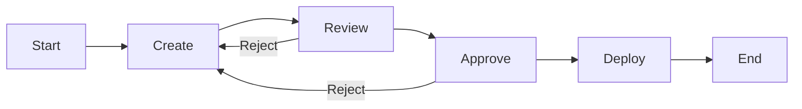
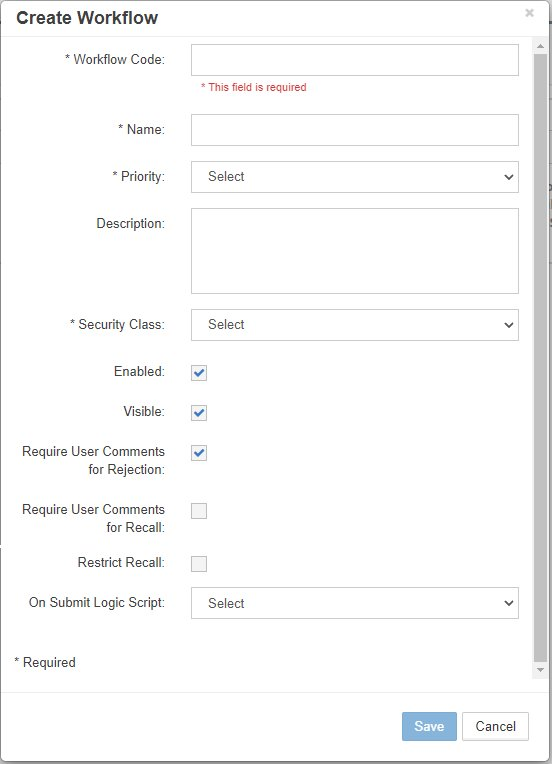
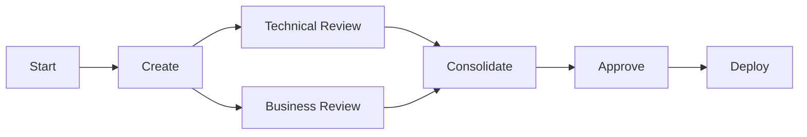
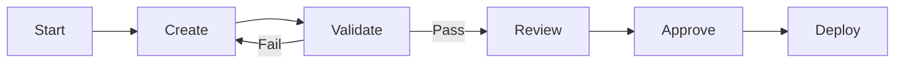
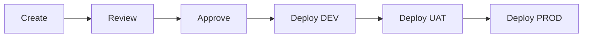

# Workflow

The Workflow module enables administrators to build and maintain dynamic, task-driven workflows that enforce business processes for metadata management. Workflows consist of stages containing tasks that route requests through review, approval, and deployment processes.

<br/>
*Workflow module showing workflow builder and task management*

## Overview

The Workflow module is comprised of two main components:

- **[Workflow Tasks](#workflow-tasks)** - Individual operations assigned to stages
- **[Workflow Builder](#workflow-builder)** - Visual workflow designer for creating and managing workflows

Workflows enforce your organization's metadata governance by:
- Routing requests through defined approval chains
- Validating data quality at each stage
- Automating notifications and escalations
- Ensuring compliance with business rules
- Deploying approved changes systematically

## Quick Links

<div class="grid cards">
  <div class="card">
    <h3>📋 Task Management</h3>
    <p>Create and configure workflow tasks for stages</p>
    <a href="#workflow-tasks" class="md-button">Manage Tasks →</a>
  </div>
  
  <div class="card">
    <h3>🔄 Workflow Builder</h3>
    <p>Design visual workflows with stages and transitions</p>
    <a href="#workflow-builder" class="md-button">Build Workflows →</a>
  </div>
  
  <div class="card">
    <h3>📊 Stage Configuration</h3>
    <p>Configure workflow stages and assign tasks</p>
    <a href="#workflow-stages" class="md-button">Configure Stages →</a>
  </div>
  
  <div class="card">
    <h3>🚀 Best Practices</h3>
    <p>Design patterns and optimization tips</p>
    <a href="#best-practices" class="md-button">Learn More →</a>
  </div>
</div>

---

## Workflow Tasks

Tasks are individual operations that define actions within workflow stages. Each task combines an action type with configuration for security, notifications, and custom logic.

<br/>
*Workflow Tasks management screen*

### Task Components

| Component | Description | Options |
|-----------|-------------|---------|
| **Name** | Task identifier | User-defined text |
| **Description** | Task purpose | Optional text |
| **Action** | Task operation type | Review, Approve, Validate, Deploy, Notify, Custom |
| **Email Template** | Notification template | From Email Templates |
| **Security Group** | Assigned group | Review/Approve only |
| **Custom Function** | Logic Builder script | Custom action only |
| **# of Approvals** | Required approvals | Review/Approve only |

### Task Actions

#### Review
Assigns review responsibilities to users/groups:
- Validates request data
- Checks business rules
- Can modify request lines
- Provides feedback

#### Approve
Final authorization for requests:
- Approves/rejects changes
- Escalation handling
- Cannot modify data
- Final decision point

#### Validate
Automated data validation:
- Runs validation scripts
- Checks data quality
- Enforces business rules
- No user interaction

#### Deploy
Sends metadata to target systems:
- Direct deployment
- File generation
- Interface tables
- Multi-environment support

#### Notify
Sends notifications without action:
- Status updates
- Escalation alerts
- Information only
- No approval required

#### Custom
Executes Logic Builder scripts:
- Complex business logic
- Integration calls
- Data transformation
- Custom processing

### Creating Tasks

<br/>
*Task Properties dialog for creating new tasks*

1. Navigate to **Workflow → Tasks**
2. Click the **+** icon
3. Configure task properties:

| Property | Required | Description |
|----------|----------|-------------|
| **Task Name** | Yes | Unique identifier |
| **Description** | No | Task purpose |
| **Action** | Yes | Select action type |
| **Allow Requestor to Review/Approve** | No | Requestor can act on own request |
| **Allow Reviewer to Cancel Lines** | No | Reviewer can cancel request lines |
| **Email Template** | No | Notification template |
| **Security Group** | Conditional | Required for Review/Approve |
| **# of Approvals** | Conditional | For Review/Approve actions |
| **Custom Function** | Conditional | Required for Custom action |

4. Click **Save**

### Editing Tasks

<br/>
*Edit Task Properties dialog*

1. Right-click on task row
2. Select **Edit Properties**
3. Modify configuration
4. Click **Save**

!!! warning "Task Dependencies"
    Changes to tasks don't affect in-flight requests. Existing requests maintain their original task configuration.

### Deleting Tasks

1. Right-click on task row
2. Select **Delete Task**
3. Confirm deletion

!!! danger "Deletion Impact"
    Ensure task is not assigned to any active workflow stages before deletion.

---

## Workflow Builder

The Workflow Builder provides a visual interface for creating and managing workflows. Workflows consist of stages arranged in sequence, with each stage containing one or more tasks.

<br/>
*Workflow Builder showing visual workflow with stages*

### Workflow Structure



### Workflow Properties

Click the green **Start** node to view workflow properties:

<br/>
*Workflow Properties configuration*

| Property | Description | Impact |
|----------|-------------|--------|
| **Workflow Code** | System identifier | Unique code |
| **Name** | Display name | User-visible |
| **Priority** | Workflow priority | From lookup table |
| **Description** | Workflow purpose | Documentation |
| **Security Class** | Access control | Who can use workflow |
| **Enabled** | Active status | Workflow availability |
| **Visible** | Display in dropdown | Request page visibility |
| **Require Comments for Rejection** | Mandatory rejection notes | Audit trail |
| **Require Comments for Recall** | Mandatory recall notes | Documentation |
| **Restrict Recall** | Limit recall ability | Only current stage actors |
| **On Submit Logic Scripts** | Validation/processing | Runs at submission |

### Creating Workflows

<br/>
*Workflow Properties dialog for new workflow*

1. Navigate to **Workflow → Builder**
2. Click the **+** icon
3. Configure workflow:

```
Workflow Code: FIN_STANDARD_APPROVAL
Name: Financial Standard Approval
Priority: Medium
Description: Standard financial metadata approval workflow
Security Class: FIN_USERS
Enabled: ✓
Visible: ✓
Require Comments for Rejection: ✓
Require Comments for Recall: ✓
Restrict Recall: □
On Submit Logic Script: VALIDATE_FIN_REQUEST
```

4. Click **Save**

!!! note "Restrict Recall Behavior"
    - **Unchecked**: Any user with workflow access can recall
    - **Checked**: Only requestor, reviewers, and approvers of current stage can recall

### Editing Workflows

<br/>
*Edit Workflow Properties dialog*

1. Right-click on green **Start** node
2. Select **Edit Properties**
3. Modify configuration
4. Click **Save**

### Deleting Workflows

1. Select workflow from dropdown
2. Click **Actions** button
3. Select **Delete Workflow**
4. Confirm deletion

!!! danger "Active Requests"
    Cannot delete workflows with pending requests. Complete or cancel all requests first.

---

## Workflow Stages

Stages define the sequence of operations in a workflow. Each stage contains tasks that must be completed before progression.

<br/>
*Workflow with multiple stages configured*

### Stage Properties

| Property | Description | Example |
|----------|-------------|---------|
| **Stage #** | Execution order | 10, 20, 30... |
| **Name** | Stage identifier | Review, Approve, Deploy |
| **Description** | Stage purpose | Technical review by IT |
| **Action** | Stage operation | Review, Approve, Validate, Deploy, Notify, Custom |
| **Freeze** | Lock additions | Reviewer can only edit properties |

### Adding Stages

<br/>
*Stage Properties dialog for adding stages*

1. Select workflow from dropdown
2. Click **Actions** → **Create Stage**
3. Configure stage:

```
Stage #: 20
Name: Technical Review
Description: IT department technical review
Action: Review
Freeze: □ (Allows adding members)
```

4. Click **Save**

!!! tip "Stage Numbering"
    Use increments of 10 (10, 20, 30) to allow inserting stages later without renumbering.

### Assigning Tasks to Stages

<br/>
*Assign Tasks dialog showing available tasks*

1. Click on stage node in workflow
2. Click **Actions** → **Assign Task**
3. Select tasks to assign
4. Click **Save**

### Multi-Environment Deployment

For multi-environment configurations, create deployment stages for each environment:

#### Example: Three-Tier Deployment

1. **Create Deploy Stages**:
   - Stage 40: Deploy to Development
   - Stage 50: Deploy to UAT
   - Stage 60: Deploy to Production

2. **Create Deploy Tasks**:
   - Task: Deploy_DEV (Environment: Development)
   - Task: Deploy_UAT (Environment: UAT)
   - Task: Deploy_PROD (Environment: Production)

3. **Assign Tasks to Stages**:
   - Assign Deploy_DEV to Stage 40
   - Assign Deploy_UAT to Stage 50
   - Assign Deploy_PROD to Stage 60

### Editing Stage Tasks

<br/>
*Edit task properties from within stage*

1. Select stage node
2. Right-click on task in grid
3. Select **Edit Properties**
4. Modify task configuration
5. Click **Save**

---

## Workflow Examples

### Standard Approval Workflow


**Configuration**:

| Stage | Action | Task | Security Group | Email Template |
|-------|--------|------|----------------|----------------|
| 10 | Create | - | - | REQ_Submitted |
| 20 | Review | Technical_Review | IT_Reviewers | REV_Task_Assigned |
| 30 | Approve | Final_Approval | FIN_Approvers | APP_Approval_Required |
| 40 | Deploy | Deploy_Production | - | DEP_Success |

### Parallel Review Workflow



**Configuration**:

| Stage | Action | Tasks | Notes |
|-------|--------|-------|-------|
| 10 | Create | - | Request creation |
| 20 | Review | Tech_Review, Bus_Review | Parallel tasks |
| 30 | Review | Consolidate_Review | Merge feedback |
| 40 | Approve | Final_Approval | Single approval |
| 50 | Deploy | Deploy_All | All environments |

### Validation-Heavy Workflow



**Configuration**:

| Stage | Action | Task | Script | On Failure |
|-------|--------|------|--------|------------|
| 10 | Create | - | - | - |
| 15 | Validate | Data_Validation | VALIDATE_ALL | Return to Create |
| 20 | Review | Review_Valid_Data | - | - |
| 30 | Approve | Approve_Changes | - | - |
| 40 | Deploy | Deploy_Metadata | - | - |

---

## Task Configuration Examples

### Review Task with Multiple Approvals

```
Name: Committee_Review
Action: Review
Security Group: Review_Committee
# of Approvals: 3
Email Template: REV_Committee_Required
Allow Requestor to Review: No
Allow Reviewer to Cancel Lines: Yes
```

### Custom Validation Task

```
Name: Complex_Validation
Action: Custom
Custom Function: VALIDATE_COMPLEX_RULES
Email Template: VAL_Results
Description: Runs complex cross-dimensional validations
```

### Notification-Only Task

```
Name: Stakeholder_Notification
Action: Notify
Email Template: NOTIFY_Stakeholders
Security Group: All_Stakeholders
Description: Informs stakeholders of pending changes
```

---

## Best Practices

### 1. Workflow Design

- **Keep It Simple** - Start with basic workflows and add complexity as needed
- **Clear Naming** - Use descriptive names for workflows and stages
- **Document Purpose** - Maintain descriptions for all components
- **Logical Flow** - Ensure stages follow business logic
- **Test Thoroughly** - Validate in non-production first

### 2. Task Management

- **Reusable Tasks** - Create generic tasks for multiple workflows
- **Consistent Naming** - Use prefixes (REV_, APP_, DEP_)
- **Template Association** - Always assign email templates
- **Security Groups** - Define clear group responsibilities
- **Approval Counts** - Set appropriate approval thresholds

### 3. Stage Configuration

- **Number Spacing** - Use increments of 10 for flexibility
- **Action Alignment** - Match stage action to task actions
- **Freeze Judiciously** - Only freeze when necessary
- **Validation Early** - Place validation stages early
- **Deploy Last** - Deployment should be final stage

### 4. Performance Optimization

- **Limit Stages** - Keep workflows under 10 stages
- **Efficient Scripts** - Optimize Logic Builder scripts
- **Parallel Tasks** - Use parallel reviews when possible
- **Batch Deployments** - Group deployments for efficiency
- **Archive Old Workflows** - Disable rather than delete

---

## Troubleshooting

### Common Issues

| Issue | Cause | Solution |
|-------|-------|----------|
| Workflow not visible | Not enabled or visible | Check workflow properties |
| Task not executing | Security group not assigned | Verify task security configuration |
| Email not sent | Template not assigned | Check task email template |
| Cannot delete workflow | Active requests exist | Complete or cancel pending requests |
| Stage order wrong | Stage # not sequential | Review and adjust stage numbers |
| Approval stuck | Insufficient approvers available | Check group membership |
| Custom task fails | Script error | Debug in Logic Builder |

### Workflow Monitoring

Monitor workflow execution:

1. **Dashboard** - View request status
2. **Audit Trail** - Track stage transitions
3. **Email Logs** - Verify notifications
4. **Error Logs** - Check for failures

### Testing Workflows

1. **Create Test Request** - Use test data
2. **Progress Through Stages** - Verify each stage
3. **Test Rejections** - Ensure proper routing
4. **Verify Notifications** - Check email delivery
5. **Validate Deployment** - Confirm target updates

### Important Considerations

!!! warning "In-Flight Requests"
    Workflow changes don't affect existing requests. A snapshot of the workflow is taken at request creation.

!!! info "Security Context"
    Task security is evaluated at runtime based on current group membership, not snapshot.

!!! tip "Emergency Changes"
    Keep an "Emergency Approval" workflow with minimal stages for urgent changes.

---

## Multi-Environment Workflows

### Configuration Components

1. **Shell Applications** - Logical representations of non-production apps
2. **Environments** - Define deployment tiers (DEV, UAT, PROD)
3. **Deploy Stages** - One per environment
4. **Deploy Tasks** - Environment-specific tasks
5. **Environment Mapping** - Link applications to environments

### Example: Three-Tier Deployment



**Configuration Steps**:

1. Create environments with deployment order
2. Create shell applications for UAT/DEV
3. Add deploy stages to workflow
4. Create deploy tasks per environment
5. Map applications to environments

---

## Integration Points

### Email Templates

Tasks use email templates for notifications:
- Assign templates to tasks
- Use variable tags for dynamic content
- Configure success/failure templates

### Logic Builder

Custom tasks and validation scripts:
- Pre/post processing scripts
- Complex validation logic
- Integration with external systems

### Security

Workflow security integration:
- Security classes control workflow access
- Groups assigned to review/approve tasks
- Member-level security respected

### Deployment Manager

Deploy tasks trigger deployment:
- Direct deployment to target
- File generation
- Interface table updates

---

## Related Topics

- [Email Templates](../email-templates/index.md) - Configure task notifications
- [Security Groups](../security/index.md#groups) - Assign to review/approve tasks
- [Logic Builder](../logic-builder/index.md) - Create custom task scripts
- [Deployment Manager](../deployment/index.md) - Configure deployment tasks
- [Multi-Environment Setup](../infrastructure/index.md#multi-environment-configuration) - Deploy to multiple tiers
